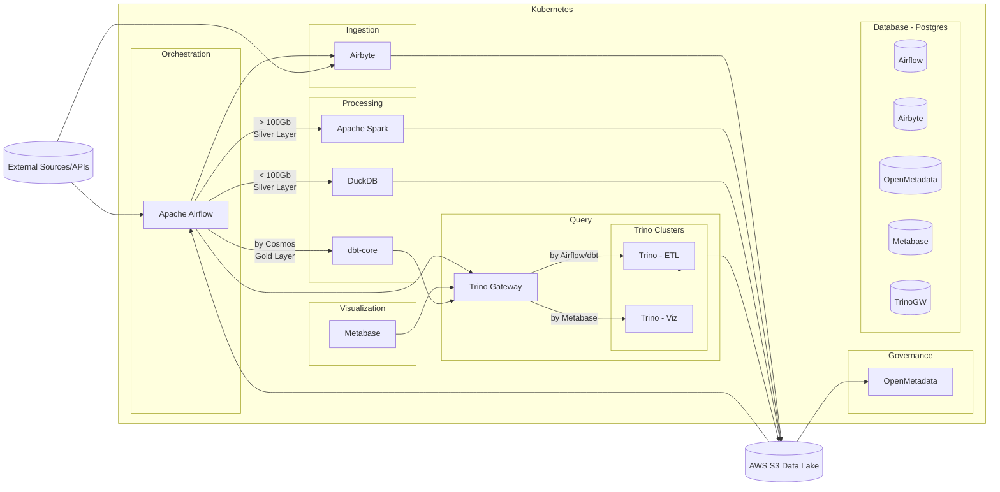

# RFC 001: Analytics Engineering Framework

## Metadata

| Attribute | Description |
| :--- | :--- |
| **Status** | Draft |
| **Author** | Data Architecture Team |
| **Stakeholders** | Data Analysts, Analytics Engineers, BI Leads |
| **Tools** | Airbyte, dbt-core, DuckDB, Metabase, OpenMetadata |

---

## Executive Summary

This RFC proposes a standardized framework for the **Analytics Engineering** lifecycle. The goal is to establish a robust **ELT (Extract, Load, Transform)** pipeline that prioritizes development speed, cost-efficiency for medium-sized datasets, and self-service BI, ensuring that data is modeled, tested, and documented before reaching the end-user.

---

## Technical Proposal

### Ingestion (Airbyte)
* **Strategy:** Use Airbyte's library of pre-built connectors to sync data from SaaS platforms and operational databases.
* **Destination:** Raw data will be landed in the **S3 Bronze Layer** in its native format (JSON/Parquet).

### Transformation Logic (dbt + DuckDB)
* **The "Fast Track" (< 100GB):** For datasets under 100GB, we will utilize **DuckDB** as the execution engine. This allows for high-performance SQL processing without the cost and overhead of spinning up distributed Spark clusters.
* **Modeling:** `dbt-core` will manage all SQL transformations:
    * **Silver Layer:** Cleaning, renaming, and type casting.
    * **Gold Layer:** Business logic, aggregations, and Star Schema (Dimension/Fact) modeling.
* **Orchestration:** Integration with Airflow via **Astronomer Cosmos** to automatically convert dbt models into *Airflow Task Groups*.

### Visualization & Governance
* **Metabase:** Acts as the primary interface for business users, connecting to the Gold Layer via **Trino Gateway**.
* **Data Catalog:** Every dbt model must include descriptions and owner tags, which will be automatically synced to **OpenMetadata** for discovery and lineage.

---

## Quality Guardrails

To ensure data integrity and reliability, the following rules are mandatory:

* **Mandatory Testing:** Every model must have at least `unique` and `not_null` tests.
* **CI/CD:** Changes to dbt models must pass `dbt parse` and `dbt test` in a pull request before merging to production.

---
> **Note:** This document is a draft proposal and is subject to technical review by the aforementioned stakeholders.
