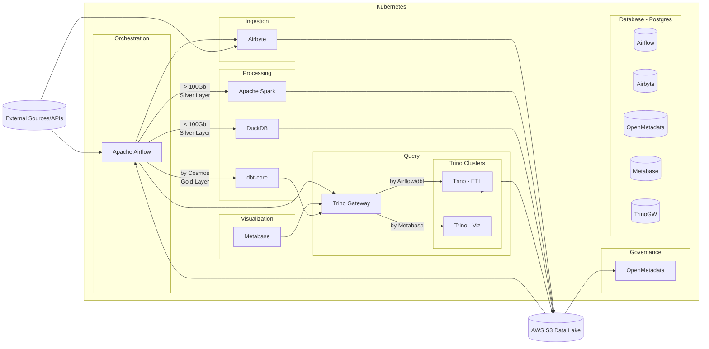

# RFC Scalable Data Engineering Platform Infrastructure

## Metadata

| Attribute | Description |
| :--- | :--- |
| **Status** | Draft |
| **Author** | Platform Engineering / Data Engineering |
| **Stakeholders** | Data Engineers, DevOps, SRE |
| **Tools** | Apache Airflow, Apache Spark, Trino (Gateway), Kubernetes (K8s) |

---

## Executive Summary

This RFC defines the high-scale infrastructure required to handle Big Data workloads and multi-tenant query access. It focuses on the "heavy lifting" of the data platform, ensuring that the Kubernetes cluster can scale compute resources dynamically for massive datasets and concurrent user queries.

---

## Technical Proposal

### Orchestration Backbone (Airflow)
* **Deployment:** Airflow running on K8s using the `KubernetesExecutor`.
* **Responsibility:** Managing cross-layer dependencies, triggering Spark jobs for large volumes, and coordinating Airbyte syncs.

### Big Data Processing (Apache Spark)
* **The "Heavy Track" (> 100GB):** Spark is the designated engine for datasets exceeding 100GB or requiring complex shuffling/joins.
* **Execution:** Spark jobs will run as ephemeral pods on Kubernetes to optimize resource utilization (pay-per-use).

### Unified Query Layer (Trino & Trino Gateway)
To provide a single point of entry and prevent resource contention, we will implement:
* **Trino Gateway:** A routing proxy that directs incoming traffic based on the source.
* **Trino-ETL Cluster:** Dedicated to dbt/Airflow heavy write operations.
* **Trino-Viz Cluster:** Optimized for Metabase's high-concurrency read queries to ensure a snappy dashboard experience.

### Storage Architecture
* **Data Lake:** AWS S3 serves as the single source of truth.
* **Format:** Standardization on **Apache Iceberg** to support ACID transactions, schema evolution, and partition evolution, which are critical for large-scale Spark and Trino operations.

---

## Resource Management

* **Auto-scaling:** K8s Horizontal Pod Autoscaler (HPA) will be configured for Trino workers to handle peak BI hours.
* **Isolation:** Use of K8s namespaces and resource quotas to prevent a single Spark job from consuming the entire cluster's memory.

---
> **Note:** This document is a technical proposal and requires review from SRE and DevOps teams regarding cluster resource allocation.
