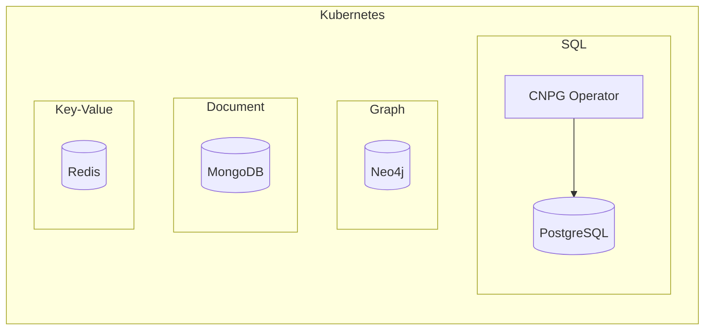

```mermaid
graph TD
    subgraph Kubernetes
        direction TD
        
        subgraph SQL
            CNPG[CNPG Operator] --> PG[(PostgreSQL)]
        end

        subgraph Graph
            N4J[(Neo4j)]
        end

        subgraph Document
            MG[(MongoDB)]
        end

        subgraph Key-Value
            RD[(Redis)]
        end
    end
```