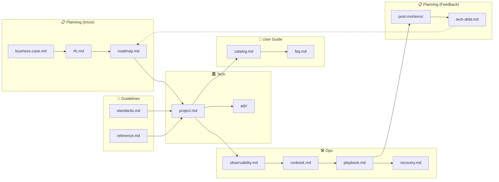

Essa estrutura de diretórios segue o padrão de Documentation as Code, organizando o conhecimento técnico de forma modular e escalável por área interessada. 

Aqui está o resumo de cada seção:

🏛️📂 docs/tech/
- adr/: (O histórico de decisões técnicas. O porquê das decisões de escolha de arquitetura).
- project.md: (Diagramas e visão geral do projeto, C4, componentes, ferramentas, integrações, redes, segurança).

📏📂 /docs/guidelines/
- reference.md: (O modelo ideal de quando usar arquitetura e quando não usar).
- standards.md: (Suas políticas de Tags, Redes, IAM, URLs).

🛠️📂 docs/ops/
- runbook.md: (Manutenção e operações do dia a dia).
- playbook.md: (Erros comuns. O que fazer quando o alerta disparar).
- upgrades.md: (Guia de atualização de Versões).
- recovery.md: (Plano de reconstrução pós-apocalipse).
- observability.md: Onde estão os Dashboards (Grafana/Datadog) e quais métricas (SLIs/SLOs) monitorar

📋📂 /docs/planning/
- business-case.md: (Impacto, ROI e Matriz de Riscos - Visão Executiva).
- roadmap.md: (O que chamamos de planning.md antes: Tarefas + Milestones + DoD).
- tech-debt.md: (O que está ruim e precisa ser priorizado para o futuro).
- rfc.md 
- post-mortems/: Uma pasta para documentar lições aprendidas de falhas críticas passadas.

🛒📂 /docs/user-guide/
- catalog.md: (Como usuários externos consomem esse projeto).
- faq.md: Perguntas frequentes para evitar que o time de dev vire "suporte técnico" constante.

Agora em mais detalhes: 

🏛️ /docs/tech/

O cérebro do projeto. Este diretório foca na fundação técnica, registrando o estado atual e o histórico de escolhas que moldaram o software. É o ponto de partida para qualquer desenvolvedor que precise entender a topologia e a lógica por trás da construção do sistema.

- adr/: Registra as decisões de design e seus contextos (ex: "Usaremos PostgreSQL em vez de MongoDB porque precisamos de transações ACID"). Evita discussões circulares no futuro ao explicar o "porquê" de escolhas passadas.

- project.md: Oferece a visão macro. Contém diagramas C4 (Contexto, Containers), fluxo de rede e segurança. Exemplo: Um desenho mostrando como o Frontend fala com a API via Gateway, protegido por um WAF e autenticado via JWT.

📏 /docs/guidelines/

A bíblia de padrões. Define as "leis" do projeto para garantir consistência. Sem isso, cada desenvolvedor cria recursos com nomes e permissões diferentes, gerando dívida técnica e caos administrativo na infraestrutura.

- reference.md: Define casos de uso ideais. Exemplo: "Use Microserviços apenas se o domínio exigir escala independente; caso contrário, mantenha no Monólito Modular". Ajuda a evitar o uso excessivo (over-engineering) de tecnologias complexas.

- standards.md: Regras práticas de higiene. Define que toda Tag deve ter env: prod, que URLs seguem o padrão api.empresa.com/v1/ e que o IAM deve seguir o princípio do menor privilégio, proibindo permissões de Admin em produção.

🛠️ /docs/ops/

O manual de campo. Focado na saúde do sistema em execução. É o diretório mais acessado por SREs e DevOps para manter o "avião voando" e garantir que, se algo quebrar, a recuperação seja rápida e previsível.

- runbook.md: Procedimentos rotineiros. Exemplo: Como rotacionar chaves de API, como limpar logs antigos ou o passo a passo para criar um novo banco de dados de homologação sem afetar outros serviços.

- playbook.md: Guia de emergência. Exemplo: "Se o alerta 'CPU > 90%' disparar, verifique a query X no banco e execute o script de escalonamento vertical". Foca em resolver o sintoma rapidamente durante incidentes.

- upgrades.md: Cronograma de evolução. Detalha como migrar da versão 14 para a 15 do Node.js ou como aplicar patches de segurança no Kubernetes sem causar downtime para os usuários.

- recovery.md: O plano de desastre. Descreve como restaurar o sistema do zero em outra região da nuvem caso a principal fique offline, incluindo ordem de restauração de backups e testes de integridade de dados.

- observability.md: Mapa de monitoramento. Lista os links para Dashboards no Grafana e define que o SLO de disponibilidade é de 99.9%, monitorando a latência média (p95) e a taxa de erros HTTP 5xx.

📋 /docs/planning/

A bússola do produto. Conecta o código aos objetivos de negócio e ao futuro do projeto. Serve tanto para desenvolvedores quanto para gestores entenderem as prioridades, os riscos financeiros e o que ainda precisa ser melhorado.

- business-case.md: Justificativa financeira. Exemplo: "Este projeto reduzirá o custo de infraestrutura em 20%, trazendo um ROI em 6 meses". Útil para alinhar expectativas com diretores e stakeholders não técnicos.

- roadmap.md: O cronograma de entregas. Lista as grandes funcionalidades (Milestones) e o que define uma tarefa como concluída (DoD), como: "Feature X: Código mergeado, testes integrados passando e documentação atualizada".

- tech-debt.md: O inventário do que está "feio". Registra débitos técnicos, como uma biblioteca obsoleta ou um código mal refatorado, garantindo que esses problemas não sejam esquecidos e entrem no ciclo de priorização.

- rfc.md: Pedido de Comentários (Request for Comments). Um documento para propor grandes mudanças antes de implementá-las, permitindo que o time revise a ideia e sugira melhorias no design da solução.

- post-mortems/: Lições das falhas. Após um incidente grave, documenta-se: o que aconteceu, por que aconteceu e o que foi feito para garantir que o mesmo erro nunca mais ocorra.

🛒 /docs/user-guide/

A vitrine e o suporte. Focado na experiência de quem consome o projeto, seja um cliente externo ou outro time da empresa. O objetivo aqui é a auto-suficiência do usuário, reduzindo interrupções desnecessárias para o time de desenvolvimento.

- catalog.md: O menu de serviços. Explica quais endpoints estão disponíveis, como obter acesso e exemplos de chamadas curl para integrar com o sistema rapidamente.

- faq.md: Respostas para dúvidas comuns. Exemplo: "Como recupero minha senha?", "Qual o limite de requisições por segundo?". Se uma pergunta é feita duas vezes no Slack, a resposta deve vir para cá.
