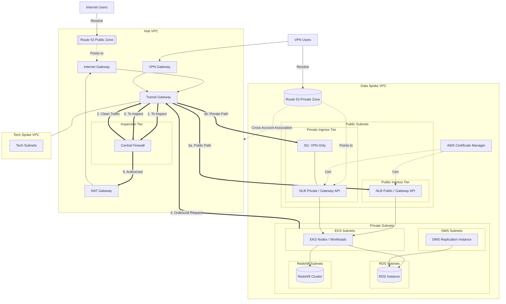

# RFC
 
 ## Status
 Draft
 
 ## Applies to
 AWS Regions PRD and DEV
 
 ## Objective
 Define a secure, scalable, and cost-effective networking foundation for EKS and Data workloads.
 
 ## Architecture Overview
 The networking model follows a Transit Gateway (TGW) **hub-spoke** approach to standardize inter-VPC connectivity and governance.
 
 Key outcomes:
 - Reduce routing complexity compared to ad-hoc point-to-point connectivity.
 - Centralize segmentation and shared connectivity (e.g., corporate networks).
 - Keep high-volume data paths contained within the environment network boundary when possible.
 
 ## Interconnection Standard (Transit Gateway)
 ### Default: Hub-Spoke via Transit Gateway
 - Each environment will use a **TGW hub** for inter-VPC routing and connectivity to legacy/corporate networks.
 - Application/data VPCs are **spokes** attached to the TGW.
 - Routing must be controlled via TGW route tables to enforce segmentation.
 
 ### VPC Peering
 VPC Peering is **not** the standard for interconnecting networks. It may be used only as an exception for narrow, well-scoped use-cases where:
 - no transitive routing is required,
 - connectivity is isolated to a single pair of VPCs,
 - and the operational overhead is explicitly accepted.
 
 ### TGW Routing and Segmentation Conventions
 - Spokes must attach to TGW using dedicated TGW attachments.
 - Use TGW route tables to separate traffic domains, for example:
   - data plane (EKS/data VPC)
   - shared services
   - corporate/legacy connectivity
 - Default routing between spokes is **deny by design** (explicit routes only).
 - Centralize network audit and change control through TGW route table ownership.
 
 ## VPC Hierarchy & Subnet Strategy
 The architecture will transition to a **Unified Data VPC model per environment** to minimize TGW data processing costs and routing complexity for high-volume traffic.
 
 ### VPC Sizing
 - VPC allocation: one `/16` CIDR block per environment (e.g., `10.x.0.0/16`).
 - Justification:
   - sufficient address space for EKS nodes/pods and managed data services
   - enables direct Security Group referencing within the same VPC boundary
 
 ### VPC Roles (per environment)
 - **Data VPC (primary)**
   - EKS worker nodes and private workloads
   - managed databases (RDS/ElastiCache)
   - internal-only ingress
 - **Shared Services VPC (optional, future)**
   - shared tooling (build, observability, DNS forwarding, etc.)
   - attached to the same TGW and segmented via route tables
 
 ### Subnet Layout
 - Private subnets (EKS/nodes)
   - `/19` blocks (~8,000 IPs) across two AZs to satisfy EKS control plane requirements
 - Data subnets (isolated)
   - dedicated subnets for RDS/data stores
   - no route to the NAT Gateway
 
 ### AZ Strategy
 To optimize cross-AZ data transfer costs and simplify EBS zonal management:
 - managed node groups should be constrained to a single AZ (AZ-A)
 - the second AZ remains for EKS control plane high availability
 
 ## Ingress & Access Management (Gateway API)
 A no-service-mesh approach is mandated. Envoy Gateway (implementing the Kubernetes Gateway API) will provide L7 capabilities at the edge.
 
 ### Centralized SSO (OIDC)
 - Requirement: authentication must be enforced at the Gateway level using OIDC.
 - Benefit: removes the need for manual source range allowlists on every ingress; endpoints are protected by default via the IDP.
 
 ### Internal-Only Exposure
 - AWS Load Balancer Controller: configured to provision internal NLBs.
 - External-DNS: synchronizes Gateway/HTTPRoute hostnames with Route 53 private hosted zones.
 - VPN access: resolvability and connectivity restricted to AWS Client VPN clients.
 
 ## Network Security & Governance
 ### AWS Managed Prefix Lists
 - Standard: all inter-VPC and inter-subnet traffic rules must use AWS managed prefix lists.
 - Implementation:
   - EKS pod and node CIDRs are aggregated into prefix lists
   - improves Security Group manageability and TGW auditability
 
 ### Egress Traffic
 - NAT Gateway: each environment uses a NAT Gateway for controlled internet egress.
 - Whitelisting: the NAT Gateway Elastic IP is the authoritative source IP for third-party allowlists.
 
 ## Observability & Troubleshooting
 ### Endpoint Audience (Traffic Metrics)
 - Envoy metrics: Envoy Gateway exports Prometheus metrics (e.g., `envoy_http_downstream_rq_total`).
 - Goal: provide granular audience insights (request counts per endpoint/path) without sidecar overhead.
 
 ### Network Troubleshooting (Netshoot)
 - Protocol: Netshoot is the designated diagnostic tool.
 - It shall be deployed as ephemeral containers to validate connectivity between EKS subnets and legacy corporate environments via the Transit Gateway.

 Transit Gateway, privatelinks, private and public DNS
hub and spoke, firewall, 
1 iac repo dev, 1 repo iac prd

