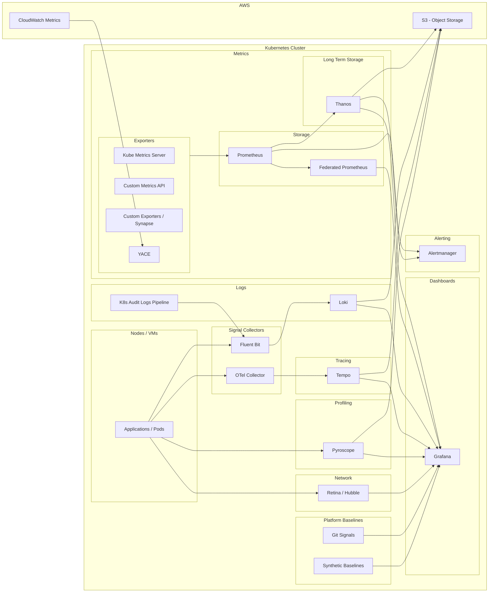

# Observability RFC (Parent): Kubernetes + Cloud

- **Status**: Draft
- **Owners**: Platform/SRE

## Abstract

This document defines the "Mother" architecture for observability across all Kubernetes clusters. It establishes a decoupled, vendor-neutral telemetry stack that prioritizes high-cardinality data correlation, long-term retention via object storage (AWS S3), and GitOps-driven management.

## Context & Problem Statement

As our microservices footprint grows, traditional "siloed" monitoring fails. We currently face:
* **High Costs:** Storing logs and traces in high-performance SSDs or expensive SaaS providers.
* **Blind Spots:** Lack of L3/L4 network visibility and code-level profiling.
* **Fragmented Context:** Metrics, logs, and traces live in different tools, making root-cause analysis slow.

## The Five Pillars of Signal

To achieve full observability, every service on the platform must emit and correlate these five signals:

* **Metrics:** Numerical snapshots (**The What**). Used for real-time health and cost-effective alerting.
* **Logs:** Discrete text events (**The Why**). Provides specific error context and stack traces.
* **Traces:** Request lifecycles (**The Where**). Maps the path of a request across service boundaries.
* **Profiles:** Function-level analysis (**The How**). Identifies which code line consumes resources.
* **Alerts:** Actionable notifications (**The Acknowledge**). The proactive layer that initiates the incident response.

---

## Architecture diagram

## Proposed Architecture

### Unified Metrics Layer
We standardize on the Prometheus ecosystem but solve for scalability and retention by decoupling storage from the compute cluster.

* **Prometheus Operator:** Automates scraping via `ServiceMonitors`. It ensures that telemetry is a first-class citizen of the deployment lifecycle, not an afterthought.
    * *RFC Detail:* [`metrics.md`](./metrics.md)
* **Thanos:** Solves the "short-term memory" of Prometheus. It ships metric blocks to **AWS S3**, providing a global query view and years of retention at a fraction of the cost of EBS volumes.
    * *RFC Detail:* [`thanos.md`](./thanos.md)
* **Federated Prometheus:** Aggregates critical "rollups" from edge clusters to a central management cluster for global capacity planning and executive dashboards.
    * *RFC Detail:* [`federated-prometheus.md`](./federated-prometheus.md)

### High-Efficiency Logging & Auditing
Log volume is our biggest cost driver. We shift from an "index-everything" to a "label-based" indexing strategy.

* **Fluent Bit:** A lightweight C-based agent running as a `DaemonSet`. It enriches logs with K8s metadata (pod_name, namespace) at the source before shipping to the store.
    * *RFC Detail:* [`fluentbit.md`](./fluentbit.md)
* **Loki:** Our S3-backed log store. By indexing only metadata (labels) rather than the full log body, we achieve massive cost savings while maintaining high-speed correlation with Prometheus metrics.
    * *RFC Detail:* [`logs.md`](./logs.md)
* **K8s Audit Pipeline:** A dedicated compliance stream that captures control-plane events. This is our forensic "black box" for security and cluster state changes.
    * *RFC Detail:* [`kubernetes-audit-logs.md`](./kubernetes-audit-logs.md)

### Distributed Tracing & Profiling
To debug complex interactions, we move beyond the "node" and into the "code."

* **OpenTelemetry (OTel):** Our universal adapter. All applications must use OTel SDKs/Collectors to ensure we can switch backends or route data without code refactoring.
    * *RFC Detail:* [`open-telemetry.md`](./open-telemetry.md)
* **Tempo:** An "index-free" trace store. By relying on Trace IDs discovered via Logs or Metrics, Tempo allows us to store 100% of our traces in S3 without the overhead of a search index.
    * *RFC Detail:* [`tracing.md`](./tracing.md)
* **Pyroscope:** Continuous profiling records what the CPU is doing 24/7. It bridges the gap between "high utilization" and "which function is the culprit" at the line-of-code level.
    * *RFC Detail:* [`pyroscope.md`](./pyroscope.md)

### Network & Platform Health
Visibility into the "pipes" between services is mandatory for debugging connectivity issues and security drops.

* **Retina / Hubble (eBPF):** We use eBPF to gain L3/L4 visibility directly from the kernel. This allows us to debug packet drops and network policy failures without the overhead of sidecar proxies.
    * *RFC Detail:* [`retina.md`](./retina.md)
* **Synthetic Baselines:** We establish "known-good" workloads for Airflow and Kafka. If these controlled probes fail, we know the platform is degraded before user traffic is impacted.
    * *RFC Detail:* [`data-platform-infrastructure.md`](./data-platform-infrastructure.md)

### Control, Visualization & Alerting
The final layer where raw data becomes actionable insight and automated response.

* **Grafana Operator:** Dashboards and Datasources are managed as code in Git. This prevents "dashboard drift" and ensures our visualization layer is as reproducible as our infrastructure.
    * *RFC Detail:* [`grafana.md`](./grafana.md)
* **Alertmanager:** The central routing engine. It deduplicates and groups alerts to prevent notification fatigue, ensuring on-call engineers receive high-signal alerts only.
    * *RFC Detail:* [`alertmanager.md`](./alertmanager.md)

---

## Operational Strategy: The "Single Pane of Glass"

The success of this RFC is measured by the **Correlation Path**:
1.  **Metric Spike** triggers an **Alert**.
2.  Engineer opens **Grafana**, clicks the spike to see related **Loki Logs**.
3.  Logs contain a **Trace ID** that opens the **Tempo Trace**.
4.  Trace points to a specific service where **Pyroscope** reveals the expensive function.

## Conclusion

This architecture removes the "Data Tax" by leveraging S3 and open standards. It ensures that observability is a unified, GitOps-managed platform rather than a collection of disconnected tools.
