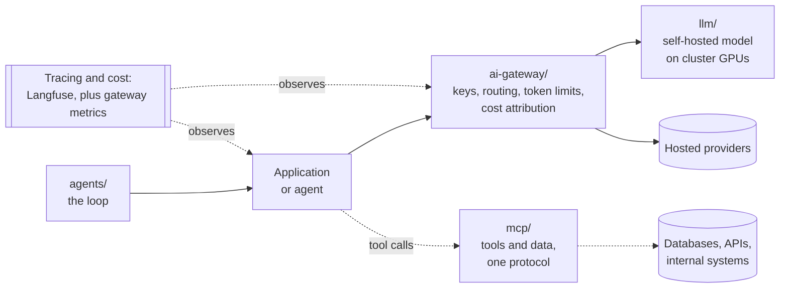
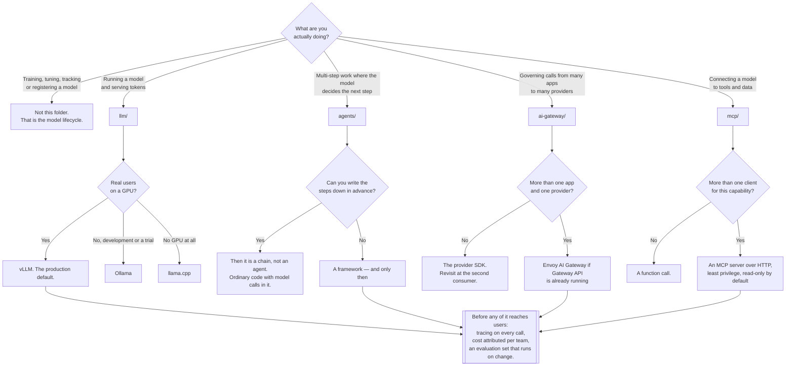

[← infrastructure/](../README.md)

# AI

The application and serving layer for AI — running models, governing the traffic to them, and
wiring them to tools.

Subfolders: [`agents/`](agents/README.md) · [`ai-gateway/`](ai-gateway/README.md) ·
[`llm/`](llm/README.md) · [`mcp/`](mcp/README.md)

## Contents

1. [The boundary with mlops](#1-the-boundary-with-mlops)
2. [The map](#2-the-map)
3. [The path a request takes](#3-the-path-a-request-takes)
4. [Four properties that make this different](#4-four-properties-that-make-this-different)
5. [Decision tree](#5-decision-tree)
6. [Anti-patterns](#6-anti-patterns)
7. [Notes](#7-notes)
8. [How this applies to pikakube](#8-how-this-applies-to-pikakube)

---

## 1. The boundary with mlops

This is a real question in this repository and it deserves an explicit answer rather than an
implicit one.

| | `ai/` — this folder | `mlops/` |
|---|---|---|
| The question | how does an application **use** a model? | how does a model come to **exist**? |
| Concerns | serving, routing, tool access, orchestration | training, experiment tracking, registry, deployment, drift |
| Unit of work | a request | a model version |
| Owned by | application and platform teams | data science and ML engineering |
| Time horizon | milliseconds | weeks |
| The model is | a dependency you consume | the artefact you produce |

The short form: **`mlops/` is the lifecycle of a model; `ai/` is the runtime around it.** A team
that never trains anything and calls a hosted API still needs everything in this folder and
nothing in `mlops/`. That asymmetry is the reason the split exists at all — for most
organisations, most AI work now consumes models rather than producing them, and the
infrastructure for consuming them is a different discipline from the infrastructure for
producing them.

**There is one genuine overlap and pretending otherwise would be dishonest:
[`llm/`](llm/README.md) is model serving, and model serving is classically an MLOps concern.**
A `Workspace` CRD that deploys a model, or a vLLM Deployment holding weights, is the last stage
of the lifecycle by any traditional reading.

It is filed here on the "where it shines" principle used throughout this repository. Serving an
open-weights model that somebody else trained has almost nothing in common with deploying a
model your team fitted last week — no experiment lineage, no registry promotion, no retraining
trigger, no drift monitoring against training data. What it has instead is GPU scheduling, batch
throughput, KV cache sizing and cold start. Those are serving problems, and its neighbours are
the gateway in front of it and the agents calling it, not the training pipeline that produced
the weights.

If a model is ever trained here, the boundary is the registry: **producing a version is
`mlops/`; serving it is `llm/`.**

## 2. The map

| Folder | The question it answers |
|---|---|
| [`llm/`](llm/README.md) | how does a model become an endpoint, on hardware that is scarce? |
| [`ai-gateway/`](ai-gateway/README.md) | who is allowed to call which model, at what rate, and who pays? |
| [`mcp/`](mcp/README.md) | how does a model reach tools and data, once, in a way any client can use? |
| [`agents/`](agents/README.md) | how is a multi-step, tool-using loop structured and operated? |

The order is deliberate — it is roughly the order in which the pieces become necessary. A model
endpoint is useful on its own. A gateway becomes necessary at the second consumer. MCP becomes
necessary at the second client of a tool. Agents become necessary only when the sequence of
steps genuinely cannot be written down in advance, which is less often than the discourse
suggests.

Two things are filed in this tree that do not match their folder, recorded as observations
rather than moved:

**[Langfuse](agents/langfuse/README.md) sits in `agents/` and is LLM observability** — tracing,
prompt management, evaluation and cost tracking. It orchestrates nothing. It belongs closer to
[`observability/`](../observability/README.md), or in an `ai/observability/` folder alongside the
four above. It is also the capability this whole discipline is weakest without, which makes the
misfiling more than cosmetic: it is easy to overlook a component when it is shelved under the
wrong heading.

**[n8n](agents/n8n/README.md) is workflow automation with AI nodes**, not an agent framework. Its
peers are Zapier and Make.

## 3. The path a request takes

Three things in that diagram are worth noticing.

**The gateway is the only place that sees every model call.** Self-hosted and hosted traffic both
pass through it, which is what makes "which team spent that" answerable and what makes moving
traffic between a hosted provider and a self-hosted backend a configuration change rather than a
code change in every repository.

**Tool traffic does not go through the model provider.** MCP connects the application to systems
directly. That path carries the credentials and the side effects, which is why it carries most
of the security weight in this folder.

**Observability sits outside the request path and watches both.** The gateway sees traffic; the
tracing layer sees application semantics — which chain, which prompt version, which step went
wrong. Neither substitutes for the other, and running both without deciding which is
authoritative for cost produces two dashboards that disagree.

## 4. Four properties that make this different

Everything awkward in this discipline reduces to one of these, and none of them is a tool choice.

| Property | Consequence |
|---|---|
| **Non-determinism** | the same input can produce different output; a bug may not reproduce, and equality assertions do not work |
| **Cost is metered per token** | the unit of cost is not the request, so request-rate limits bound nothing and the bill is usage-shaped |
| **Latency is measured in seconds** | every timeout, retry and connection-pool assumption inherited from HTTP services is wrong by an order of magnitude |
| **Correctness has no oracle** | there is no assertion for "good answer", so testing is replaced by evaluation sets and human judgement |

The fourth is the one that reshapes engineering practice most and gets the least attention.
Ordinary software has tests that pass or fail. An LLM feature has a distribution of outputs and
a judgement about whether it is good enough. That means:

- **Evaluation replaces unit tests.** A fixed set of inputs, scored on every prompt or model
  change. Without it, quality regressions ship silently and are discovered by users.
- **Tracing replaces stack traces.** There is no exception when the answer is wrong. The only
  way to reconstruct a failure is to have recorded every step with its inputs and outputs.
- **Rollout is a quality question, not just an availability one.** A new model version can be
  healthy by every infrastructure metric and worse at the job.

The other three are more mechanical but not less real. Token metering is why
[`ai-gateway/`](ai-gateway/README.md) exists as a category. Second-scale latency is why agent
step counts compound into user-visible waits. Non-determinism is why the reliability discussion
in [`agents/`](agents/README.md) is about containment rather than correctness.

## 5. Decision tree

## 6. Anti-patterns

| Anti-pattern | Why it is bad | What to do instead |
|---|---|---|
| An agent where a chain would do | non-determinism and multiplied cost, for flexibility nobody needed | write the steps down; call the model at each one |
| Shipping an LLM feature with no evaluation set | quality regressions are invisible until users find them | a fixed input set, scored on every prompt or model change |
| No tracing of prompts and responses | there is no stack trace, so failures cannot be reconstructed | tracing from the first day, not after the first incident |
| Provider keys in every application | rotation is a cross-team coordination exercise | keys at the gateway |
| Cost known only from the invoice | one unattributable number that nobody can act on | per-team token metrics at the gateway, per-run accounting in tracing |
| Self-hosting justified on cost with no utilisation estimate | an idle GPU costs the same as a busy one | calculate the crossover; residency and control are the better reasons |
| Model training filed here | it is a different lifecycle with different owners and cadence | `mlops/` |
| HTTP-service assumptions applied to model calls | seconds-scale latency breaks timeouts, retries and pool sizing | budget for seconds; make retries idempotent and bounded |
| Untrusted content and write credentials in one agent or MCP server | injected instructions inherit the credential | split them; approval before destructive actions |
| Adopting a tool because it is new | this area produces more projects than it retires | pick the boring option; the cost of a rewrite exceeds the benefit of the novelty |
| A prototype flow promoted to production unchanged | canvas or notebook artefacts cannot be reviewed as diffs | decide up front whether it may graduate; rewrite in code if it does |

## 7. Notes

Everything recorded in the original notes for this folder, translated and grouped, with what
each item is and why it was written down. These were collected as pointers to evaluate — very
little of it is deployed, and the list is a map of what was being considered rather than a set of
recommendations.

### 7.1 Spec-driven development

The heading in the original note was exactly that: *spec driven development*.

- <https://github.com/bmad-code-org/BMAD-METHOD>
- <https://github.com/github/spec-kit>
- <https://github.com/Fission-AI/OpenSpec>

The shared idea is a reaction to a specific failure of coding agents: given a vague instruction
they produce plausible code that solves the wrong problem, and the mistake is only visible after
it is written. Spec-driven development inserts a written, reviewable specification between the
request and the implementation — the human reviews the spec, which is cheap, rather than the
diff, which is not. It is a process convention supported by templates and prompts, not a tool
you deploy, and it is the most transferable idea in this section: it applies whichever agent is
being used.

### 7.2 The landscape

- <https://l.cncf.io/?group=ai-native> — the CNCF landscape filtered to the AI-native category.
  The reference for what exists in this space with a foundation behind it, which is a useful
  filter in an area where the majority of projects have neither governance nor a second
  maintainer.

### 7.3 Agent engineering doctrine

- <https://github.com/humanlayer/12-factor-agents> — the closest thing this area has to an
  engineering doctrine, in the style of the original twelve-factor app. Its argument is that
  reliable agents are mostly ordinary software: own your prompts and your context window rather
  than letting a framework manage them, keep state explicit and serialisable, make agents small
  and stateless, and put a human in the loop at the points that matter. It is the recommended
  reading behind the reliability section of [`agents/`](agents/README.md).

### 7.4 Building on models

- <https://github.com/run-llama/llama_index> — a data framework for retrieval-augmented
  generation: ingestion, chunking, indexing and querying over your own documents. The relevant
  half of RAG that is not the model.
- <https://github.com/pydantic/pydantic-ai> — an agent framework from the Pydantic authors, whose
  distinguishing bet is **typed, validated outputs**: the model's response is parsed into a
  declared schema and validated, so a malformed answer is an error rather than a surprise
  downstream. That directly addresses the "correctness has no oracle" problem in section 4 for
  the subset of cases where the output has a structure.
- <https://github.com/mem0ai/mem0> — a memory layer for LLM applications: storing and retrieving
  what happened in past interactions so a conversation is not stateless. Memory is one of the
  three components of an agent and the one most often improvised badly.
- <https://github.com/mcp-use/mcp-use> — a library for connecting LLMs to MCP servers from your
  own code, rather than only from a host application that already speaks the protocol. See
  [`mcp/`](mcp/README.md).
- <https://github.com/anthropics/claude-cookbooks> — worked notebooks for building against the
  Claude API: tool use, structured output, retrieval, evaluation, vision. Reference material
  rather than a dependency, and useful for the same reason the OpenLineage workshops are —
  the runnable example is a faster way to learn an API's shape than its specification. Note the
  vendor bias, which is inherent: these demonstrate one provider's API, not the general problem.

### 7.5 Serving and safety

- <https://github.com/lmcache/lmcache> — a KV cache layer for LLM serving. It extends the idea
  described in [`llm/`](llm/README.md) section 2: rather than keeping cached prefixes only in GPU
  memory within one server, it stores and shares them across a wider tier, so repeated context
  is not re-prefilled on every request or on every replica. This is directly relevant to
  RAG and agent traffic, where a large shared prefix is the norm.
- <https://github.com/guardrails-ai/guardrails> — validation and enforcement on model output:
  structure, content checks, and corrective re-asking when a response fails a rule. Worth
  reading together with the caution in
  [`ai-gateway/`](ai-gateway/README.md) section 5 — output validation catches categories of
  problem, and none of it solves prompt injection.

### 7.6 Evaluation

The original note filed these under *llm evaluation*.

- <https://github.com/promptfoo/promptfoo> — evaluation and red-teaming for prompts, run from
  the command line and in CI. Declarative test cases, side-by-side comparison across models and
  prompt versions. The most CI-shaped of these, which is what makes evaluation a habit rather
  than an exercise.
- <https://github.com/confident-ai/deepeval> — an evaluation framework in a unit-test idiom,
  with metrics for the usual failure modes including hallucination and, for RAG, whether the
  answer is grounded in the retrieved context.
- <https://github.com/comet-ml/opik> — tracing plus evaluation, from Comet. It is a direct
  alternative to [Langfuse](agents/langfuse/README.md), which is the one actually deployed here;
  the comparison to make is on self-hosting story and dependencies rather than on feature lists,
  which are similar.

Together these are the answer to the fourth property in section 4, and the capability this
repository is missing entirely: nothing here yet defines what a good answer is for any deployed
component.

### 7.7 Web scraping

The original note filed these under *web scraping*.

- <https://github.com/firecrawl/firecrawl> — crawls a site and returns clean Markdown suitable
  for a model, handling the rendering and boilerplate removal that make raw HTML unusable as
  context.
- <https://github.com/browser-use/browser-use> — lets an agent drive a real browser: navigate,
  click, fill forms. Far more capable and far more dangerous than fetching a page, since it acts
  on live sites with whatever session it has been given.

Both are the canonical source of untrusted content in section 4's last anti-pattern. Anything
that reads the open web and also holds a credential that can write is the combination to avoid.

### 7.8 Protocols

- <https://github.com/a2aproject/A2A> — Agent2Agent, a protocol for agents built by different
  teams or vendors to discover and delegate work to one another. MCP standardises
  agent-to-tool; A2A aims at agent-to-agent. It is the traffic
  [agentgateway](ai-gateway/agentgeteway/README.md) is designed to govern.
- <https://github.com/agentclientprotocol/agent-client-protocol> — ACP, a protocol between
  editors and coding agents, so any editor can host any agent instead of each pairing being a
  bespoke integration. The same N × M argument as MCP, applied to the editor boundary.

### 7.9 Coding agents

Grouped under the original note's own heading, *# Coding Agent*. These are developer tools rather
than platform components — none of them deploys to a cluster — and the list was clearly collected
as a survey. Where a description is given below it is what the project is; where it is not, the
project was recorded as a pointer and is **not evaluated here**, which is the honest state of it.

| Recorded | What it is |
|---|---|
| <https://github.com/anthropics/claude-code> | Anthropic's coding agent, run from the terminal or hosted in an editor. Agentic rather than completion-based: it reads the repository, runs commands, and edits files across a task. Configured per repository through a `CLAUDE.md` and reusable skills — the packaged-instruction pattern described in section 7.10 |
| <https://github.com/openai/codex> | OpenAI's coding agent, run from the terminal |
| <https://github.com/aider-ai/aider> | terminal pair programmer, built around Git — it commits its own changes, which makes review and revert normal operations |
| <https://github.com/cline/cline> | autonomous coding agent as an editor extension |
| <https://github.com/Kilo-Org/kilocode> | editor-based AI coding extension |
| <https://github.com/anomalyco/opencode> | recorded as a pointer; not evaluated |
| <https://github.com/earendil-works/pi> | recorded as a pointer; not evaluated |
| <https://github.com/odysseus-dev/odysseus> | recorded as a pointer; not evaluated |
| <https://github.com/rtk-ai/rtk> | recorded as a pointer; not evaluated |
| <https://github.com/JuliusBrussee/caveman> | recorded as a pointer; not evaluated |
| <https://github.com/Gitlawb/openclaude> | recorded as a pointer; not evaluated |
| <https://github.com/code-yeongyu/oh-my-openagent> | recorded as a pointer; not evaluated |
| <https://github.com/alvinunreal/oh-my-opencode-slim> | recorded as a pointer; not evaluated |

The aider row is worth singling out because its design choice generalises: **an agent that
commits its work in small, labelled steps is reviewable and revertible**, which is the only
answer available to the "no rollback" problem in [`agents/`](agents/README.md). Git is the undo
that agents otherwise lack.

The size of this list is itself the observation. A dozen coding agents recorded in one file
describes the state of the area accurately, and it is the concrete case for the "adopting a tool
because it is new" anti-pattern in section 6.

### 7.10 Skills, prompts and context for agents

- <https://github.com/agentskills/agentskills>
- <https://github.com/tech-leads-club/agent-skills>
- <https://github.com/obra/superpowers>
- <https://github.com/gsd-build/get-shit-done>
- <https://github.com/forrestchang/andrej-karpathy-skills>
- <https://github.com/mattpocock/skills>
- <https://github.com/karpathy/autoresearch>
- <https://github.com/VoltAgent/awesome-design-md>

These are collections of reusable instructions, prompts and workflows for coding agents — the
packaged form of "how to make an agent do a particular kind of task properly". The individual
contents are not evaluated here. What the group demonstrates is the pattern behind them: agent
capability is being distributed as **shareable instruction files** rather than as code, which is
why the specification and documentation habits in section 7.1 matter more than they look.

- <https://github.com/upstash/context7> — related but mechanically different: an MCP server that
  supplies current, version-specific library documentation to a coding agent. It targets the
  most common and least interesting agent failure, which is confidently writing against an API
  that changed after the model's training data ended.

### 7.11 The spec-driven data platform note

The file `windsurf.md` in this folder holds a separate plan, written in Portuguese and
translated here in full. Its heading was *projeto spec ai driven* — a spec-driven AI project.
The intent is applying section 7.1 to this organisation's data platform: writing down the
standards so that agents, and people, produce work that conforms to them.

The checklist as recorded:

- Definition of the directory structure for an Airflow project.
- Airflow best practices, from
  <https://airflow.apache.org/docs/apache-airflow/stable/best-practices.html> — the official
  guidance.
- Minimum quality rules for Airflow DAGs: owner, namespace, resources, and so on.
- Python coding standards: testing, linting, logging, and so on.
- Creation of dbt documentation and tests.
- A commit message standard.
- Data products.
- An OpenMetadata MCP server.

Read as a whole, this is a specification of what "done" means for a data engineering task,
written so that it can be handed to an agent as context. That is the practical form of
spec-driven development for an existing platform, and it is more valuable than any of the
individual tools in this section: the standards are useful whether or not an agent ever reads
them.

The MCP servers recorded alongside it, which are the concrete integrations that plan needs:

| Server | What it connects to |
|---|---|
| <https://github.com/github/github-mcp-server> | GitHub — repositories, issues, pull requests. Official |
| <https://github.com/sooperset/mcp-atlassian> | Jira and Confluence |
| <https://github.com/dbt-labs/dbt-mcp> | dbt projects — models, tests, documentation. Official |
| <https://github.com/grafana/mcp-grafana> | Grafana — dashboards and queries. Official |
| <https://github.com/hashicorp/terraform-mcp-server> | Terraform — providers and modules. Official |
| <https://github.com/awslabs/mcp> | AWS services. Official |
| <https://github.com/motherduckdb/mcp-server-motherduck> | MotherDuck and DuckDB |
| <https://github.com/open-metadata/OpenMetadata> | the metadata platform itself, referenced for its MCP server — the "mcp server openmetadata" item on the checklist |

Most of these are published by the vendor of the system they connect to, which is the
distinction that matters when applying the audit rule in [`mcp/`](mcp/README.md) section 7: an
official server is a smaller trust decision than one found in a directory.

The last line of the note reads *mermaid (procurar github)* — "mermaid (look for the GitHub
repo)", an unresolved to-do about diagram generation. Recorded as it stands; it was never
followed up.

`windsurf.md` is left in place; its content is reproduced here so that this README is complete
on its own.

## 8. How this applies to pikakube

**Seven components are actually deployed across this discipline**, and the pattern in them is
consistent: the capability is installed, and the configuration that would make it useful mostly
is not.

| Deployed | Version | State |
|---|---|---|
| [kagent](agents/kagent/README.md) | `0.10.0-rc1` | configured — external CloudNativePG database, metrics on, Ollama as default provider |
| [Langflow](agents/langflow/README.md) | `0.1.1` | IDE and runtime, chart defaults |
| [Langfuse](agents/langfuse/README.md) | `1.5.12` | chart defaults, including its backing services |
| [Envoy AI Gateway](ai-gateway/envoy-ai-gateway/README.md) | `v0.6.0` | installed, no backends or limits configured |
| kgateway, in [`agentgeteway/`](ai-gateway/agentgeteway/README.md) | `v2.1.1` | installed, unconfigured |
| [Ollama](llm/ollama/README.md) | `0.21.1` | serving `llama3.2` to kagent |
| [Open WebUI](llm/ollama/open-webui/README.md) | `3.6.0` | its `HelmRepository` URL looks wrong — see its README |
| [KAITO](llm/kaito/README.md) | `v0.4.4` | installed; its example workspace is Azure-specific |

**The one end-to-end path that works is self-hosted and closed.** kagent calls Ollama in-cluster
with a small open-weights model. No provider key, nothing leaving the cluster. That is a real
achievement and it is the right first milestone. Its ceiling is equally real: a small model on a
developer-experience inference server caps both what the agents can reliably do and how many of
them can do it at once.

**Three gaps, in the order they are worth closing.**

**Evaluation and tracing, first.** Langfuse is deployed but on chart defaults, and nothing
anywhere defines what a good answer looks like for any deployed component. Until that exists the
platform can say what an agent did and not whether it should have — and every other improvement
is unmeasurable. Configuring Langfuse against this repository's existing database and storage
operators, rather than bundled dependencies, is the concrete first task.

**Cost attribution, second.** The gateway is installed and nothing routes through it. Putting
the existing in-cluster traffic through it now — before any provider key is ever introduced — is
the cheapest possible moment to establish per-team token accounting, because there is no
migration to do and no bill yet to explain.

**A production serving path, third.** [vLLM](llm/vllm/README.md) is documented and not deployed.
It is the right answer the moment anything in this folder has real users, and the arithmetic for
it — GPU memory split between weights and KV cache, and cold start measured in minutes — is
worth doing before it is urgent.

**Two gateway control planes are installed for overlapping jobs.** Envoy AI Gateway for provider
traffic and kgateway for agent traffic is defensible, but it should be a decision rather than an
accumulation.

**MCP is assumed and absent.** kagent's tool model is MCP-based and there are no servers. The
first one is a platform decision — HTTP transport and a Deployment makes it a shared capability;
stdio makes it a private detail of one host — and the safest starting point is read-only and
cluster-facing, which is exactly what kagent is built for.

**Everything else in this tree is mapped rather than adopted**, including most of section 7. In
an area that produces projects faster than it retires them, a repository of pointers with honest
notes about what has not been evaluated is worth more than a cluster full of things nobody chose
deliberately.

---

[← infrastructure/](../README.md)
