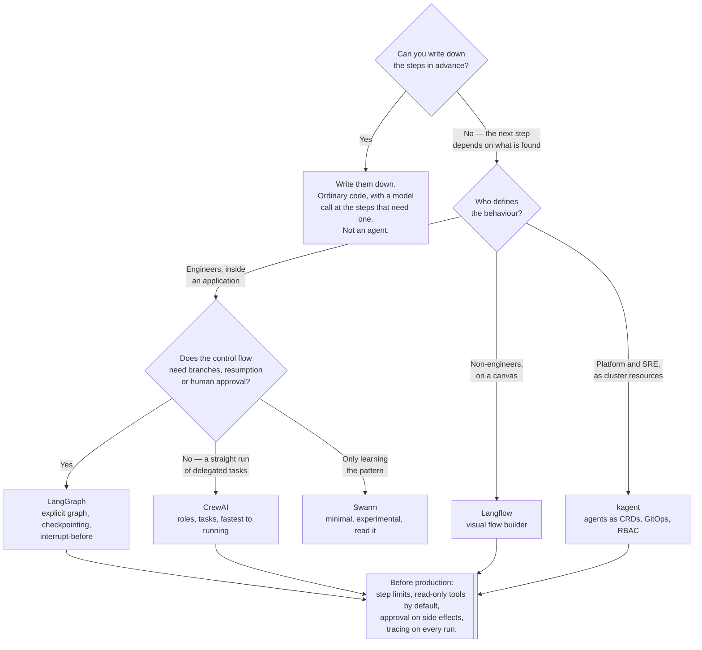

[← AI](../README.md)

# Agents

An LLM in a loop with tools — the frameworks that structure that loop, and the platforms that
run it.

Subfolders: [`crewai/`](crewai/README.md) · [`hermes-agent/`](hermes-agent/README.md) ·
[`kagent/`](kagent/README.md) · [`langflow/`](langflow/README.md) ·
[`langfuse/`](langfuse/README.md) · [`langgraph/`](langgraph/README.md) ·
[`n8n/`](n8n/README.md) · [`swarm/`](swarm/README.md)

## Contents

1. [What an agent actually is](#1-what-an-agent-actually-is)
2. [Three different things live in this folder](#2-three-different-things-live-in-this-folder)
3. [Why multi-agent is usually premature](#3-why-multi-agent-is-usually-premature)
4. [The reliability problem](#4-the-reliability-problem)
5. [Cost and latency compound](#5-cost-and-latency-compound)
6. [Two things filed here that are not agent frameworks](#6-two-things-filed-here-that-are-not-agent-frameworks)
7. [Decision tree](#7-decision-tree)
8. [Anti-patterns](#8-anti-patterns)
9. [How this applies to pikakube](#9-how-this-applies-to-pikakube)

---

## 1. What an agent actually is

Strip the vocabulary away and an agent is a loop:

```
call the model
  → if it asked to use a tool, run the tool and append the result
  → repeat
  → until it produces an answer or you stop it
```

That is the entire mechanism. Three properties follow from it, and every difficulty in this
folder is downstream of one of them:

| Property | Consequence |
|---|---|
| **The model chooses the next step** | the control flow is decided at runtime by a probabilistic system |
| **Tools have side effects** | a step can change the world, and there is no undo |
| **Each iteration is a full model call** | cost and latency multiply by the number of steps |

The useful distinction is against a **chain**, where the sequence of steps is fixed by the
programmer and only the content varies. A chain is ordinary software with an LLM inside it. An
agent hands the control flow to the model. That is a much larger step than it is usually
presented as, and it should be taken deliberately — because most tasks described as needing an
agent are chains, and a chain is testable, debuggable and cheap.

The honest test: **can you write down the steps?** If yes, write them down and call the model at
each one. Reach for an agent only when the sequence genuinely depends on what is discovered
along the way.

## 2. Three different things live in this folder

This matters more than any comparison between individual tools, because only one of these groups
is infrastructure at all.

| | **Libraries you import** | **Platforms you deploy** |
|---|---|---|
| What they are | Python packages | services running in the cluster |
| Here | [CrewAI](crewai/README.md), [LangGraph](langgraph/README.md), [Swarm](swarm/README.md) | [kagent](kagent/README.md), [Langflow](langflow/README.md), [n8n](n8n/README.md) |
| Deployment artefact | the application image that imports them | Helm releases, CRDs, a database |
| Who decides | the application team | the platform team |
| Failure blast radius | one application | everything using the platform |
| Upgrade | a dependency bump in one repository | a cluster-wide change |
| Belongs in this repository because | it is worth comparing before a team picks one | it is genuinely operated here |

There is a **third shape**, and it fits neither column:
[Hermes Agent](hermes-agent/README.md) is an agent you run and talk to — reached from a terminal
or a chat client, configured by conversation and by skills it writes for itself. It is not imported
by an application and not operated for other teams; it belongs to a person. It is catalogued here
because the question it raises — **what reviewed the behaviour an agent taught itself?** — applies
well beyond that one project, and section 4 is where it lands.

**Only the platforms column is infrastructure.** A team choosing CrewAI over LangGraph is
making an application decision; it needs no cluster change and no platform involvement. A team
adopting kagent is asking the platform to run a controller, a database and a set of CRDs.

The distinction also tells you what a platform is *for*. Deploying an agent platform is only
worthwhile if agents need to be defined by people who will not build a service — otherwise the
library is strictly simpler.

Within the platforms, the three answer different questions:

| Platform | The question it answers |
|---|---|
| [kagent](kagent/README.md) | how do agents become Kubernetes objects, with GitOps, RBAC and metrics? |
| [Langflow](langflow/README.md) | how does someone who does not write code build and change a flow? |
| [n8n](n8n/README.md) | how do we automate a business process that has one AI step in it? |

## 3. Why multi-agent is usually premature

Frameworks sell teams of specialised agents — a researcher, a writer, a critic — handing work to
one another. It is a compelling picture and it is usually the wrong first move.

The reasoning is arithmetic. If a single step succeeds 95% of the time, then:

| Steps | End-to-end success |
|---|---|
| 1 | 95% |
| 5 | 77% |
| 10 | 60% |
| 20 | 36% |

Multi-agent architectures add steps. Each handoff is a step, each critique round is a step, and
every one of them multiplies into that number. Worse, the failures are not independent in a
helpful way: an agent that receives a subtly wrong input from another agent will usually build
on it confidently rather than reject it, because nothing in the loop is checking.

There is also a compounding problem specific to handoffs: **context does not survive them
intact**. Each agent receives a summary of what happened, not the whole conversation, and detail
is lost at every boundary. Whatever the second agent misunderstands, the third inherits.

The practical sequence that works:

1. One prompt. Measure it.
2. One agent with tools. Measure it.
3. Only if a specific step is measurably failing, and only for that step, add structure.

Multi-agent designs earn their place when the sub-tasks genuinely need different tools or
different permissions — a retrieval agent that can read a database and a writing agent that
cannot is a real security boundary, not decoration. That is a good reason. "Specialisation
improves quality" is usually not.

## 4. The reliability problem

This is the part that is systematically underweighted, and it is why agents are harder to
operate than the demos suggest.

| Problem | What it means in production |
|---|---|
| **Non-determinism** | the same input can produce a different sequence of actions; a bug may not reproduce |
| **No rollback** | a tool call with side effects has already happened when the next step goes wrong |
| **Silent failure** | there is no exception; the run completes and the answer is wrong |
| **No test oracle** | you cannot assert equality on an answer, so ordinary tests do not apply |
| **Prompt injection** | content the agent reads can contain instructions it follows |
| **Unbounded loops** | an agent can retry the same failing tool until something stops it |

**No rollback is the one that dictates design.** A database transaction rolls back. A sent
email, a created ticket, a deleted resource and a posted message do not. An agent that has
executed three of four steps and gone wrong on the fourth has left the world in a state nobody
designed.

The mitigations are unglamorous and they work:

| Mitigation | What it buys |
|---|---|
| Read-only tools wherever possible | most useful agents need to look things up, not change things |
| Human approval before side-effecting tools | [LangGraph](langgraph/README.md) supports interrupt-before as a primitive |
| Idempotent tools with request IDs | a retry stops being a second side effect |
| Hard step and token limits per run | bounds the cost of a loop that will not terminate |
| Least-privilege credentials per tool | the blast radius of a bad decision is the credential, not the platform |
| Tracing every step, with inputs and outputs | the only way to reconstruct what happened — see [Langfuse](langfuse/README.md) |
| Evaluation sets run on every prompt change | the replacement for unit tests, and the thing teams skip |

**Prompt injection deserves its own sentence** because it is the security property most often
missed: any content the agent reads — a web page, a ticket description, a document, a tool's
output — can contain text that the model treats as instruction. If that agent also holds a
credential that can act, the untrusted content has just been handed the credential. Treat every
tool result as untrusted input, and never combine "reads arbitrary external content" with "can
take destructive action" in one agent without a human in between.

## 5. Cost and latency compound

The economics are not intuitive because the unit of work is not the request.

A five-step agent run is five model calls. Each call resends the accumulated conversation, so
the input grows at every step. The result is that cost grows faster than linearly with steps
while latency grows at least linearly — and the user is waiting through all of it.

| Shape | Model calls | Cost | Latency |
|---|---|---|---|
| One prompt | 1 | baseline | one call |
| Agent, 5 steps | 5 | more than 5× — the context is resent and growing | 5 calls in sequence |
| 3 agents × 4 steps | 12 | more than 12×, plus handoff context | 12 calls in sequence |

Three consequences worth designing around:

**Streaming does not help.** It improves the perceived latency of the *last* step only. Steps one
through four are invisible waiting.

**Caching is the biggest lever available.** A large shared prefix — system prompt, tool
definitions, retrieved documents — can be served from cache instead of reprocessed, at both the
provider and the gateway. See [`../ai-gateway/`](../ai-gateway/README.md).

**Cost must be attributed before it is a surprise.** Per-run token accounting from
[Langfuse](langfuse/README.md), or per-team token metrics from a gateway. An agent platform
without cost attribution is a bill nobody can explain.

## 6. Two things filed here that are not agent frameworks

Recorded as observations about the taxonomy. Neither is moved.

**[Langfuse](langfuse/README.md) is LLM observability, not an agent framework.** It does tracing,
prompt management, evaluation and cost tracking. It orchestrates nothing. It belongs closer to
[`observability/`](../../observability/README.md), or in an `ai/observability/` folder next to
`ai/llm/` and `ai/ai-gateway/`. It is genuinely important to everything else in this folder —
the reliability section above is unworkable without it — but it is a different capability.

**[n8n](n8n/README.md) is workflow automation that has AI nodes.** Its peers are Zapier and
Make, not LangGraph. It is excellent at connectors, triggers and retries, and its AI nodes are a
feature of a workflow engine rather than an agent runtime. Filing it here is defensible on
adjacency and misleading on capability, so it is worth stating rather than leaving implied.

## 7. Decision tree



Not in the tree, deliberately: if the task is integrating SaaS systems with one AI step,
[n8n](n8n/README.md) is the answer and it is not an agent question.

## 8. Anti-patterns

| Anti-pattern | Why it is bad | What to do instead |
|---|---|---|
| An agent for a task with fixed steps | pays non-determinism and cost for flexibility nobody needs | a chain — code, with model calls in it |
| Starting with a multi-agent crew | error rates multiply, and context degrades at every handoff | one agent, measured, then add structure where it demonstrably fails |
| Side-effecting tools with no approval step | a wrong decision is already committed when it is noticed | read-only by default; human in the loop before writes |
| No step or token limit | a loop retries until the budget is gone | hard caps per run, enforced outside the model |
| No tracing | failures cannot be reconstructed, because there is no stack trace | [Langfuse](langfuse/README.md) or equivalent, from day one |
| Prompt changes shipped without evaluation | quality regressions are invisible until users find them | an evaluation set, run on every prompt change |
| One credential shared by every tool | injected content inherits full privilege | least privilege per tool |
| Trusting tool output as instructions | prompt injection through any content the agent reads | treat all tool results as untrusted data |
| A prototype flow promoted to production | canvas JSON cannot be reviewed as a diff | decide up front whether a flow may graduate; rewrite it in code if it does |
| Deploying an agent platform for one team | a controller, a database and CRDs to operate, for one consumer | a library in that team's application |
| Cost measured only on the provider invoice | nobody can attribute the number, so nobody can reduce it | per-run token accounting, or gateway metrics per team |

## 9. How this applies to pikakube

**One agent platform is actually deployed: [kagent](kagent/README.md).** Two OCI charts pinned
at `0.10.0-rc1` — a release candidate — with CRDs installed as a separate `HelmRelease` that the
main one depends on, state in an external CloudNativePG cluster rather than a bundled database,
and controller metrics enabled. That shape is right: it is operated like the rest of the
platform rather than as a special case.

**Its default model provider is the in-cluster [Ollama](../llm/ollama/README.md)** with
`llama3.2`. So the whole path is self-hosted and nothing leaves the cluster, which is a real
property worth having. The cost is equally real: a small model is noticeably weaker at
multi-step tool use than the frontier hosted ones, and Ollama is a developer-experience server
rather than a production one. Whatever these agents can reliably do is capped there, not by
kagent.

**[Langflow](langflow/README.md) is deployed with chart defaults**, both the IDE and the runtime
at `0.1.1`. The IDE/runtime split is the right structure — authoring separated from serving —
but empty values means persistence and authentication have not been decided, and both need to be
before anyone builds something they would be upset to lose.

**[Langfuse](langfuse/README.md) is deployed at `1.5.12`, also with chart defaults**, which is
the one to look at next: its recent versions bring several backing services, and this repository
already runs operators for the real versions of them rather than bundled ones. It is also the
component that makes everything in sections 4 and 5 possible, so it is worth doing properly.

**[CrewAI](crewai/README.md), [LangGraph](langgraph/README.md) and [Swarm](swarm/README.md) are
mapped, not deployed** — correctly, since they are libraries and there is nothing to deploy.
They are here to be compared before an application team picks one.

**[n8n](n8n/README.md) is mapped only.** If it is ever adopted, read its Sustainable Use Licence
first — it is not a standard open-source licence, and that is a decision to make deliberately
rather than by default.

**The named gap is evaluation.** Tracing will exist once Langfuse is configured properly.
Nothing here yet defines what "good output" means for any deployed agent, and without that the
platform can tell you what an agent did but not whether it should have.

---

[← AI](../README.md)
