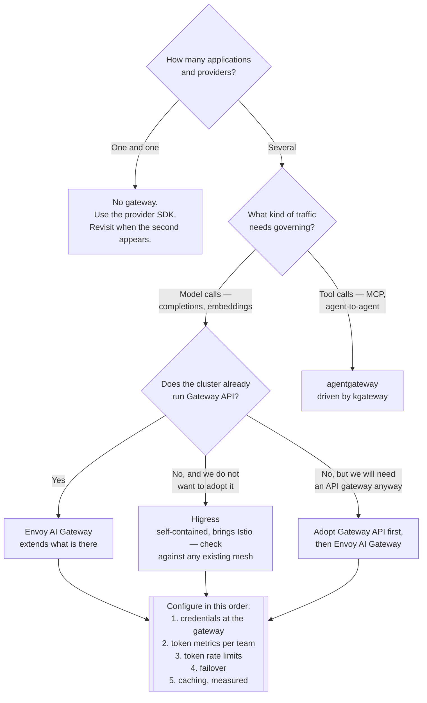

[← AI](../README.md)

# AI gateway

One hop between every application and every model provider — for keys, routing, limits, caching
and the question of who spent what.

Subfolders: [`agentgeteway/`](agentgeteway/README.md) ·
[`envoy-ai-gateway/`](envoy-ai-gateway/README.md) · [`envoyproxy/`](envoyproxy/README.md) ·
[`higress/`](higress/README.md)

## Contents

1. [The problem, precisely](#1-the-problem-precisely)
2. [What a gateway centralises](#2-what-a-gateway-centralises)
3. [Tokens, not requests](#3-tokens-not-requests)
4. [Caching, the real cost lever](#4-caching-the-real-cost-lever)
5. [Security, without overclaiming](#5-security-without-overclaiming)
6. [Relationship to the API gateway](#6-relationship-to-the-api-gateway)
7. [The options here](#7-the-options-here)
8. [Decision tree](#8-decision-tree)
9. [Anti-patterns](#9-anti-patterns)
10. [How this applies to pikakube](#10-how-this-applies-to-pikakube)

---

## 1. The problem, precisely

It starts with one application calling one provider, which needs no gateway and should not have
one. It becomes a problem at the point where the following is all true at once:

- Several applications call several providers — a hosted API, a second hosted API for fallback,
  and a self-hosted model on the cluster.
- Each has its own SDK, its own authentication, its own error shapes and its own quota.
- Provider keys are in each application's secrets, which means rotating one is a coordinated
  change across teams.
- The monthly bill is one number, and nobody can decompose it.
- A provider degrades, and every application fails independently and differently.

Each of those is survivable alone. Together they are the argument for putting one hop in the
middle — the same argument as any other gateway, applied to a backend that is metered, expensive
and occasionally unavailable.

The counter-argument is worth stating with equal force: a gateway is a component on the critical
path of every model call. It has to be operated, upgraded and debugged, and when it is down,
everything is down. Two applications and one provider do not justify that.

## 2. What a gateway centralises

| Capability | What it replaces |
|---|---|
| **Provider credentials** | keys in every application's secrets, rotated by coordination |
| **Unified API** | one SDK per provider, and a code change to switch |
| **Routing** | provider selection compiled into each application |
| **Failover** | an outage at one provider becoming an outage in every caller |
| **Rate limiting, in tokens** | request quotas that do not correspond to cost |
| **Caching** | paying twice for the same question |
| **Cost attribution** | one invoice, unallocated |
| **Observability** | per-application logging that does not aggregate |

**Cost attribution is the one that usually pays for the gateway.** Provider invoices arrive by
account or by key, not by team, feature or user. Once every call passes through one hop that
counts tokens and knows who the caller was, "which team spent that, on which model" becomes a
query instead of an argument. That single capability is more often the reason these get deployed
than routing or failover are.

The **unified API** is the second-order benefit and it compounds quietly: when applications
speak one OpenAI-shaped API, swapping a hosted model for a self-hosted [vLLM](../llm/vllm/README.md)
backend — or the reverse — is a gateway configuration change and no application change at all.
That is what makes a self-hosting decision reversible, and reversibility in this area is worth
paying for.

## 3. Tokens, not requests

This is the property that distinguishes an AI gateway from an ordinary API gateway, and it is
not a detail.

An ordinary rate limit counts requests. For LLM traffic that unit is nearly meaningless: one
request may consume a hundred tokens or two hundred thousand, and the cost difference between
them is three orders of magnitude. A limit of "1000 requests per minute" bounds nothing that
matters.

| Limit expressed in | Bounds | Useful for LLM traffic |
|---|---|---|
| Requests per minute | connection volume | barely — protects the gateway, not the budget |
| **Tokens per minute** | actual consumption and cost | yes — this is the unit providers bill in |
| Concurrent requests | queue depth at the backend | yes, for a self-hosted backend's memory |

There is a wrinkle that makes this harder than it looks: **the output token count is not known
until the response is finished.** A gateway can count input tokens up front, but it can only
enforce an output budget by observing the stream and cutting it off, or by accounting after the
fact and applying the debt to the next window. Different implementations choose differently, so
"supports token rate limiting" is a claim to check the mechanics of rather than take at face
value.

Concurrent-request limiting matters separately when the backend is self-hosted: a
[vLLM](../llm/vllm/README.md) server's KV cache memory grows with concurrency, and the failure
mode of exceeding it is not a slow response but an out-of-memory kill.

## 4. Caching, the real cost lever

Two different things are called caching here and they work at different levels.

| Kind | What it matches | Saving | Risk |
|---|---|---|---|
| **Exact-match response cache** | identical request, identical parameters | the whole call | staleness; low correctness risk |
| **Prefix / KV cache** | a shared prompt prefix across different requests | the prefill for the shared part | none to correctness — it is a compute optimisation |
| **Semantic cache** | a *similar* question, by embedding distance | the whole call | real — "similar" is a threshold, and a wrong hit returns the wrong answer |

**Prefix caching is the safe, large win**, and it is largely a property of the serving layer
rather than the gateway: a long system prompt, a fixed set of tool definitions or a retrieved
document repeated across requests is prefill work done once instead of every time. vLLM does
this natively.

**Exact-match caching is safe and narrow.** It helps a great deal where the same question is
genuinely asked repeatedly — internal documentation assistants, classification of repeated
inputs — and not at all for conversational traffic, where no two requests are identical.

**Semantic caching is the one to be careful about.** Returning a cached answer to a
*sufficiently similar* question is a correctness decision made by a similarity threshold. It can
be a large saving and it can also confidently answer a question that was not asked. It is
defensible for narrow, high-repetition, low-stakes traffic and hard to defend anywhere else.

Whatever the mechanism, the metric to publish is the **hit rate alongside the token spend**. A
cache nobody measures is an assumption.

## 5. Security, without overclaiming

Two genuine concerns, and one claim to be sceptical of.

**Data leaving the organisation is a real, solvable problem.** A gateway is the single point
where you can see what is being sent to a third party, log it, redact it, or route particular
traffic to a self-hosted model instead. Without one, "what did we send to which provider" is
unanswerable. This is the strongest security argument for a gateway and it is mostly a
governance and visibility argument rather than a technical control.

**Key containment is real and unglamorous.** Provider keys held by the gateway are not held by
every application, so a compromised application does not yield a provider key, and rotation is
one change. This is the same benefit any credential proxy provides.

**Prompt-injection filtering at the gateway is the claim to be sceptical of.** Gateways can run
moderation and pattern-matching plugins on prompts and responses, and those catch some things —
obvious data patterns, known jailbreak strings, categories of content. What they cannot do is
solve prompt injection, because injection is not a pattern. It is instruction-shaped text
arriving through content the model was asked to read, and no filter reliably distinguishes
"instructions the user gave" from "instructions embedded in a document the agent fetched".

The gateway's honest role in that is **containment, not prevention**: limit what credentials
flow through it, log everything, and keep the destructive capability behind an approval step in
the application. See [`../agents/`](../agents/README.md), section 4, for where injection
actually bites. Broader controls live in [`security/`](../../security/README.md).

## 6. Relationship to the API gateway

An AI gateway is an API gateway with three additions: it understands the provider APIs well
enough to translate between them, it counts tokens, and it can cache at the level of a
completion. Everything else — routing, TLS, authentication, retries, observability — is what a
normal gateway already does.

That is why the strongest options here are built on Envoy rather than written from scratch, and
why they are usually deployed as an extension of a Gateway API control plane rather than beside
one. In this repository the neighbouring concerns are
[`network/gateway-api/`](../../network/gateway-api/README.md) for the API itself and
[`network/api-gateway/`](../../network/api-gateway/README.md) for the implementations.

The practical rule: **do not run a second gateway if you already have one.** Two data planes on
the same cluster means two upgrade cycles, two sets of policy and a debugging question every
time a request behaves unexpectedly. Extend what is there.

## 7. The options here

| Option | What it is | Pick it when |
|---|---|---|
| [Envoy AI Gateway](envoy-ai-gateway/README.md) | an extension of Envoy Gateway, from the Envoy project | you run, or will run, Gateway API — the default choice |
| [`envoyproxy/`](envoyproxy/README.md) | the same project, in a second folder | never; it duplicates the above |
| [Higress](higress/README.md) | Alibaba's complete Envoy/Istio gateway with an AI mode and WASM plugins | you have no Gateway API installation to extend, and want its plugins |
| [agentgateway](agentgeteway/README.md) | agent-facing data plane — MCP and agent-to-agent traffic — driven by kgateway | the traffic is tool calls and agent-to-agent, not provider calls |

Two notes on the folder layout, recorded as observations rather than changes:

**`agentgeteway/` is a typo** for `agentgateway`. Its manifests also install kgateway rather than
agentgateway — the control plane, not the data plane it drives.

**`envoyproxy/` and `envoy-ai-gateway/` are the same project.** One holds the GitHub link, the
other holds the deployment.

## 8. Decision tree

## 9. Anti-patterns

| Anti-pattern | Why it is bad | What to do instead |
|---|---|---|
| A gateway for one application and one provider | a critical-path component with nothing to centralise | the provider SDK; add the gateway at the second consumer |
| A second gateway alongside an existing one | two data planes, two upgrade cycles, ambiguous request paths | extend the gateway already running |
| Rate limiting by requests | one request can cost a thousand times another | limit tokens; add concurrency limits for self-hosted backends |
| Provider keys still in applications after deploying a gateway | the containment benefit is zero and rotation is still coordinated | keys at the gateway only, and remove them from the applications |
| No per-team token metrics | the bill remains one unattributable number | attribute at the gateway, where the identity of the caller is known |
| Semantic caching on correctness-sensitive traffic | a similarity threshold decides whether the answer is right | exact-match and prefix caching; semantic only where repetition is high and stakes are low |
| Treating the gateway as prompt-injection protection | filters catch patterns; injection is not a pattern | containment — least privilege, approval on side effects, full logging |
| No failover configured | a provider incident is your incident | a second backend, and test that the failover path works |
| Gateway deployed with empty values and no routes | the capability exists and does nothing, which reads as done | configure backends and limits, or record it as not yet adopted |
| Requests logged with full prompts and no retention policy | a new store of whatever users typed | decide retention deliberately; see the observability note in [Langfuse](../agents/langfuse/README.md) |

## 10. How this applies to pikakube

**[Envoy AI Gateway](envoy-ai-gateway/README.md) is deployed**, at `v0.6.0` — CRDs and control
plane as two `HelmRelease` resources, correctly ordered with `dependsOn`, into the
`envoy-gateway` namespace alongside Envoy Gateway rather than in a namespace of its own. That is
the right choice for this cluster and the right shape for it.

**It is deployed with empty values, so nothing is routed through it yet.** No backends, no
credentials, no token limits. The capability is installed; the configuration is the work that
remains, and it is the work that produces all the benefits in section 2.

**kgateway is also deployed**, at `v2.1.1`, from the folder named for
[agentgateway](agentgeteway/README.md). Two observations from those manifests: the main release
does not declare `dependsOn` the CRD release, unlike the Envoy AI Gateway pair — so the first
reconciliation can fail noisily before converging — and the charts are pinned by tag without a
digest, where kagent's are pinned by digest. Both are small consistency fixes.

**That leaves two gateway control planes installed for overlapping jobs.** Envoy AI Gateway for
provider traffic and kgateway for agent traffic is a defensible split, but it is worth deciding
explicitly rather than by accumulation — particularly since kgateway is a full Gateway API
control plane in its own right.

**[Higress](higress/README.md) is mapped, not deployed**, which is correct given the above.
Adopting it would mean a third gateway.

**The first thing worth configuring is cost attribution**, before routing or failover. There is
a self-hosted [Ollama](../llm/ollama/README.md) backend on the cluster and
[kagent](../agents/kagent/README.md) calling it; putting that traffic through the gateway makes
token consumption per caller visible, and it does so before any provider key is ever introduced —
which is the cheapest possible moment to establish the habit.

---

[← AI](../README.md)
