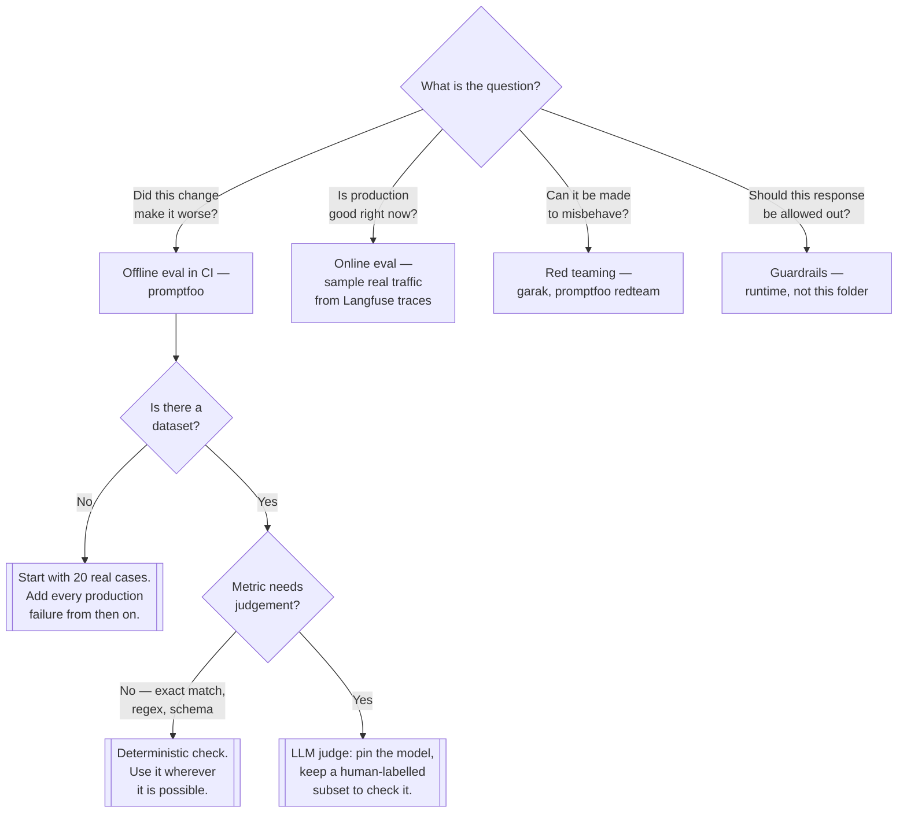

[← AI](../README.md)

# Evaluation

Deciding whether the output is any good — the capability that replaces unit tests once a model is
in the request path.

Tools covered: [`promptfoo/`](promptfoo/README.md)

## Contents

1. [Why this is a folder and not a test suite](#1-why-this-is-a-folder-and-not-a-test-suite)
2. [Four things called evaluation](#2-four-things-called-evaluation)
3. [What a usable eval set looks like](#3-what-a-usable-eval-set-looks-like)
4. [The judge problem](#4-the-judge-problem)
5. [Decision tree](#5-decision-tree)
6. [Anti-patterns](#6-anti-patterns)
7. [How this applies to pikakube](#7-how-this-applies-to-pikakube)

---

## 1. Why this is a folder and not a test suite

[`ai/`](../README.md) section 4 lists four properties that make this discipline different. The
fourth — **correctness has no oracle** — is the one that creates this folder.

An ordinary service has assertions. `expect(total).toBe(42)` either passes or it does not, and CI
is built on that being true. A feature built on a model has a *distribution* of outputs and a
judgement about whether they are good enough. Nothing about the existing testing stack survives
that change intact:

| Ordinary software | Here |
|---|---|
| assertion passes or fails | a score, against a threshold someone chose |
| a failing test blocks the merge | a 3% regression on one metric — is that a block? |
| a bug reproduces | the same input may not produce the same output twice |
| the test suite is the spec | the eval set is a sample, and it is always incomplete |

The consequence is that quality has to be **measured continuously and deliberately**, because
nothing else will surface a regression. A prompt edit, a model version bump, a retrieval change or
a provider silently updating a model behind the same name all ship the same way: green pipeline,
worse product, discovered by users.

## 2. Four things called evaluation

The word covers four different activities, and conflating them is why teams think they have this
covered when they do not.

| | Question | When it runs | Looks like |
|---|---|---|---|
| **Offline eval** | is this version better than the last one? | on every prompt or model change | a fixed dataset, scored, in CI |
| **Online eval** | is production actually good? | continuously | sampled real traffic, scored or reviewed |
| **Red teaming** | can this be made to misbehave? | before release, then periodically | adversarial probes, not a quality score |
| **Guardrails** | should this specific response be allowed out? | on every request | a runtime check in the path |

The first two answer *is it good*. The third answers *is it safe*, which is the question in
[`security/0-governance/supply-chain/ml/`](../../security/0-governance/supply-chain/ml/README.md),
and the fourth is enforcement rather than measurement — it belongs in the request path, not in CI.

A team with guardrails and no offline eval has confused refusing bad output with knowing whether
the output is good.

## 3. What a usable eval set looks like

The tooling is the easy half. The dataset is the work, and it is the part that cannot be bought.

- **It starts small and real.** Twenty cases from actual usage beat two hundred invented ones, and
  the invented ones tend to encode the assumptions that were already wrong.
- **Every production failure becomes a case.** This is the single habit that compounds. It is the
  regression test of this discipline, and it is the only way the set grows in the right direction.
- **It is versioned next to the prompt.** Prompt, eval set and results in the same repository, so a
  change and its effect on quality are reviewable as one diff.
- **It is not all one kind of case.** The easy path, the ambiguous input, the out-of-scope request
  that should be refused, the adversarial one. A set of only happy paths scores high and says
  nothing.
- **A score is only meaningful relative to the previous score.** Absolute numbers are not
  comparable across metrics, models or datasets; the delta is the signal.

## 4. The judge problem

Most metrics worth having — *is this answer grounded in the retrieved context*, *is it helpful*,
*does it follow the instruction* — cannot be computed by string comparison, so they are scored by
another model. That works, and it has three specific weaknesses to hold in mind:

- **The judge is also non-deterministic.** Score the same pair twice and the numbers may differ.
  Pinning the judge model and its temperature is the minimum.
- **The judge has biases.** Longer answers, more confident phrasing and its own family's outputs
  tend to score higher, independent of quality.
- **It drifts under you.** A hosted judge model updated behind the same name moves every historical
  score. If comparability across months matters, the judge needs pinning like any other dependency.

The counterweight is cheap: keep a small **human-labelled** subset and check periodically that the
judge still agrees with it. When it stops agreeing, the metric stopped measuring what it did.

## 5. Decision tree

## 6. Anti-patterns

| Anti-pattern | Why it is bad | What to do instead |
|---|---|---|
| No eval at all, shipping prompt changes on a vibe | quality regressions are invisible until users find them | twenty cases and a threshold, today |
| The eval set written entirely by the feature's author | it encodes the same assumptions the prompt does | real traffic, and every reported failure |
| Judge model unpinned | scores move when the provider updates the model, and nothing in your repository changed | pin it; treat it as a dependency |
| Trusting the judge without ever checking it | the metric can stop measuring what it claims to | a human-labelled subset, re-checked periodically |
| An LLM judge for something a regex could check | slower, more expensive and less reliable than the deterministic version | deterministic checks wherever the answer has a shape |
| Red teaming treated as the eval | it answers a different question and says nothing about quality | both, and know which is which |
| A score with no threshold and no owner | a number nobody acts on is a dashboard, not a gate | a threshold in CI, and someone who decides when it moves |
| Evaluating only the model | most regressions in a RAG system come from retrieval | evaluate the pipeline, and the retrieval step separately |

## 7. How this applies to pikakube

This folder exists because [`ai/`](../README.md) said, in its own notes, that evaluation was *"the
capability this repository is missing entirely: nothing here yet defines what a good answer is for
any deployed component"*. One tool with manifests is a start on that, not an answer to it.

[promptfoo](promptfoo/README.md) has a `GitRepository` and a `HelmRelease` — deployed as the
results viewer, which is the smaller half of what it does. The part that matters runs in CI against
a config file, and there is no such config in this repository yet, for a reason worth stating: none
of the AI components here — [Ollama](../llm/ollama/README.md),
[LiteLLM](../ai-gateway/litellm/README.md), the agent frameworks — has a defined task to be
evaluated *on*. An eval set needs a job to be good at.

What is adjacent and already here:

- [Langfuse](../agents/langfuse/README.md) — tracing, and the source of the real cases that should
  seed the first dataset. Online eval starts by sampling what it already records.
- [garak](../README.md#76-evaluation) — the red-teaming half, recorded as a note.
- [`security/0-governance/supply-chain/ml/`](../../security/0-governance/supply-chain/ml/README.md)
  — guardrails and model provenance, the runtime layer this folder does not cover.

---

[← AI](../README.md)
