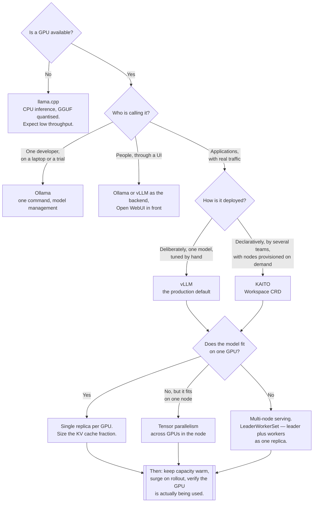

[← AI](../README.md)

# LLM

Model serving — turning weights on disk into an endpoint, on hardware that is scarce and
expensive.

Subfolders: [`kaito/`](kaito/README.md) · [`llama-ccp/`](llama-ccp/README.md) ·
[`llmkube/`](llmkube/README.md) · [`ollama/`](ollama/README.md) ·
[`ollama/open-webui/`](ollama/open-webui/README.md) · [`vllm/`](vllm/README.md)

## Contents

1. [What model serving actually is](#1-what-model-serving-actually-is)
2. [The two mechanisms that decide throughput](#2-the-two-mechanisms-that-decide-throughput)
3. [GPUs on Kubernetes](#3-gpus-on-kubernetes)
4. [Cold start, and why it changes the deployment model](#4-cold-start-and-why-it-changes-the-deployment-model)
5. [Quantisation, the fitting lever](#5-quantisation-the-fitting-lever)
6. [KV cache, the sizing lever](#6-kv-cache-the-sizing-lever)
7. [Self-host or call an API](#7-self-host-or-call-an-api)
8. [The options here](#8-the-options-here)
9. [Decision tree](#9-decision-tree)
10. [Anti-patterns](#10-anti-patterns)
11. [How this applies to pikakube](#11-how-this-applies-to-pikakube)

---

## 1. What model serving actually is

A language model is a large array of numbers and a program that multiplies them. Serving it
means holding those numbers in memory close to a processor that can do the arithmetic quickly,
and answering requests without reloading them.

Two phases per request, and they have different characteristics:

| Phase | What happens | Bound by |
|---|---|---|
| **Prefill** | the whole prompt is processed at once | compute — it parallelises well |
| **Decode** | one token generated at a time, each depending on the last | memory bandwidth — it does not parallelise across the sequence |

Almost every serving optimisation is an attack on the decode phase, because that is where the
time goes and because generating one token at a time uses a fraction of the hardware's compute.
The way to fix that is to have the GPU work on **many sequences at once**, so its parallelism is
used even though each individual sequence is sequential.

This folder is the **serving** side of the model lifecycle. Training, fine-tuning, experiment
tracking and the model registry are `mlops/` — see the [parent folder](../README.md) for that
boundary, which is genuinely blurry exactly here.

## 2. The two mechanisms that decide throughput

Nearly all of the difference between a naive server and a good one comes from two ideas, both
popularised by [vLLM](vllm/README.md).

**Continuous batching.** Static batching collects N requests, runs them together, and waits for
the slowest to finish before starting the next batch. Short requests wait behind long ones and
the GPU idles between batches. Continuous batching operates per token step: a finished sequence
leaves and a queued request joins immediately. The batch is topped up rather than drained and
refilled.

**PagedAttention.** Every generated token keeps attention key/value tensors for the rest of the
sequence — the KV cache. Allocating a contiguous block sized for the maximum possible sequence
length wastes almost all of it, since most sequences are far shorter, and fragments the rest.
PagedAttention stores the cache in fixed-size non-contiguous blocks with a lookup table, so
memory is allocated as tokens are actually produced.

The second has a consequence that is easy to miss and is worth as much as the memory saving:
because blocks are indirected, **identical prefixes can share physical blocks**. Many requests
with the same system prompt, the same tool definitions or the same retrieved document reference
the same memory instead of each holding a copy. That is prefix caching, and it cuts both memory
and time-to-first-token for workloads with a large shared preamble — which describes most agent
and RAG traffic.

The practical effect of the two together is a large multiple in throughput per GPU over naive
serving, which is the same statement as a proportionally lower cost per token. That is why vLLM
is the production default and why the other options in this folder are chosen for reasons other
than throughput.

## 3. GPUs on Kubernetes

Kubernetes schedules CPU and memory natively. GPUs are an extended resource, and the differences
are the source of most surprises.

| Fact | Consequence |
|---|---|
| A **device plugin** must be installed | without it the node advertises no GPU and pods stay `Pending` with no obvious cause |
| GPUs are requested as an integer resource | you cannot request half a GPU by default |
| **A GPU is not shared between pods by default** | one pod holds the whole card, even if it uses 10% of it |
| Requests and limits must be equal | GPUs are not compressible; there is no throttling, only exclusive assignment |
| Node labels describe the model of GPU | scheduling to the right hardware is a `nodeSelector` or affinity problem, not automatic |
| The container needs the right driver and toolkit | a mismatch usually degrades to CPU **silently**, not to an error |

**The non-shareability is the one that drives cost.** A single card assigned exclusively to a pod
that is idle most of the time is the most common way to waste money in this folder. There are
mechanisms to subdivide a card — time-slicing, MPS, and hardware partitioning on some models —
but each has real trade-offs around isolation and memory, and none is on by default. The simpler
answer is usually the right one: **run one serving process that batches many requests**, rather
than many processes each holding a card. That is exactly what continuous batching is for, and it
is why the serving engine choice and the GPU cost question are the same question.

**The silent CPU fallback deserves its own habit.** When a model responds but is inexplicably
slow, check that the GPU is being used at all before concluding anything about the model —
`nvidia-smi` inside the pod settles it in one command.

## 4. Cold start, and why it changes the deployment model

Model weights are large. They must be fetched to the node and loaded into device memory before
the first request can be served. Depending on model size and where the weights come from, that
is anywhere from tens of seconds to many minutes, and it happens on every pod restart, every
rollout, every node replacement and every scale-up.

This breaks the reflex that Kubernetes makes cheap for stateless services:

| Reflex | Why it fails here |
|---|---|
| Scale to zero when idle | the first request after zero waits for the whole load |
| Scale up on a latency spike | new capacity arrives long after the spike |
| Roll out frequently | every rollout is a full reload of every replica |
| Let the scheduler move pods freely | a rescheduled inference pod is minutes of unavailability |

What to do instead: keep warm capacity and treat scale-up as slow and planned; use surge
rollouts so the old replica serves until the new one is loaded; put weights where they load fast
— a node-local cache or a fast volume rather than pulling from the internet each time; and set
readiness probes that account for load time so traffic is not sent to a pod that is still
loading.

Scale-to-zero is not always wrong — for a genuinely intermittent internal tool it is the right
economics, and the first user waits. It just has to be a decision, not a default.

## 5. Quantisation, the fitting lever

Weights are normally 16-bit floats. Quantisation stores them at lower precision, most commonly
around 4 bits, cutting the memory they occupy roughly proportionally.

This is the primary lever for **fitting a model onto the hardware you actually have**. It is
what makes a model that nominally needs multiple data-centre GPUs run on one, and what makes
local models on a laptop possible at all — see [llama.cpp](llama-ccp/README.md), whose GGUF
format is the de facto standard for distributing quantised weights.

The trade is real and should be stated plainly rather than waved through:

| | Effect |
|---|---|
| Memory | falls roughly in proportion to the bit width |
| Speed | usually improves, since decode is memory-bandwidth bound |
| Quality | degrades, and **not uniformly** |

The non-uniformity is the important part. Casual conversation survives aggressive quantisation
better than reasoning, code generation, long-context work and precise instruction-following do.
A quantised model can look fine in a demo and fail at the task you actually deployed it for. If
quantisation is used to fit a model onto available hardware — which is a legitimate and common
reason — evaluate it on the real task before accepting the saving.

The alternative lever is a **smaller model at full precision**, and it is frequently the better
trade. A smaller model that was trained at that size often outperforms a heavily quantised
larger one at the same memory footprint. Test both rather than assuming bigger-and-squashed
wins.

## 6. KV cache, the sizing lever

The weights are not the whole memory budget, and forgetting this is the standard sizing mistake.

```
GPU memory = model weights + KV cache + activations and overhead
```

The KV cache grows with **concurrency × context length**. Weights are a fixed cost you can
calculate exactly; the KV cache is a variable cost that depends on traffic. A deployment sized
for the weights alone works perfectly in testing and runs out of memory the first time real
concurrency arrives.

Three consequences:

- **Maximum context length is a capacity decision, not a feature flag.** Doubling the advertised
  context doubles the worst-case cache per sequence.
- **Concurrency has a hard ceiling** set by memory, not by CPU. Past it, requests must queue —
  which is why concurrency limits at the [gateway](../ai-gateway/README.md) protect a
  self-hosted backend in a way that request-rate limits do not.
- **Prefix sharing reduces it**, which is the second reason PagedAttention matters.

vLLM pre-reserves a configurable fraction of GPU memory for the cache. Setting it too low means
low concurrency on a half-empty card; too high means out-of-memory. It is worth calculating
rather than defaulting.

## 7. Self-host or call an API

The honest comparison, because self-hosting is often adopted for reasons that do not survive
contact with the invoice.

| Self-host when | Call a hosted API when |
|---|---|
| Data must not leave the organisation | that is not a constraint |
| Volume is high and **sustained** | traffic is spiky or low |
| A specific open-weights model is required | frontier quality is what matters |
| Latency to a nearby GPU beats a network round trip | ordinary latency is fine |
| Costs must be fixed and predictable | pay-per-token suits variable demand |

The economics in one sentence: **a GPU costs the same whether it is busy or idle**, so
self-hosting beats per-token pricing only above a utilisation threshold. Continuous batching
lowers that threshold substantially; it does not remove it. Work out the crossover point with
real numbers before assuming self-hosting is cheaper — and include the operational cost, which
is a person's attention, not just the instance.

The strongest reasons to self-host are usually **data residency** and **model control**, not
price. Those are good reasons on their own and do not need the cost argument to be true.

A gateway makes this decision reversible: if applications speak one API through
[`../ai-gateway/`](../ai-gateway/README.md), moving traffic between a hosted provider and a
self-hosted backend is a configuration change.

## 8. The options here

| Option | What it is | Pick it when |
|---|---|---|
| [vLLM](vllm/README.md) | the production serving engine — continuous batching, PagedAttention | anything with real users on a GPU. **The default.** |
| [Ollama](ollama/README.md) | developer experience — one command to a running model | local development, trials, low-traffic internal tools |
| [llama.cpp](llama-ccp/README.md) | CPU and GGUF quantised inference | no GPU, edge nodes, laptops |
| [KAITO](kaito/README.md) | Kubernetes operator — model deployment as a CRD, with node provisioning | declarative model deployment where nodes should appear on demand |
| [llmkube](llmkube/README.md) | recorded as a pointer; not evaluated | after checking what it runs underneath and who maintains it |
| [Open WebUI](ollama/open-webui/README.md) | chat front end for any OpenAI-compatible backend | people, rather than applications, need to use the model |

Two folder-name observations, recorded rather than changed: `llama-ccp/` is a typo for
`llama.cpp`, and Open WebUI is filed under `ollama/` although it works with any OpenAI-compatible
backend.

## 9. Decision tree



## 10. Anti-patterns

| Anti-pattern | Why it is bad | What to do instead |
|---|---|---|
| Ollama as a production server | not built around batching throughput; it degrades under concurrency | [vLLM](vllm/README.md) once there is more than a trickle of traffic |
| Sizing GPU memory for the weights only | the KV cache grows with concurrency; it works in testing and dies in production | budget weights plus cache plus overhead, and set the cache fraction deliberately |
| Scale to zero for a latency-sensitive endpoint | the first request pays the full model load | warm capacity; scale to zero only where waiting is acceptable |
| One pod per GPU per small model | a card is exclusive, so idle models hold whole GPUs | one server batching many requests; consolidate models |
| Aggressive quantisation accepted without evaluation | quality degrades unevenly, and demos hide it | evaluate on the real task; consider a smaller full-precision model instead |
| Assuming the GPU is being used | a driver or runtime mismatch falls back to CPU silently | check `nvidia-smi` in the pod before blaming the model |
| Self-hosting justified by cost without a utilisation estimate | an idle GPU costs the same as a busy one | calculate the crossover; residency and control are better reasons |
| Applications calling the model server directly | swapping backends becomes an application change in every repository | one OpenAI-compatible surface via [`../ai-gateway/`](../ai-gateway/README.md) |
| Frequent rollouts of inference deployments | every rollout reloads every replica | batch changes; surge rather than recreate |
| No concurrency limit in front of a self-hosted backend | exceeding the KV cache is an OOM kill, not a slow response | concurrency limits at the gateway |
| Weights pulled from the internet on every start | cold start becomes minutes of network transfer | a local registry, a cache, or a pre-populated volume |

## 11. How this applies to pikakube

**What is deployed is [Ollama](ollama/README.md), not [vLLM](vllm/README.md).** The community
`ollama` chart at `0.21.1` in the `ollama` namespace, with chart defaults. That is a reasonable
place to be: it proves the path end to end, requires no provider key, and keeps everything in
the cluster.

**It is also a dependency, which raises the stakes.** [kagent](../agents/kagent/README.md) is
configured to use it as the default model provider — `llama3.2` at
`http://ollama.ollama.svc.cluster.local:11434`. So the agent platform runs on a
developer-experience inference server with default values. It works, and it is precisely where
the Ollama-versus-vLLM distinction stops being theoretical: agent quality is capped by a small
model, and concurrency is capped by this server. **vLLM is the named gap for anything with real
users.**

**Empty chart values leave two questions open** for Ollama: whether model storage is persistent —
without it every restart re-pulls every model, which is the cold-start problem made worse on
purpose — and whether a GPU is requested at all.

**[Open WebUI](ollama/open-webui/README.md) is deployed at `3.6.0` and its source configuration
looks wrong**: its `HelmRepository` points at `https://otwld.github.io/ollama-helm/`, the Ollama
chart repository, rather than the Open WebUI charts. Two `HelmRepository` resources with
different names and the same URL is the signature of a copy-paste. Worth checking whether that
release reconciles at all.

**[KAITO](kaito/README.md) is deployed at `v0.4.4`** from a `GitRepository` restricted to
`/charts/kaito`, in the `kaito` namespace, with empty values. Its example `Workspace` requests
`phi-3.5-mini-instruct` on `Standard_NC24ads_A100_v4` — an Azure VM SKU. On a non-Azure cluster
that instance type means nothing and node provisioning will not happen, so that example is the
first thing to change if KAITO is evaluated here for real.

**[vLLM](vllm/README.md), [llama.cpp](llama-ccp/README.md) and [llmkube](llmkube/README.md) are
mapped, not deployed.** llama.cpp is nonetheless load-bearing indirectly: Ollama uses it
underneath and serves GGUF models, so the quantisation trade-offs in section 5 apply to what is
already running.

**For models too large for one node**, the Kubernetes primitive is `LeaderWorkerSet` — a leader
pod and its workers treated as a single replica — which lives in
[`devops/advanced-workloads/lws/`](../../devops/advanced-workloads/lws/README.md) in this
repository. Nothing here needs it yet; it is the piece that makes sharded serving a workload
rather than a hand-assembled cluster when something does.

---

[← AI](../README.md)
