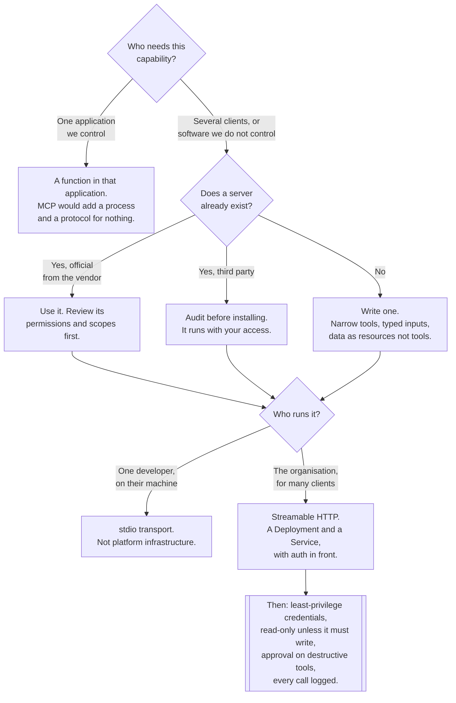

[← AI](../README.md)

# MCP — Model Context Protocol

One protocol between LLM applications and the tools and data they use, so a server is written
once instead of once per framework.

## Contents

1. [The problem it solves](#1-the-problem-it-solves)
2. [The shape of it](#2-the-shape-of-it)
3. [Transports, and what they mean on Kubernetes](#3-transports-and-what-they-mean-on-kubernetes)
4. [Security, stated plainly](#4-security-stated-plainly)
5. [When MCP earns its place](#5-when-mcp-earns-its-place)
6. [Decision tree](#6-decision-tree)
7. [Anti-patterns](#7-anti-patterns)
8. [Notes](#8-notes)
9. [How this applies to pikakube](#9-how-this-applies-to-pikakube)

---

## 1. The problem it solves

An LLM by itself can only produce text. Everything useful comes from connecting it to something
— a database, a ticket system, a repository, a monitoring API. Before MCP, each of those
connections was written against whatever plugin format the framework in use happened to define.
Six frameworks meant six implementations of the same integration, each drifting independently.

MCP is the standardisation of that boundary. It is a protocol — JSON-RPC over a transport —
between an **application that hosts a model** and a **server that exposes capabilities**. Write
the server once, and any client that speaks MCP can use it.

That is the whole argument, and it is the same argument as every protocol standard: it converts
an N × M problem into N + M. It is worth being clear that this is a **plumbing** benefit, not a
capability benefit. MCP does not make a model better at using tools. It makes the tool
integration reusable.

The corollary is the honest limit: **if there is one application and one integration, MCP adds
a process boundary and a protocol for nothing.** A function call is simpler. MCP starts paying
when the same capability is needed by more than one client, or when the client is somebody
else's software — a coding assistant, a desktop application, an agent platform — that you cannot
add a function to.

## 2. The shape of it

Three roles:

| Role | What it is |
|---|---|
| **Host** | the application the user interacts with, which holds the model |
| **Client** | the connector inside the host, one per server |
| **Server** | the process exposing capabilities — your code, or somebody's |

And the capabilities a server exposes, which are deliberately not all "tools":

| Primitive | What it is | Controlled by |
|---|---|---|
| **Tools** | actions the model can invoke, with typed inputs | the model decides when to call |
| **Resources** | data the host can read — files, records, documents | the application, or the user, decides what to include |
| **Prompts** | reusable templates the user can invoke | the user chooses |

**The tools/resources distinction is worth taking seriously** because it is where a lot of MCP
server design goes wrong. A tool is something the model chooses to invoke. A resource is
something the application supplies as context. Exposing a read-only data lookup as a tool means
handing the model the decision of whether to fetch it; exposing it as a resource means the
application decides. The second is more predictable and should be the default for anything that
is simply data.

## 3. Transports, and what they mean on Kubernetes

Two transports matter, and the difference is not cosmetic — it decides whether an MCP server is
a Kubernetes workload at all.

| Transport | Shape | Where it runs |
|---|---|---|
| **stdio** | the host launches the server as a subprocess and speaks over its standard streams | the same machine as the host — a laptop, a container |
| **Streamable HTTP** | an ordinary HTTP endpoint | anywhere — a Service in the cluster |

**stdio servers are not deployable infrastructure.** They are launched, one per host process,
with the host's own privileges, and they die with it. That is entirely appropriate for a
developer's coding assistant and it is not something a platform runs.

**HTTP servers are ordinary services**, and everything a platform already knows applies: a
Deployment, a Service, authentication in front, network policy, resource limits, metrics,
horizontal scaling. This is the form in which MCP becomes a platform concern rather than a
developer-tooling concern — one team runs the server for a data source, and every agent and
assistant in the organisation connects to the same one, with access control in one place.

For HTTP servers the specification defines an authorisation flow based on OAuth. It has moved
more than once, so check the revision your client and server implement rather than assuming they
match — mismatched auth expectations are the most common reason a server that works locally
fails when it is deployed.

An [AI gateway](../ai-gateway/README.md) can also front MCP servers, which is the reason the
Envoy AI Gateway MCP documentation is bookmarked in this repository and the reason
[agentgateway](../ai-gateway/agentgeteway/README.md) exists at all: one endpoint federating many
MCP servers, with authorisation and observability on tool calls at the proxy rather than in
every client.

## 4. Security, stated plainly

An MCP server is **code the model can decide to run**. That single sentence contains the whole
threat model, and it is worth not softening.

| Concern | What it means |
|---|---|
| **The model chooses** | which tool runs, and with what arguments, is decided at runtime by a probabilistic system |
| **Injection through content** | anything the model reads — a document, a page, another tool's output — can contain instructions it follows |
| **Confused deputy** | the server acts with *its* credentials on behalf of whoever asked, which may be untrusted content |
| **Tool description as attack surface** | descriptions are part of the prompt; a malicious server can influence behaviour through them |
| **Third-party servers** | installing one from a directory is running someone else's code with your access |
| **Aggregation** | a server that can read three systems can correlate what none of them individually exposes |

The combination that causes real damage is specific and avoidable: **a server that reads
untrusted external content, and also holds a credential that can change something.** Injected
instructions in the content get the credential. Splitting those into two servers with different
privileges removes the class of problem entirely, and costs almost nothing.

The controls that actually work:

| Control | Why |
|---|---|
| Read-only by default | most useful servers only need to look things up |
| Least privilege per server | the blast radius is the credential, not the platform |
| Human approval before destructive tools | the only reliable check on a runtime decision |
| Narrow, specific tools rather than a generic one | `run_arbitrary_sql` is not a tool, it is an interactive session |
| Servers audited before installation | especially anything from a public directory |
| Every tool call logged with its arguments | the only way to answer what happened afterwards |
| Untrusted content and write access never in the same server | see above; this is the important one |

The generic version of the last point is in [`../agents/`](../agents/README.md), section 4 — MCP
is the mechanism through which most of it arrives.

## 5. When MCP earns its place

| Use MCP when | Do not when |
|---|---|
| The same capability is needed by several clients | one application, one integration — call the function |
| The client is software you do not control | the tool is internal to your own agent's code |
| Access to a data source should be governed centrally | governance is already handled inside the one caller |
| A capability should outlive the framework using it | the framework choice is settled and permanent |
| A coding assistant needs to reach your systems | the assistant already has a native integration that works |

## 6. Decision tree

## 7. Anti-patterns

| Anti-pattern | Why it is bad | What to do instead |
|---|---|---|
| An MCP server for one internal caller | a process boundary and a protocol buying nothing | a function call; adopt MCP at the second consumer |
| A third-party server installed without review | it runs with your credentials and your network access | audit it; prefer official servers from the system's vendor |
| One server holding every credential | any injection reaches everything | one server per system, least privilege each |
| Untrusted content and write access in the same server | injected instructions inherit the write credential | split them; this is the failure that causes real damage |
| A generic `execute_query` or `run_command` tool | the model has an interactive shell, not a tool | narrow, specific, typed operations |
| Everything exposed as a tool | the model decides when to fetch data it did not need | resources for data, tools for actions |
| Destructive tools with no approval step | a runtime decision has already committed the change | human in the loop before writes and deletes |
| Tool calls not logged | there is no record of what was done or why | log every call with arguments and result |
| Assuming stdio servers are deployable | they are subprocesses of a host, with its privileges | HTTP transport for anything shared |
| Tool descriptions treated as documentation | they are part of the prompt and shape behaviour | write them as instructions, and review them as such |
| A server's auth revision assumed to match the client's | the specification has moved; this fails at deployment, not locally | check both against the same revision |

## 8. Notes

Everything recorded in the original notes for this folder, with what each one is:

**The specification and reference implementations**

- <https://github.com/modelcontextprotocol/modelcontextprotocol> — the specification itself. The
  authority for what the protocol actually says, including the transport and authorisation
  revisions mentioned in section 3. Worth reading before building a server; it is short.
- <https://github.com/modelcontextprotocol/servers> — the reference servers. Two uses: working
  examples to copy, and a set of ready-made integrations for common systems.
- <https://github.com/modelcontextprotocol/python-sdk> — the official Python SDK, for both
  clients and servers.
- <https://github.com/modelcontextprotocol/inspector> — a developer tool for testing a server
  interactively: connect to it, list its tools and resources, call them and see the raw
  exchange. This is the equivalent of Postman for MCP and it is the fastest way to find out
  whether a problem is in the server or in the client.

**Building servers**

- <https://github.com/jlowin/fastmcp> — a higher-level Python framework for writing MCP servers
  with less boilerplate than the raw SDK. Its approach influenced the official SDK, so the two
  look similar; check which one a given example targets.
- <https://github.com/googleapis/genai-toolbox> — Google's toolbox for exposing databases to
  models. It matters here as the answer to the `run_arbitrary_sql` anti-pattern: rather than
  handing the model a SQL console, queries are defined and parameterised in configuration, and
  the model may only invoke those. That is the right shape for database access, and the pattern
  is worth copying whether or not this specific tool is used.

**Finding servers**

- <https://glama.ai/mcp/servers> — a public directory of MCP servers. Useful for discovering
  whether an integration already exists, and precisely the place the audit anti-pattern in
  section 7 is aimed at: a directory listing is not a review, and installing a server is running
  its author's code with your access.

**Concrete servers recorded elsewhere in this discipline.** The [parent folder](../README.md)
notes list a set of specific servers that were being considered — for GitHub, Atlassian,
Terraform, Grafana, dbt, AWS, MotherDuck and OpenMetadata — alongside a plan for using them.
They are kept there because that is where they were written down, and because the plan they
belong to is about spec-driven development rather than about the protocol.

**Nothing is deployed.** This folder contains no manifests and no subfolders. MCP is documented
here as a concept and a set of pointers; there is no MCP server running on the cluster.

## 9. How this applies to pikakube

**Nothing is deployed, but two deployed components already assume MCP exists.**
[kagent](../agents/kagent/README.md) uses MCP-based `ToolServer` resources as the way agents get
tools, and the [Envoy AI Gateway](../ai-gateway/envoy-ai-gateway/README.md) note in this
repository is specifically its MCP capability page. So the protocol is already the assumed
integration point for the agent platform — there are simply no servers yet for it to point at.

**That makes the first MCP server a platform decision rather than an application one**, and it
is worth taking the transport question in section 3 seriously at that moment. A server run as
stdio inside kagent is a private detail; the same server run over HTTP as a Deployment is a
shared capability that every client on the cluster can use, with authentication and logging in
one place. The second costs slightly more to set up and is the one that scales past the first
team.

**The natural first candidates are read-only and cluster-facing**, which is also the safest
possible starting point: querying metrics, reading Kubernetes resources, looking up
documentation. None of them writes anything, so the dangerous combination in section 4 never
arises, and kagent's cluster-facing origins make that exactly the use case it is built for.

**If and when a writing server appears, the rule to have already agreed** is that it does not
also read untrusted external content, and that destructive operations pass through a human. That
is much easier to establish before there is a server than afterwards.

**A gateway in front of MCP servers is worth planning for but not building yet.** With zero
servers there is nothing to federate. With five, one endpoint with authorisation and tool-call
observability is clearly better than five direct connections per client — and the components
that would do it, [Envoy AI Gateway](../ai-gateway/envoy-ai-gateway/README.md) and kgateway, are
already installed.

---

[← AI](../README.md)
