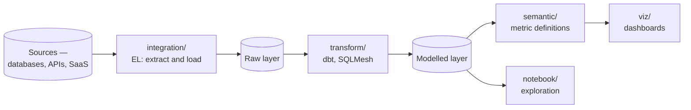

# Analytics Engineering

Getting data in, modelling it in SQL, and putting it in front of people.

## How this folder is organised

One axis: **capability**. Each subfolder answers a distinct question, and a tool is filed by
**where it shines** rather than by everything it can do.

## The map

| Folder | The question it answers |
|---|---|
| [`integration/`](integration/README.md) | how does data get **in**, from the systems that produce it? |
| [`transform/`](transform/README.md) | how is raw data turned into something trustworthy? |
| [`semantic/`](semantic/README.md) | where do metric definitions live, so everyone counts the same way? |
| [`viz/`](viz/README.md) | how do people see it? |
| [`notebook/`](notebook/README.md) | how do analysts and scientists explore it? |
| [`sql/`](sql/README.md) | the language underneath all of it |

## The pipeline

The shape is **ELT, not ETL**, and that ordering is the defining change of the last decade:
load raw data first, transform it afterwards in SQL, in the warehouse. Transformation becomes
version-controlled code rather than logic buried in an ingestion tool.

## Why this is a separate discipline from data engineering

The split is about **who does the work and in what language**:

| | [`data-engineering/`](../data-engineering/README.md) | this folder |
|---|---|---|
| Concerned with | compute at volume, orchestration, distributed processing | modelling, business logic, delivery to people |
| Language | Python, Scala, JVM | **SQL** |
| Owned by | data/platform engineers | analytics engineers |
| Failure looks like | a job that did not run | a number that is wrong |

The second failure mode is the harder one. A pipeline that fails is visible; a metric that
quietly means something different from last quarter is not.

## The semantic layer, and why it exists

The most common failure in this discipline is not technical: **two dashboards disagree about
revenue**, because the definition was written twice, slightly differently.

A [semantic layer](semantic/README.md) puts the definition in one place, versioned, and makes
every consumer derive from it. Without one, metric definitions live scattered across BI tools
and nobody can say which is authoritative.

## Where the boundaries are

| Concern | Where |
|---|---|
| Orchestration, Spark, distributed processing | [`data-engineering/`](../data-engineering/README.md) |
| Streaming ingestion and CDC | [`data-streaming/`](../data-streaming/README.md) |
| Table formats, catalogue, lineage, contracts, quality | [`data-governance/`](../data-governance/README.md) |
| Warehouses and databases themselves | [`databases/`](../databases/README.md) |

Data **quality** in particular lives in `data-governance/` rather than here, even though dbt
tests are where it is usually enforced. The tests are a mechanism; the policy is governance.

## How this applies to pikakube

**dbt, Airbyte and Metabase** are the tools with real experience behind them in this
repository — transformation orchestrated from Airflow, ingestion for small distributed teams,
and cost-effective BI.

The rest is mapped for comparison: SQLMesh as the dbt alternative, the other integration tools,
and the BI options evaluated against Metabase.
