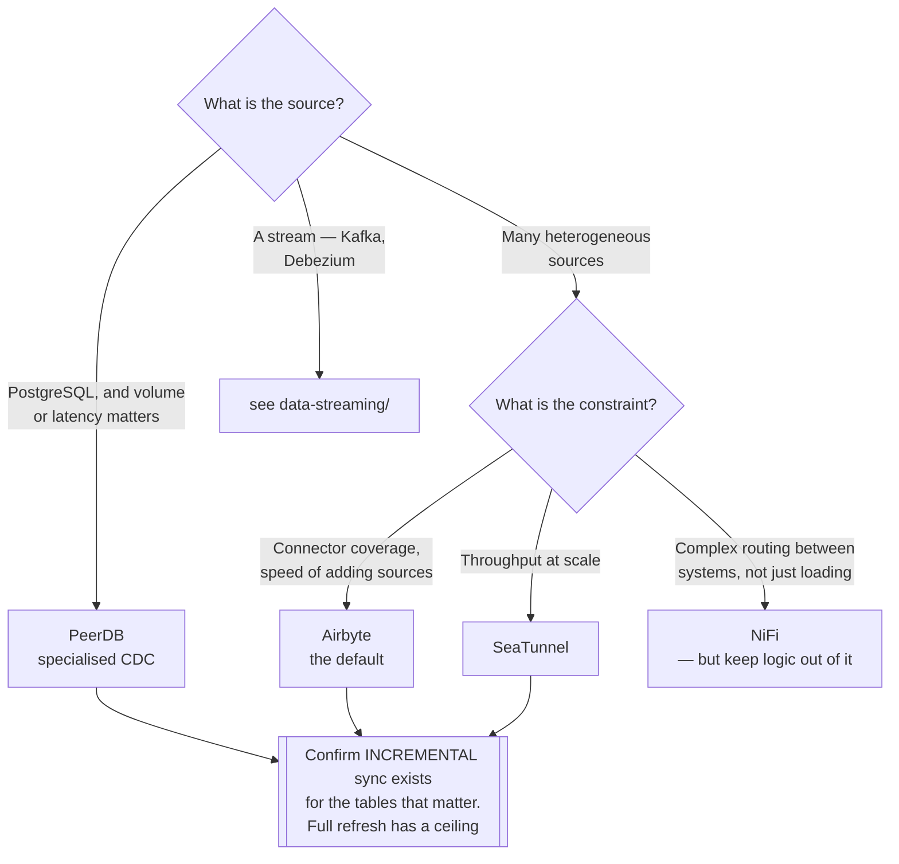

[← Analytics Engineering](../README.md)

# Integration

Getting data **in**, from the systems that produce it.

Tools covered: [`airbyte`](airbyte/README.md) · [`nifi`](nifi/README.md) · [`seatunnel`](seatunnel/README.md) ·
[`peerdb`](peerdb/README.md) · [`inlong`](inlong/README.md)

## Contents

1. [The EL in ELT](#1-the-el-in-elt)
2. [Connectors are the whole product](#2-connectors-are-the-whole-product)
3. [The tools](#3-the-tools)
4. [Decision tree](#4-decision-tree)
5. [Anti-patterns](#5-anti-patterns)
6. [How this applies to pikakube](#6-how-this-applies-to-pikakube)

---

## 1. The EL in ELT

This folder is deliberately the **E** and the **L**, not the T. Extract from a source, load it
raw, and stop — transformation happens afterwards in SQL, in
[`transform/`](../transform/README.md).

That restraint is the point. The moment an ingestion tool also transforms, the logic becomes
invisible: not in Git, not reviewable, not testable, and discoverable only by opening the tool.

Practical rule: **land it raw, transform it downstream.** Type casting and light structuring
are fine; business logic is not.

## 2. Connectors are the whole product

Every tool here is really a **connector catalogue** with a runtime attached. The engineering
question is rarely "can it move data" — it is:

| Question | Why it decides things |
|---|---|
| Does the connector exist? | writing one is a project, not an afternoon |
| Does it support **incremental** sync? | full refresh of a large table daily is unaffordable |
| Does it handle **schema drift**? | sources add columns without asking |
| How does it handle failure mid-sync? | partial loads are worse than none |
| Is state stored reliably? | cursors decide whether resumption works |

Incremental sync is the one that separates viable from unviable at scale. A connector that only
does full refresh has a size ceiling, and you find it late.

## 3. The tools

| Tool | Model | Shines when | Do not use when | Detail |
|---|---|---|---|---|
| **Airbyte** | large connector catalogue, UI-driven, containerised connectors | **the default** — breadth of sources, and low effort to add a new one | very high volume, where per-connector overhead shows | [→](airbyte/README.md) |
| **SeaTunnel** | Apache, high-performance, engine-backed (Spark/Flink) | throughput matters and the pipeline is large | you want a big catalogue and a UI | [→](seatunnel/README.md) |
| **NiFi** | visual dataflow, routing and mediation | complex routing, transformation-in-flight, non-analytics integration | simple EL into a warehouse — it is far more than needed | [→](nifi/README.md) |
| **PeerDB** | Postgres-specialised replication, CDC-first | **PostgreSQL** is the source and speed matters | sources are heterogeneous | [→](peerdb/README.md) |
| **InLong** | Apache, integration platform for large-scale ingestion | you want a managed platform model with governance built in | a small number of pipelines | [→](inlong/README.md) |

**NiFi is the odd one.** It is a dataflow tool, not an ELT tool — routing, enrichment and
mediation between systems, with transformation as a first-class feature. That makes it powerful
and makes it the easiest way to end up with untracked logic in a UI.

**PeerDB is deliberately narrow**, and that is its value: Postgres CDC done properly beats a
generic connector doing the same job.

## 4. Decision tree

## 5. Anti-patterns

| Anti-pattern | Why it is bad | What to do instead |
|---|---|---|
| Transforming during ingestion | logic becomes invisible and untestable | land raw, transform in [`transform/`](../transform/README.md) |
| Full refresh of large tables | cost and duration grow until the window is missed | incremental sync with a reliable cursor |
| No schema-drift handling | a new column silently breaks the load, or is silently dropped | decide the behaviour explicitly |
| Ingesting straight into modelled tables | no raw layer means no reprocessing after a bug | always keep the raw landing zone |
| Reading from a production database at volume | analytics load causes an outage in an unrelated service | a replica, or CDC |
| One tool for every source by default | a specialised connector often beats a generic one substantially | match the tool to the important sources |

## 6. How this applies to pikakube

**Airbyte** is the one with real history — ingestion for small distributed teams, which is
exactly where its trade-offs fit: connector breadth and low setup cost matter more than raw
throughput.

The others are mapped for the cases Airbyte handles less well: **SeaTunnel** when volume is the
constraint, **PeerDB** when the source is PostgreSQL and CDC is the right mechanism, **NiFi**
when the problem is routing between systems rather than loading a warehouse.

Streaming ingestion — Kafka, Debezium, CDC into a lakehouse — is a different capability and
lives in [`data-streaming/`](../../data-streaming/README.md).

---

[← Analytics Engineering](../README.md)
