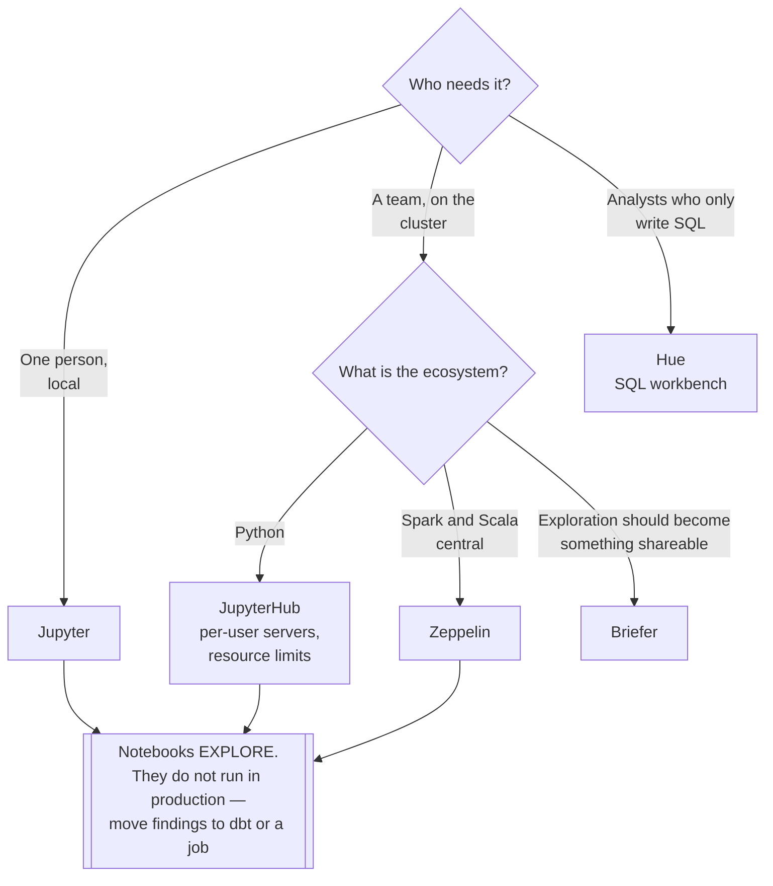

[← Analytics Engineering](../README.md)

# Notebooks

Where analysts and scientists explore, before anything becomes a pipeline.

Tools covered: [`jupyter`](jupyter/README.md) · [`jupyterhub`](jupyterhub/README.md) ·
[`zeppelin`](zeppelin/README.md) · [`hue`](hue/README.md) · [`briefer`](briefer/README.md)

## Contents

1. [What notebooks are for](#1-what-notebooks-are-for)
2. [The problem with notebooks in production](#2-the-problem-with-notebooks-in-production)
3. [The tools](#3-the-tools)
4. [Decision tree](#4-decision-tree)
5. [Anti-patterns](#5-anti-patterns)
6. [How this applies to pikakube](#6-how-this-applies-to-pikakube)

---

## 1. What notebooks are for

Exploration. An analyst has a question, does not know the shape of the answer, and needs to
look at data interactively — running a query, plotting it, adjusting, and running it again.

Nothing else in this discipline supports that loop. A dashboard shows a known answer; a dbt
model produces a defined table. A notebook is where you find out what the question even is.

They are also the natural interface to [Spark](../../data-engineering/processing/spark/README.md) and
[Trino](../../data-engineering/query-engine/README.md) for people who work in Python rather than in a BI
tool.

## 2. The problem with notebooks in production

The failure mode is universal enough to state plainly: **a notebook that became a pipeline**.

| Problem | Why |
|---|---|
| Hidden state | cells run out of order produce results that cannot be reproduced |
| Not reviewable | the diff of a `.ipynb` is JSON with embedded output |
| Not testable | there is no unit to test |
| No dependencies | it runs because it ran, not because anything guarantees order |
| Outputs committed | including, frequently, data that should not be in Git |

The rule that avoids all of it: **notebooks are for exploring, not for running**. When the
answer is found, it moves into [dbt](../transform/README.md) or into a job that an
[orchestrator](../../data-engineering/orchestration/README.md) submits.

Scheduling a notebook is the shortest path to a pipeline nobody can debug at 3am.

## 3. The tools

| Tool | Model | Shines when | Do not use when | Detail |
|---|---|---|---|---|
| **Jupyter** | the standard single-user notebook | individual exploration, and the ecosystem everyone knows | many users need isolated environments | [→](jupyter/README.md) |
| **JupyterHub** | multi-user Jupyter, spawning per-user servers on Kubernetes | a **team** needs notebooks, with isolation and resource limits | one person on a laptop | [→](jupyterhub/README.md) |
| **Zeppelin** | multi-language notebooks, strong Spark integration | Spark and Scala are central, with built-in visualisation | Python is the ecosystem — Jupyter is better supported | [→](zeppelin/README.md) |
| **Hue** | SQL-first workbench for the Hadoop ecosystem | browsing tables and running SQL against Hive, Trino and friends | notebook-style Python work | [→](hue/README.md) |
| **Briefer** | notebooks and dashboards combined, collaborative | exploration should turn into something shareable without a second tool | you already have a BI tool | [→](briefer/README.md) |

**Hue is SQL-first**, not a notebook in the Jupyter sense — a workbench for querying and
browsing a lakehouse. Worth knowing when the requirement is "let analysts run SQL against
Trino" rather than "let them write Python".

## 4. Decision tree

## 5. Anti-patterns

| Anti-pattern | Why it is bad | What to do instead |
|---|---|---|
| Scheduling notebooks as pipelines | hidden state, no tests, unreviewable diffs | move the logic to dbt or a job |
| Committing outputs | data and credentials end up in Git | strip outputs, or use a format that separates them |
| Credentials in cells | they leak into the notebook, into Git, and into screenshots | a secret backend |
| Shared notebook server with no isolation | one user's memory error kills everyone's session | JupyterHub with per-user limits |
| Notebooks reading production databases directly | analytical load on an OLTP system | the warehouse, or a query engine |
| No environment management | "works on my notebook" | pinned images per user server |

## 6. How this applies to pikakube

**Jupyter** is the one with real history here — part of the development environment on
Kubernetes provided to data engineers, analytics engineers and scientists, alongside Airflow
and VS Code in a custom Helm chart.

That is the right shape: notebooks as an **exploration surface within a development
environment**, not as an execution engine. The output of exploration moves into
[dbt](../transform/dbt/README.md) or into a job that [Airflow](../../data-engineering/orchestration/airflow/README.md)
submits.

The alternatives are mapped for the cases Jupyter fits less well — **JupyterHub** when
multi-user isolation matters, **Hue** for SQL-only users, **Zeppelin** where Spark is central.

---

[← Analytics Engineering](../README.md)
