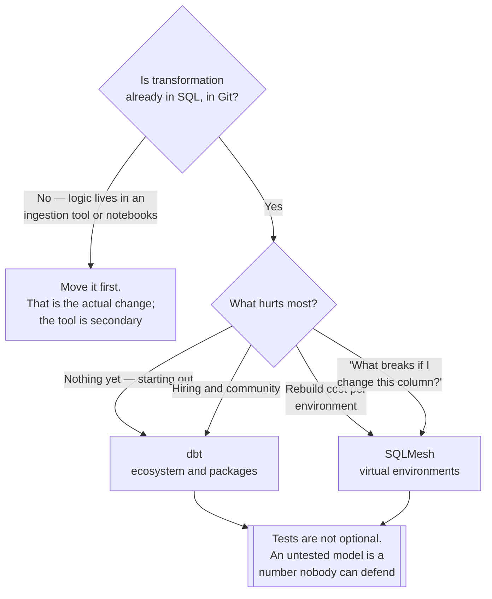

[← Analytics Engineering](../README.md)

# Transform

Turning raw data into something trustworthy — in SQL, in version control.

Tools covered: [`dbt`](dbt/README.md) · [`sqlmesh`](sqlmesh/README.md) ·
[`recce`](recce/README.md)

## Contents

1. [What changed with ELT](#1-what-changed-with-elt)
2. [What a transformation framework provides](#2-what-a-transformation-framework-provides)
3. [The tools](#3-the-tools)
4. [Decision tree](#4-decision-tree)
5. [Anti-patterns](#5-anti-patterns)
6. [How this applies to pikakube](#6-how-this-applies-to-pikakube)

---

## 1. What changed with ELT

The old shape was ETL: transform data in flight, load the result, and keep the logic inside an
ingestion tool where nobody could review it.

ELT loads raw first and transforms **in the warehouse, in SQL**. The consequence is not
technical convenience — it is that **transformation becomes code**: versioned, reviewed,
tested, and reproducible.

That is the whole point of this folder. Everything else follows from it.

## 2. What a transformation framework provides

Plain SQL scripts cannot do these, which is why the frameworks exist:

| Capability | Why it matters |
|---|---|
| **Dependency graph** | models reference each other; execution order is derived, not maintained by hand |
| **Testing** | uniqueness, not-null, referential integrity, and custom assertions as part of the build |
| **Incremental models** | reprocess only what changed, instead of rebuilding a table daily |
| **Documentation and lineage** | generated from the code, so it does not drift |
| **Environments** | the same models built into dev, staging and production targets |
| **Macros** | logic reused instead of copy-pasted across twenty files |

The dependency graph is the one that changes daily work. A change to a base model tells you
exactly what downstream breaks, before it does.

## 3. The tools

### The framework choice

| Tool | Model | Shines when | Do not use when | Detail |
|---|---|---|---|---|
| **dbt** | the de facto standard — models, tests, docs, macros | **the default** — largest ecosystem, most packages, most people who know it | you need real state awareness and virtual environments | [→](dbt/README.md) |
| **SQLMesh** | column-level lineage, virtual environments, true incrementals | you want to **preview a change without rebuilding**, and know exactly which columns are affected | the ecosystem and hiring pool matter more than the semantics | [→](sqlmesh/README.md) |

### The distinction worth understanding

dbt compiles SQL and runs it. It knows the model graph, not what actually changed in the data.

SQLMesh tracks **column-level lineage and model state**. Two consequences that are hard to get
any other way:

- **Virtual environments** — a change is built once and pointed at, rather than copying whole datasets per environment. Testing a change stops costing a full rebuild.
- **Breaking-change detection** — it can tell whether an edit changes results at all, and only reprocess what genuinely needs it.

That is the more rigorous model. dbt remains the default because the ecosystem, packages and
familiarity are worth a great deal in practice.

### Recce is not a third option

[**Recce**](recce/README.md) is listed in this folder and it is **not an alternative to dbt or
SQLMesh** — it requires a dbt project and reviews changes made in it. Placing it beside the two
frameworks would imply a choice that does not exist, so it is stated plainly here.

What it adds is the missing half of the dbt pull-request workflow. A model change appears in
review as a **SQL diff**; what nobody can see from that diff is whether row counts moved, whether
a distribution shifted, or whether a join started fanning out. Recce builds both versions and
diffs the **output** — row count, schema, profile, values — so the review comment is about the
data rather than about the code.

It is complementary to dbt's tests, not a replacement: tests assert invariants somebody already
knew to assert, Recce surfaces the deltas nobody predicted. It costs both versions being
materialised somewhere, which is the real adoption question — see
[`recce/`](recce/README.md).

## 4. Decision tree

## 5. Anti-patterns

| Anti-pattern | Why it is bad | What to do instead |
|---|---|---|
| Transformation logic in the ingestion tool | invisible, unreviewable, untestable | SQL in Git |
| Models with no tests | wrong numbers reach dashboards silently | uniqueness and not-null at minimum |
| One enormous model | impossible to test, review or reuse | staging → intermediate → marts |
| `SELECT *` between models | schema changes propagate silently | explicit columns |
| Full rebuild every run | cost grows with history, for data that did not change | incremental models |
| Metric definitions inside models | the same metric gets defined twice, differently | a [semantic layer](../semantic/README.md) |
| Running transformations from the orchestrator's workers | couples compute to scheduling | submit the run; see [`data-engineering/orchestration/`](../../data-engineering/orchestration/README.md) |
| Approving a model change from the SQL diff alone | the diff shows the code; the fan-out, the dropped rows and the shifted distribution are invisible | diff the resulting data — see [`recce/`](recce/README.md) |

## 6. How this applies to pikakube

**dbt** is the one with real history — transformations orchestrated from Airflow on Kubernetes,
which is the pairing that matters: Airflow decides *when*, dbt decides *what*, and the warehouse
does the work.

**SQLMesh** is mapped as the serious alternative rather than as a curiosity. Its column-level
lineage overlaps directly with what this repository currently addresses through separate tooling
in [`data-governance/`](../../data-governance/README.md) — which makes it worth a real evaluation rather
than a footnote.

**Recce** is documented, not adopted. It is only worth anything where dbt changes already go
through pull requests, and its cost is a place to materialise both versions. It pairs with
[`data-governance/quality/`](../../data-governance/quality/README.md) — quality checks validate
data after it lands, Recce validates a change before it merges — and with
[`data-governance/lineage/`](../../data-governance/lineage/README.md), which answers what is
affected while Recce answers how.

---

[← Analytics Engineering](../README.md)
