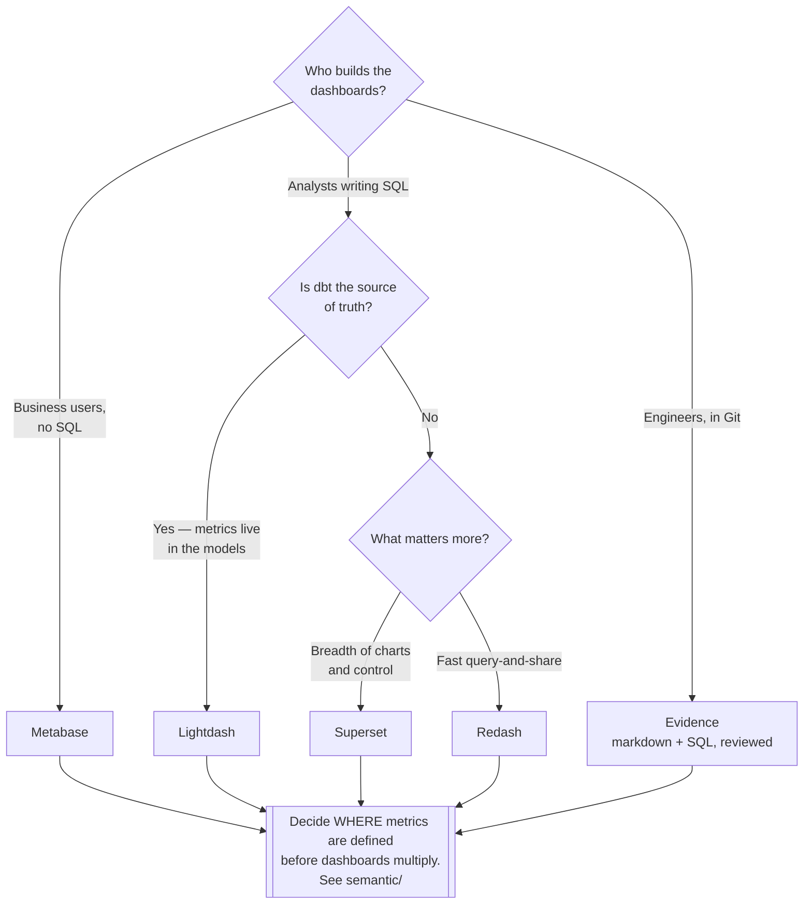

[← Analytics Engineering](../README.md)

# Visualisation

Putting data in front of people.

Tools covered: [`metabase`](metabase/README.md) · [`superset`](superset/README.md) ·
[`lightdash`](lightdash/README.md) · [`redash`](redash/README.md) · [`evidence`](evidence/README.md)

## Contents

1. [The decision is about who uses it](#1-the-decision-is-about-who-uses-it)
2. [Where metrics get defined](#2-where-metrics-get-defined)
3. [The tools](#3-the-tools)
4. [Decision tree](#4-decision-tree)
5. [Anti-patterns](#5-anti-patterns)
6. [How this applies to pikakube](#6-how-this-applies-to-pikakube)

---

## 1. The decision is about who uses it

Every tool here draws charts. What separates them is **who is expected to build them**:

| Audience | Needs |
|---|---|
| Business users, no SQL | point-and-click question builder, and a model that hides joins |
| Analysts who write SQL | a good editor, parameters, and fast iteration |
| Analytics engineers | definitions as **code**, reviewed in pull requests |
| Everyone, reading only | dashboards that load fast and are not wrong |

Choosing a tool for the wrong audience is the usual failure. A code-first BI tool given to
business users produces no dashboards; a click-only tool given to analytics engineers produces
sixty dashboards nobody can review.

## 2. Where metrics get defined

The most consequential question in this folder, and it is not about charts.

If metrics are defined **inside** the BI tool, they get defined more than once — and two
dashboards disagree about revenue, with no way to say which is right.

Three places the definition can live:

| Where | Consequence |
|---|---|
| In each dashboard | duplicated, inconsistent, undiscoverable |
| In the [transform layer](../transform/README.md) | versioned and tested, but re-implemented per aggregation |
| In a [semantic layer](../semantic/README.md) | defined once, consumed by every tool — including the BI tool |

Lightdash is notable here because it reads dbt metrics directly, which puts the definition in
the same place as the models.

## 3. The tools

| Tool | Audience | Shines when | Do not use when | Detail |
|---|---|---|---|---|
| **Metabase** | business users | **the default for self-service** — genuinely usable without SQL, and cheap to run | you need deep customisation or code-defined dashboards | [→](metabase/README.md) |
| **Superset** | analysts and engineers | you want breadth — many chart types, many databases, fine-grained control | non-technical users are the main audience | [→](superset/README.md) |
| **Lightdash** | analytics engineers | **dbt is the source of truth** and metrics should come from the models | dbt is not in use | [→](lightdash/README.md) |
| **Redash** | SQL analysts | query-centric work: write SQL, share the result, chart it | a modelled self-service experience | [→](redash/README.md) |
| **Evidence** | engineers | dashboards as **code** — markdown plus SQL, reviewed and deployed like software | business users need to build their own | [→](evidence/README.md) |

The two ends of the range are worth naming: **Metabase** optimises for people who will never
write SQL, **Evidence** optimises for people who want dashboards in Git. They are not
competing for the same job.

## 4. Decision tree

## 5. Anti-patterns

| Anti-pattern | Why it is bad | What to do instead |
|---|---|---|
| Metrics defined per dashboard | two dashboards disagree and nobody can say which is right | [semantic layer](../semantic/README.md), or the transform layer |
| Dashboards querying raw tables | logic is re-implemented in every chart | build on modelled tables |
| Choosing for the wrong audience | either nobody builds anything, or nobody can review what was built | pick from who actually uses it |
| No ownership | dashboards accumulate, break silently, and nobody deletes them | an owner per dashboard, and periodic pruning |
| BI tool pointed at a production database | analytics load causes an unrelated outage | the warehouse, or a replica |
| Every question becomes a new dashboard | forty pages nobody opens | a small set of good ones, plus ad-hoc querying |

## 6. How this applies to pikakube

**Metabase** is the one with real history — cost-effective open-source BI, chosen precisely
because it is usable by people who do not write SQL and inexpensive to operate.

The alternatives are mapped for the audiences Metabase serves less well: **Superset** for
breadth, **Lightdash** when dbt should own the metric definitions, **Evidence** when dashboards
belong in version control.

The open question the folder records rather than answers: **where metric definitions should
live**. That decision belongs in [`semantic/`](../semantic/README.md) and matters more than the
choice of chart tool.

---

[← Analytics Engineering](../README.md)
