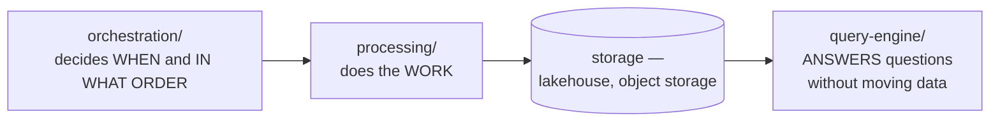

# Data Engineering

Moving and transforming data at scale — orchestration, distributed processing, and query
engines.

## How this folder is organised

One axis: **capability**. Each subfolder answers a distinct question, and a tool is filed by
**where it shines** rather than by everything it can do.

## The map

| Folder | The question it answers |
|---|---|
| [`orchestration/`](orchestration/README.md) | what runs, in what order, and what happens when a step fails? |
| [`processing/`](processing/README.md) | how is the data actually transformed, at volume? |
| [`query-engine/`](query-engine/README.md) | how do people query it without moving it first? |

## The three layers

The separation is worth stating because these get conflated constantly:

- **Orchestration** does not process data. Airflow submitting a Spark job is scheduling, not computation — and an Airflow worker doing the transformation itself is the classic anti-pattern.
- **Processing** does not decide when to run. A Spark job knows how to transform; something else decides that it should.
- **Query engines** do not store data. Trino reads from object storage, Postgres and Kafka without owning any of it.

## Where the boundaries are

| Concern | Where |
|---|---|
| Ingestion and ELT connectors | [`analytics-engineering/integration/`](../analytics-engineering/integration/README.md) |
| SQL transformation and modelling | [`analytics-engineering/transform/`](../analytics-engineering/transform/README.md) — dbt, SQLMesh |
| Streaming and real-time processing | [`data-streaming/`](../data-streaming/README.md) |
| Table formats, catalogues, lineage | [`data-governance/`](../data-governance/README.md) |
| Databases as systems of record | [`databases/`](../databases/README.md) |
| Where the bytes physically live | [`site-reliability-engineering/storage/`](../site-reliability-engineering/storage/README.md) |

The line against `analytics-engineering/` is the one people ask about: **this folder is about
compute at volume**; that one is about SQL modelling and the analytics workflow on top of it.
Spark lives here, dbt lives there.

## The decisions that actually matter

| Question | Consequence |
|---|---|
| **Batch or streaming?** | different tools, different failure modes, different cost — see [`data-streaming/`](../data-streaming/README.md) |
| **Does it fit on one machine?** | [DuckDB](processing/duckdb/README.md) handles far more than people assume, and a distributed engine you did not need is pure operational cost |
| **Who owns the schedule?** | one orchestrator, or every team with a cron somewhere |
| **Query in place, or load first?** | a query engine avoids a copy; a warehouse gives predictable performance |

The second row is the most commonly skipped. Spark on Kubernetes is a substantial commitment,
and a large share of the jobs it runs would finish faster on a single node with DuckDB.

## How this applies to pikakube

Airflow, Spark and Trino are the tools with real operational history behind them in this
repository — orchestration on Kubernetes, distributed processing on Kubernetes, and federated
query.

Everything else in the folder is mapped for comparison: the alternative orchestrators, the
Spark accelerators and shuffle services, and the query engines that were evaluated rather than
adopted.
