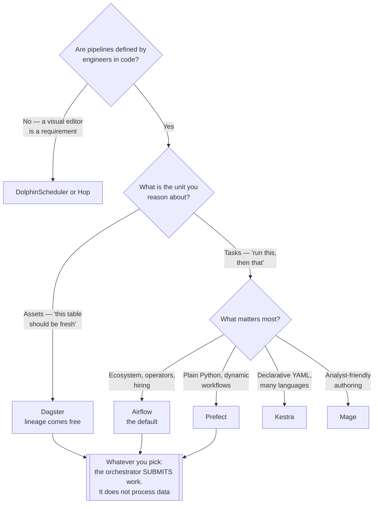

[← Data Engineering](../README.md)

# Orchestration

Deciding what runs, in what order, and what happens when a step fails.

Tools covered: [`airflow`](airflow/README.md) · [`dagster`](dagster/README.md) · [`prefect`](prefect/README.md) ·
[`kestra`](kestra/README.md) · [`mage`](mage/README.md) · [`dolphinscheduler`](dolphinscheduler/README.md) ·
[`hop`](hop/README.md)

## Contents

1. [What an orchestrator is actually for](#1-what-an-orchestrator-is-actually-for)
2. [Task-centric vs asset-centric](#2-task-centric-vs-asset-centric)
3. [The anti-pattern that defines the category](#3-the-anti-pattern-that-defines-the-category)
4. [The tools](#4-the-tools)
5. [Decision tree](#5-decision-tree)
6. [Anti-patterns](#6-anti-patterns)
7. [How this applies to pikakube](#7-how-this-applies-to-pikakube)

---

## 1. What an orchestrator is actually for

Not "running things on a schedule" — cron does that. An orchestrator exists for what happens
around the schedule:

| Capability | Why cron cannot do it |
|---|---|
| **Dependencies** | step B runs only if A succeeded, and A may be in another pipeline |
| **Retries and backoff** | per task, with limits, and without rerunning what already worked |
| **Backfill** | re-run last month, in order, without hand-editing dates |
| **Idempotency and partitioning** | a run is *for a date*, not just *at a time* |
| **Visibility** | which run failed, at which step, with which logs |
| **SLA and alerting** | this should have finished by 06:00, and did not |

The backfill row is the one that decides it in practice. Every data platform eventually has to
reprocess a period, and doing that safely is the difference between an orchestrator and a
scheduler.

## 2. Task-centric vs asset-centric

The real conceptual split in this folder:

| | Task-centric | Asset-centric |
|---|---|---|
| You declare | *what to run*, and the order | *what should exist*, and how to produce it |
| Failure means | "this task failed" | "this table is stale" |
| Examples | Airflow, Kestra, DolphinScheduler | Dagster |
| Lineage | inferred, or bolted on | native — the graph **is** the assets |

Asset-centric is the more recent idea and often the better fit for analytics: consumers care
that a table is fresh and correct, not that a task ran. It also makes lineage fall out of the
model instead of requiring a separate tool.

Task-centric is more general — it orchestrates anything, not only data assets — which is why
Airflow remains dominant in platforms that also run infrastructure and ML work.

## 3. The anti-pattern that defines the category

**Processing data inside the orchestrator.**

An Airflow worker running a large pandas transformation is the most common mistake in this
discipline. It couples compute to the scheduler, makes the orchestrator a scaling bottleneck,
and turns a memory error in a transformation into an outage of the whole scheduling layer.

The orchestrator should **submit and observe**: launch a Spark job, trigger a dbt run, start a
Kubernetes pod — and track whether it succeeded. The work belongs in
[`processing/`](../processing/README.md).

This is also why the Kubernetes executor matters: each task becomes a pod with its own
resources, isolated from the scheduler and from every other task.

## 4. The tools

| Tool | Model | Shines when | Do not use when | Detail |
|---|---|---|---|---|
| **Airflow** | task-centric, Python DAGs | **the default** — largest ecosystem, most operators, most people who know it | you want asset-centric semantics or a lighter footprint | [→](airflow/README.md) |
| **Dagster** | **asset-centric**, typed, strong local development | data assets and lineage are the mental model, and testing pipelines matters | the team is deep in Airflow and the ecosystem is the reason | [→](dagster/README.md) |
| **Prefect** | Python-native, dynamic workflows | pipelines are ordinary Python and the DAG shape is not known ahead of time | you want a heavy scheduling platform | [→](prefect/README.md) |
| **Kestra** | declarative YAML, language-agnostic | pipelines should be configuration rather than code, across many languages | Python is the ecosystem and you want its libraries | [→](kestra/README.md) |
| **Mage** | notebook-style pipeline authoring | fast iteration and a low barrier for analysts | a large platform with strict operational requirements | [→](mage/README.md) |
| **DolphinScheduler** | Apache, visual DAG editor, HA-oriented | a visual editor is a requirement and the team is not Python-first | you want code-defined pipelines | [→](dolphinscheduler/README.md) |
| **Hop** | visual data integration, Kettle/PDI lineage | migrating from Pentaho, or visual ETL is the working style | modern code-first workflows | [→](hop/README.md) |

## 5. Decision tree

## 6. Anti-patterns

| Anti-pattern | Why it is bad | What to do instead |
|---|---|---|
| Transforming data in the orchestrator | couples compute to scheduling; one bad task breaks the platform | submit to [`processing/`](../processing/README.md) |
| Non-idempotent tasks | a retry corrupts data instead of fixing it | make a run a function of its partition |
| One giant DAG | a single failure blocks everything, and nothing can be rerun in isolation | smaller DAGs with explicit dependencies |
| Scheduling by wall-clock without partitions | backfill becomes manual date arithmetic | partition-aware runs |
| No SLA alerting | a pipeline that silently stops looks identical to one with no data | alert on freshness — see [`service-level/`](../../site-reliability-engineering/service-level/README.md) |
| Secrets in DAG code | they end up in Git and in task logs | a secret backend |
| Everyone writing their own scheduling | five cron jobs and no dependency graph | one orchestrator, with real ownership |

## 7. How this applies to pikakube

**Airflow** is the one with genuine operational history here — running on Kubernetes with the
KubernetesExecutor, DAG CI/CD, DAG quality policies, and a custom multi-namespace Helm chart.
Its folder carries that detail.

Worth carrying forward from elsewhere in this repository: the
[Linkerd note](../../network/service-mesh/linkerd/README.md) — a service mesh sidecar prevents
KubernetesExecutor task pods from ever completing, which is exactly the class of problem that
only appears when an orchestrator meets the rest of the platform.

The alternatives are mapped rather than run. **Dagster** is the one worth a real evaluation:
asset-centric semantics and native lineage address problems this repository currently solves
with separate tooling in [`data-governance/`](../../data-governance/).

---

[← Data Engineering](../README.md)
