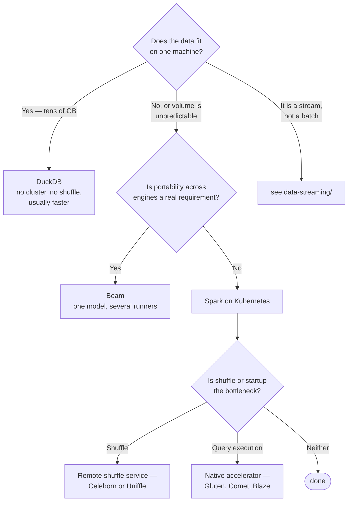

[← Data Engineering](../README.md)

# Processing

Doing the actual work — transforming data at whatever volume it arrives in.

Tools covered: [`spark`](spark/README.md) · [`duckdb`](duckdb/README.md) · [`beam`](beam/)

## Contents

1. [The question to ask first](#1-the-question-to-ask-first)
2. [Single node goes much further than people think](#2-single-node-goes-much-further-than-people-think)
3. [The tools](#3-the-tools)
4. [Decision tree](#4-decision-tree)
5. [Anti-patterns](#5-anti-patterns)
6. [How this applies to pikakube](#6-how-this-applies-to-pikakube)

---

## 1. The question to ask first

**Does this actually need a distributed engine?**

It is the cheapest question in the discipline and the one most often skipped. A Spark cluster
on Kubernetes is a real commitment: executors to size, shuffle to tune, dependencies to
package, and a failure mode nobody understands on the first outage.

A large share of the jobs running on distributed engines process tens of gigabytes — which
finishes faster on one machine with [DuckDB](duckdb/README.md), with no cluster at all.

The distributed engine earns its place when the data genuinely does not fit, or when the job
must scale elastically with unpredictable volume. Not before.

## 2. Single node goes much further than people think

Modern hardware and columnar engines moved the threshold substantially:

| Scale | Realistic answer |
|---|---|
| Up to tens of GB | **DuckDB** on one node, often in seconds |
| Hundreds of GB | DuckDB still viable with enough memory; Spark starts to make sense |
| Multiple TB, or elastic demand | **Spark** — this is what it is for |
| Streaming | not this folder — [`data-streaming/`](../../data-streaming/README.md) |

The reason this matters is operational, not ideological. Every distributed job carries
coordination overhead, and below a certain size that overhead is most of the runtime.

## 3. The tools

| Tool | Model | Shines when | Do not use when | Detail |
|---|---|---|---|---|
| **Spark** | distributed, JVM, batch and micro-batch | data genuinely does not fit on one machine, or volume is elastic | the dataset is small — the cluster costs more than the work | [→](spark/README.md) |
| **DuckDB** | in-process, columnar, single node | analytical queries over files, embedded in a job or a notebook | data exceeds one machine, or many concurrent users | [→](duckdb/README.md) |
| **Beam** | a unified **programming model**, not an engine | you want portability across runners — Flink, Dataflow, Spark | you are committed to one engine anyway | [→](beam/) |

**Beam is a different kind of thing.** It is an API that runs on other engines, so the choice
it represents is "avoid coupling the pipeline code to a runner" rather than "process data this
way". Worth knowing about; rarely worth the abstraction unless the runner really might change.

## 4. Decision tree

## 5. Anti-patterns

| Anti-pattern | Why it is bad | What to do instead |
|---|---|---|
| Spark for small data | coordination overhead exceeds the work | DuckDB |
| Processing inside the orchestrator | couples compute to scheduling — see [`orchestration/`](../orchestration/README.md) | submit a job |
| Ignoring the small-files problem | thousands of tiny files destroy read performance and cost | compaction, and the table formats in [`data-governance/`](../../data-governance/README.md) |
| Default executor sizing | either wasting resources or failing on shuffle spill | size from the actual shuffle profile |
| No `spark-history-server` | finished jobs leave nothing to diagnose | keep event logs |
| Rewriting transformations in Python | SQL is testable, reviewable, and understood by more people | SQL where possible — [`analytics-engineering/transform/`](../../analytics-engineering/transform/README.md) |

## 6. How this applies to pikakube

**Spark on Kubernetes** is the one with real history — batch workloads on the cluster, with the
operator, plus the surrounding pieces most catalogues omit: shuffle services, native
accelerators, history server and performance tooling. That detail is in
[`spark/`](spark/README.md).

**DuckDB** is mapped as the deliberate counterweight, and the reasoning is recorded rather than
implied: cost-effective processing for analytics that does not need a cluster.

Keeping both, with the boundary stated, is the useful part — the catalogue answers *when not to
use Spark*, which is the question that saves the most money.

---

[← Data Engineering](../README.md)
