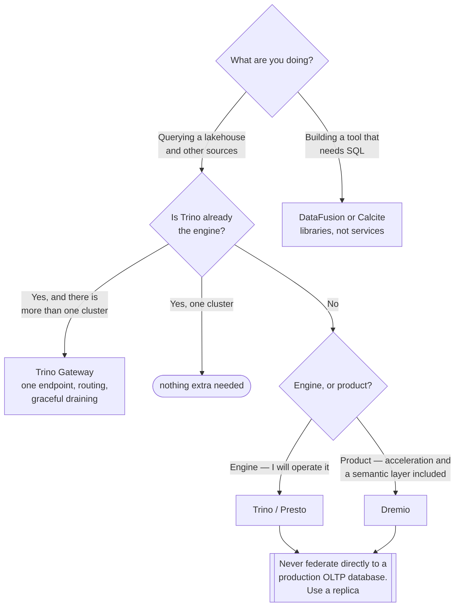

[← Data Engineering](../README.md)

# Query engine

Answering questions without moving the data first.

Tools covered: [`trino-gateway`](trino-gateway/README.md) · [`presto`](presto/README.md) ·
[`dremio`](dremio/README.md) · [`datafusion`](datafusion/README.md) · [`calcite`](calcite/README.md)

## Contents

1. [Query where it lives](#1-query-where-it-lives)
2. [What you give up](#2-what-you-give-up)
3. [The tools](#3-the-tools)
4. [Decision tree](#4-decision-tree)
5. [Anti-patterns](#5-anti-patterns)
6. [How this applies to pikakube](#6-how-this-applies-to-pikakube)

---

## 1. Query where it lives

The traditional answer to "we need to analyse this" is to copy everything into a warehouse
first. That works, and it costs a pipeline per source, a copy of every dataset, and a delay
between the data existing and being queryable.

A federated query engine inverts it: **SQL over data where it already is** — object storage,
PostgreSQL, Kafka, MongoDB — including joins across them in a single query.

What that changes:

| Benefit | Detail |
|---|---|
| No copy | one less pipeline, one less thing to keep in sync |
| Freshness | queries hit the source, not last night's snapshot |
| One SQL surface | analysts learn one dialect for everything |
| **Storage and compute separate** | scale query capacity without touching where data lives |

For a lakehouse this is the natural query layer: Iceberg or Delta tables on object storage,
queried directly, with no warehouse in between.

## 2. What you give up

Federation is not free, and the trade is usually underplayed:

- **Predictability.** Query performance depends on every underlying system. A slow Postgres makes a Trino query slow, and the cause is not visible in the engine.
- **Pushdown is not guaranteed.** When a filter cannot be pushed to the source, the engine pulls everything and filters afterwards — which is how a "quick query" reads a whole table over the network.
- **Concurrency.** A federated engine is a shared resource, and one badly-written query can affect everyone.
- **Source load.** Analytical queries hitting a production database is the classic way to cause an outage in something unrelated.

That last point is worth stating clearly: **federating to a production OLTP database is a
liability**, not a feature. Use a replica.

## 3. The tools

| Tool | What it is | Shines when | Detail |
|---|---|---|---|
| **Trino Gateway** | routing and load balancing **in front of** Trino clusters | multiple Trino clusters need one endpoint, with routing and graceful draining | [→](trino-gateway/README.md) |
| **Presto** | the project Trino forked from | you have an existing Presto deployment, or want the AWS-aligned lineage | [→](presto/README.md) |
| **Dremio** | lakehouse query platform with acceleration and a semantic layer | you want a product rather than an engine, with reflections for speed | [→](dremio/README.md) |
| **DataFusion** | Rust query engine as a **library** | building a data tool, not deploying one — it is what other engines are built on | [→](datafusion/README.md) |
| **Calcite** | SQL parser, planner and optimiser framework | building a query engine or adding SQL to a system | [→](calcite/README.md) |

Two of these are not deployable engines. **DataFusion** and **Calcite** are building blocks —
DataFusion powers a growing set of tools, Calcite provides the SQL front end for many. They are
here because knowing what a system is built on explains its behaviour.

## 4. Decision tree

## 5. Anti-patterns

| Anti-pattern | Why it is bad | What to do instead |
|---|---|---|
| Federating to a production database | analytical queries take down an unrelated service | query a replica |
| Assuming pushdown happens | the engine silently reads whole tables over the network | check the query plan |
| Federation as a substitute for modelling | joining raw sources every time is slow and repeats logic | model it — [`analytics-engineering/transform/`](../../analytics-engineering/transform/README.md) |
| One shared cluster with no resource groups | a single query starves everyone | resource groups, or separate clusters behind a gateway |
| Small files on object storage | metadata overhead dominates and queries crawl | compaction and table formats |
| No query result caching | the same dashboard query recomputes all day | cache, or materialise |

## 6. How this applies to pikakube

**Trino** is the engine with real history in this repository — distributed query on Kubernetes —
and **Trino Gateway** is documented for the case that follows it: centralised routing across
multiple clusters, which is what makes upgrades and draining possible without an outage.

The others are mapped for comparison. **Dremio** is the closest alternative as a product;
**DataFusion** and **Calcite** are here for understanding rather than deployment — they are what
an increasing number of the tools elsewhere in this repository are built on.

---

[← Data Engineering](../README.md)
