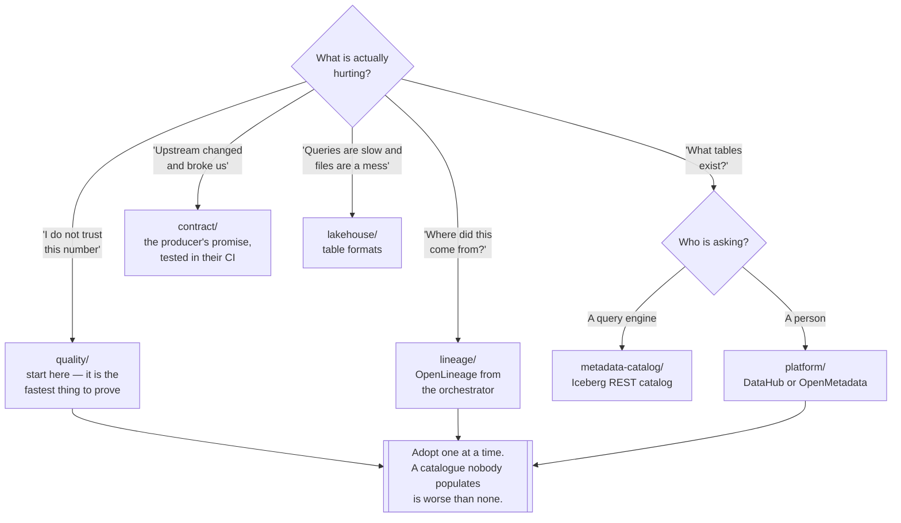

# Data governance

Knowing what data exists, where it came from, whether it is correct, and who is allowed to see
it — before anybody asks.

Capabilities: [`catalog/`](catalog/README.md) · [`platform/`](platform/README.md) ·
[`metadata-catalog/`](metadata-catalog/README.md) · [`lineage/`](lineage/README.md) ·
[`quality/`](quality/README.md) · [`contract/`](contract/README.md) ·
[`lakehouse/`](lakehouse/README.md) · [`anonymization/`](anonymization/README.md) ·
[`standards/`](standards/README.md)

## Contents

1. [The problem](#1-the-problem)
2. [Two meanings of "catalog"](#2-two-meanings-of-catalog)
3. [The capabilities](#3-the-capabilities)
4. [Decision tree](#4-decision-tree)
5. [The order that works](#5-the-order-that-works)
6. [Anti-patterns](#6-anti-patterns)
7. [How this applies to pikakube](#7-how-this-applies-to-pikakube)

---

## 1. The problem

Governance sounds like a compliance word. In practice it is the answer to five questions that
every data platform is asked, and that most cannot answer without a conversation:

| Question | Capability |
|---|---|
| What data do we have, and who owns it? | [`catalog/`](catalog/README.md), [`platform/`](platform/README.md) |
| Where did this number come from? | [`lineage/`](lineage/README.md) |
| Can I trust it? | [`quality/`](quality/README.md) |
| What did you promise this table would look like? | [`contract/`](contract/README.md) |
| Who is allowed to see it, and what is in it? | [`anonymization/`](anonymization/README.md), and access control in [`security/`](../security/README.md) |

The failure is not that these are unanswerable. It is that the answers live in the heads of two
or three people, and every question becomes an interruption of one of them.

The second-order failure is worse and quieter: **nobody asks any more.** A dashboard is
distrusted, so a team builds their own pipeline from the source, and now there are two numbers.
That is what ungoverned platforms actually look like — not chaos, but duplication and quiet
disagreement.

## 2. Two meanings of "catalog"

The most confusing word in this discipline, and this repository separates it into two folders
deliberately:

| | **Technical catalog** | **Business catalog** |
|---|---|---|
| Folder | [`metadata-catalog/`](metadata-catalog/README.md) | [`catalog/`](catalog/README.md), [`platform/`](platform/README.md) |
| Answers | *where are the files for this table, and what is its current snapshot?* | *what does this table mean, who owns it, can I trust it?* |
| Consumed by | **query engines** — Spark, Trino, Flink | **people** |
| Examples | Hive Metastore, Polaris, Lakekeeper, Gravitino, Unity Catalog | DataHub, OpenMetadata, Amundsen |
| If it is down | **queries fail** | discovery is inconvenient |
| Part of | the data path | the human path |

Confusing them produces two specific mistakes: expecting a discovery UI to serve query engines,
and expecting a metastore to explain what a column means.

Unity Catalog sits awkwardly across the line, which is why it appears in
[`catalog/`](catalog/unitycatalog/README.md) — it aims to be both.

## 3. The capabilities

| Capability | The question it answers | Note |
|---|---|---|
| [`catalog/`](catalog/README.md) | what data exists, and what does it mean? | mostly a graveyard — read it before adopting |
| [`platform/`](platform/README.md) | the same, as an integrated product | DataHub, OpenMetadata, ODD |
| [`metadata-catalog/`](metadata-catalog/README.md) | where are the files, and what is the current snapshot? | **in the query path** |
| [`lineage/`](lineage/README.md) | where did this come from, and what breaks if I change it? | OpenLineage is the standard |
| [`quality/`](quality/README.md) | is this data correct, and how would we know? | the capability with the fastest payback |
| [`contract/`](contract/README.md) | what was promised, and is it still true? | shifts quality left, to the producer |
| [`lakehouse/`](lakehouse/README.md) | ACID tables on object storage — formats, catalogs, versioning | the substrate the rest sits on |
| [`anonymization/`](anonymization/README.md) | how do lower environments get realistic data safely? | the reason production dumps end up in staging |
| [`standards/`](standards/README.md) | which external framework are we measured against? | ISO, NIST |

## 4. Decision tree

## 5. The order that works

Governance programmes fail in a recognisable way: a platform is deployed first, it is populated
by hand once, it goes stale, and the whole discipline gets a reputation.

The order that avoids it starts with the smallest thing that produces trust:

**1. Quality, on the tables people already distrust.** Checks run in the pipeline, failures are
visible. This is the fastest path to "the platform told us before the business did", and it
requires no new system — see [`quality/`](quality/README.md).

**2. Lineage, emitted automatically.** [OpenLineage](lineage/open-lineage/README.md) from the
orchestrator and the processing engines. The critical word is *automatically*: hand-maintained
lineage is wrong within a month.

**3. Contracts on the boundaries that break.** Not everywhere — the interfaces where an upstream
change has already caused an incident. See [`contract/`](contract/README.md).

**4. A catalogue, populated by 1–3.** By this point there is metadata worth browsing, produced by
systems rather than typed in. That is what makes the catalogue survive.

Doing it in reverse — catalogue first, populated manually — is the single most common way this
discipline is attempted and abandoned.

## 6. Anti-patterns

| Anti-pattern | Why it is bad | What to do instead |
|---|---|---|
| A catalogue populated by hand | correct on the day it is filled in, stale within a month | ingest from the systems that already know |
| Governance as a documentation exercise | produces a wiki nobody reads and changes no behaviour | start with quality checks that fail builds |
| Lineage maintained manually | wrong immediately, and confidently wrong | OpenLineage, emitted by the pipeline |
| Quality checks that only warn | a warning nobody acts on is a warning nobody sees | fail the pipeline, or quarantine the output |
| Contracts everywhere at once | enormous effort, most of it on interfaces that never break | the boundaries that have already caused incidents |
| Confusing the two catalogs | a discovery UI cannot serve Trino; a metastore cannot explain a column | see section 2 |
| Adopting a platform before having metadata | an empty product, and the discipline gets blamed | populate first, browse second |
| Production data copied to staging | a privacy incident waiting for an audit | [`anonymization/`](anonymization/README.md) |
| Ownership fields left blank | every question routes to whoever answered last time | ownership is the field that matters most |
| A table format chosen without a catalog | Iceberg without a catalog is files nobody can query consistently | decide both together |

## 7. How this applies to pikakube

This is a **mapped discipline** — a catalogue of the solution space, with the failures recorded
from actually running the tools. That last part is what makes it useful, and several of the notes
here are unusually blunt:

| Tool | Recorded finding |
|---|---|
| [Amundsen](catalog/amundsen/README.md) | dead project, broken Helm chart |
| [Apache Atlas](catalog/atlas/README.md) | project and chart both dead |
| [DataHub](platform/datahub/README.md) | full of bugs; the chart never works |
| [OpenMetadata](platform/open-metadata/README.md) | works, with recorded issues and no OCI support |
| [XTable](lakehouse/interoperability/xtable/README.md) | early stage, requires building the Java package yourself |
| [Paimon](lakehouse/table-formats/paimon/README.md) | local works; S3 and Hive documentation is unusable |
| [Soda contracts](contract/soda/README.md) | documentation broken — the module does not exist |

Those findings are the actual value. Every one of these tools has a landing page claiming it
solves data governance; the difference between them is whether the Helm chart installs, and that
is only discoverable by trying.

**Where the platform stands.** The lakehouse substrate is the part with real depth — table
formats, catalogs and version control are mapped with working integrations against
[MinIO](lakehouse/storage/minio/README.md). The human-facing side is mapped and not deployed,
which is consistent with section 5: there is not yet enough automatically-produced metadata to
justify a catalogue.

The gap worth naming: **lineage is not emitted anywhere.** The platform runs
[Airflow](../data-engineering/orchestration/airflow/README.md),
[Spark](../data-engineering/processing/spark/README.md) and
[dbt](../analytics-engineering/transform/dbt/README.md) — all three of which speak
[OpenLineage](lineage/open-lineage/README.md) with configuration rather than code. That is the
cheapest governance capability available here and it is not switched on.

---

[← infrastructure/](../)
