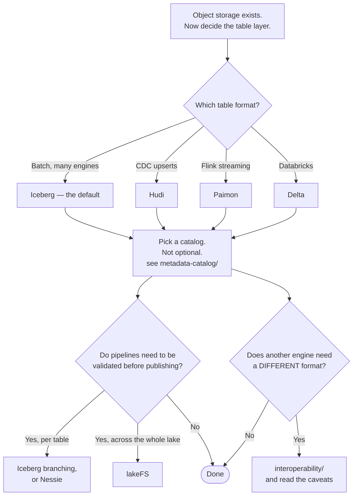

[← Data governance](../README.md)

# Lakehouse

ACID tables on object storage — the substrate the rest of the discipline sits on.

Capabilities: [`table-formats/`](table-formats/README.md) ·
[`version-control/`](version-control/README.md) ·
[`interoperability/`](interoperability/README.md) · [`sharing/`](sharing/README.md) ·
[`storage/`](storage/README.md)

## Contents

1. [What the word means](#1-what-the-word-means)
2. [The four layers](#2-the-four-layers)
3. [The capabilities](#3-the-capabilities)
4. [Decision tree](#4-decision-tree)
5. [Anti-patterns](#5-anti-patterns)
6. [How this applies to pikakube](#6-how-this-applies-to-pikakube)

---

## 1. What the word means

A data lake is files on object storage: cheap, open, and with none of the guarantees a database
provides. A warehouse gives transactions, schemas and fast queries, and keeps the data inside a
proprietary system.

The lakehouse claim is that the first can have the second's properties, by adding a metadata
layer over the files:

| | Data lake | Warehouse | Lakehouse |
|---|---|---|---|
| Storage cost | low | high | **low** |
| Transactions | no | yes | **yes** |
| Schema enforcement | no | yes | **yes** |
| Engine choice | any | one | **any** |
| Data locked in | no | **yes** | no |
| Updates and deletes | painful | trivial | workable |

The row that matters most for a platform is **engine choice**. The same Iceberg table can be read
by Spark, Trino, DuckDB, Flink and ClickHouse — so the storage decision stops determining the
compute decision, and either can be revisited without moving the data.

That is the real argument, and it is stronger than the cost one.

## 2. The four layers

A lakehouse is not one thing, and confusing the layers is the source of most of the difficulty:

| Layer | What it is | Folder |
|---|---|---|
| **Storage** | object storage — the bytes | [`storage/`](storage/README.md) |
| **File format** | Parquet, ORC — how a file is encoded | (a given; see [`data-engineering/`](../../data-engineering/README.md)) |
| **Table format** | the manifest making a set of files a table | [`table-formats/`](table-formats/README.md) |
| **Catalog** | what tells engines which table is where | [`metadata-catalog/`](../metadata-catalog/README.md) |

The bottom two are the ones people conflate. Parquet is a file; Iceberg is a **table** made of
Parquet files plus metadata. And Iceberg without a catalog is not queryable consistently by more
than one engine — the catalog is not optional infrastructure, it is part of the definition.

## 3. The capabilities

| Capability | The question it answers |
|---|---|
| [`table-formats/`](table-formats/README.md) | how do files become a table with transactions and history? |
| [`version-control/`](version-control/README.md) | can I test a change before anyone sees it? |
| [`interoperability/`](interoperability/README.md) | can one table be read as more than one format? |
| [`sharing/`](sharing/README.md) | how is data shared outside the platform without copying it? |
| [`storage/`](storage/README.md) | where the bytes live, and what governs their lifecycle |

**Version control is the underrated one.** Branching a table means a pipeline can write, be
validated, and be merged or discarded — which turns "we published bad data and now we are
backfilling" into "the branch failed its checks and was never merged". That is the same
improvement CI brought to code, applied to data.

## 4. Decision tree

## 5. Anti-patterns

| Anti-pattern | Why it is bad | What to do instead |
|---|---|---|
| A table format chosen without a catalog | engines disagree about what the table is | one decision, not two |
| Several table formats in one platform | every engine, tool and pipeline must handle each | one, unless there is a specific reason |
| Treating the lakehouse as a warehouse replacement on day one | the operational maintenance is real and new | migrate a workload, measure, then decide |
| No compaction | the small-files problem degrades everything, gradually | schedule it from the start |
| Interoperability tools used to avoid deciding | two formats to maintain and translation to debug | decide the primary format |
| Time travel treated as backup | snapshots expire and do not survive a deleted bucket | real backups |
| Object storage without lifecycle policies | cost grows with no ceiling | [`storage/`](storage/README.md) |
| Sharing by copying files to another bucket | two copies that diverge, and no revocation | [`sharing/`](sharing/README.md) |

## 6. How this applies to pikakube

This is the part of [`data-governance/`](../README.md) with the most **hands-on depth** — the
integrations were actually attempted, and the notes record what worked.

The stack that is mapped end to end:

| Layer | Here |
|---|---|
| Storage | [MinIO](storage/minio/README.md), with `boto3` client and resource examples |
| Table format | [Iceberg](table-formats/iceberg/README.md), [Delta](table-formats/delta/README.md), [Hudi](table-formats/hudi/README.md), [Paimon](table-formats/paimon/README.md) |
| Catalog | [HMS](../metadata-catalog/hms/README.md), plus three Iceberg REST catalogs |
| Version control | [lakeFS](version-control/lakefs/README.md) — MinIO integration recorded as **done** |

The consistent finding across the table-format notes is worth repeating here: **the format is
easy and the storage integration is where the time goes.** Hudi and Paimon both have recorded
documentation failures at exactly the point of connecting to S3-compatible storage, and Paimon
has no Azure or GCP support at all.

The recommended shape for this platform is **Iceberg on MinIO with a REST catalog** — the widest
engine support, and the catalog options are mapped with their own recorded limitations under
[`metadata-catalog/iceberg/`](../metadata-catalog/iceberg/README.md).

---

[← Data governance](../README.md)
