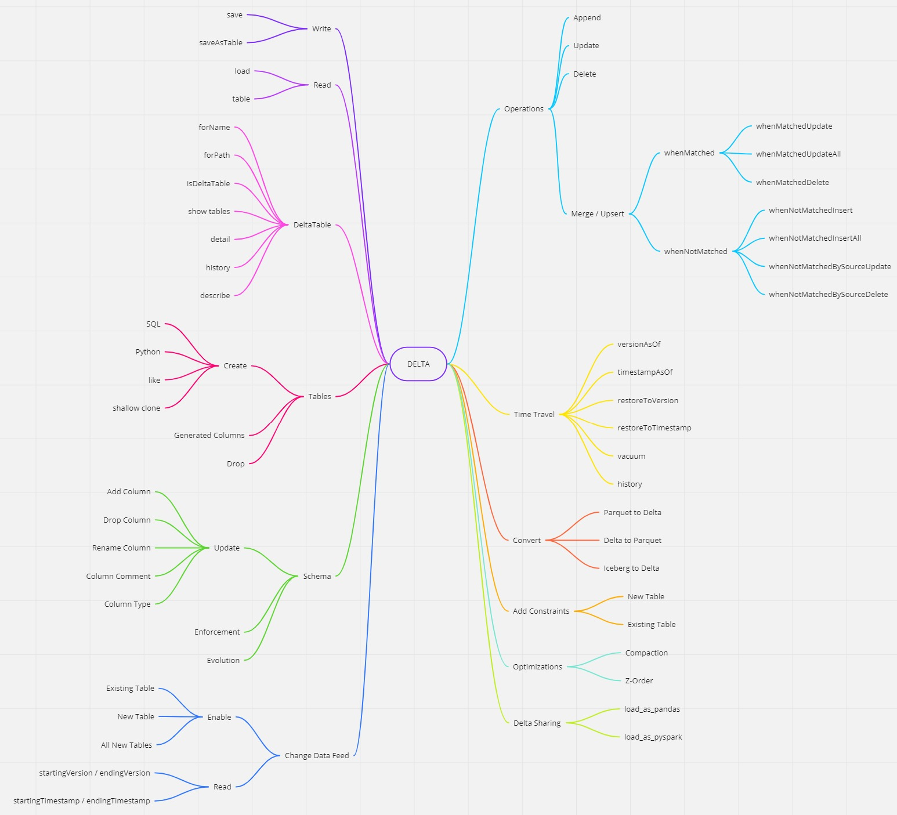

# Hands on Delta
# Inicializando o docker e subindo o container com jupyter e spark

```sh
sudo service docker start

docker run --name delta -p 8888:8888 -v /home/andreyolv/projects/big-data-platform-on-k8s/docs/hands-on/delta:/home/jovyan/delta jupyter/all-spark-notebook:spark-3.3.0

```

Substitua o path '/home/andreyolv/projects/big-data-platform-on-k8s/docs/hands-on/delta' do meu exemplo pelo path onde se encontram seus jupyter notebooks

# Clique no link gerado no seu terminal e bora pro jupyter!

<p align="center">
  
</p>
