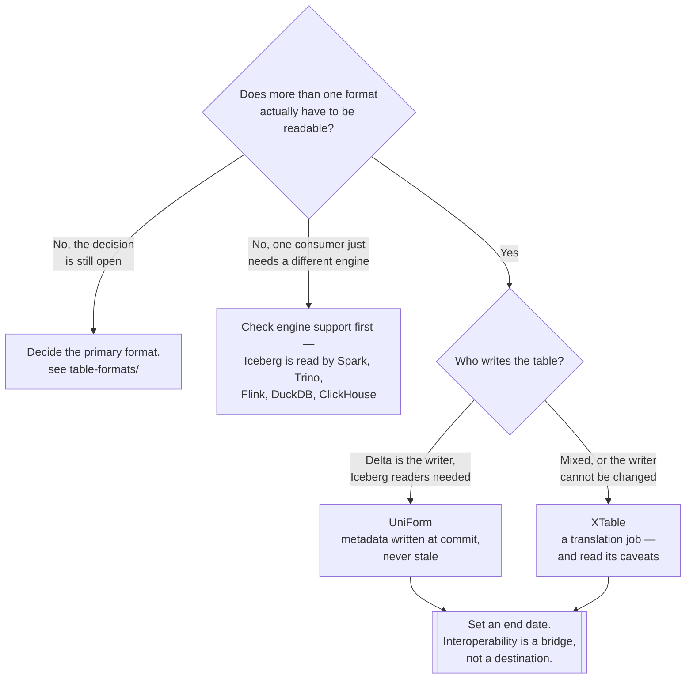

[← Lakehouse](../README.md)

# Interoperability

Reading one table as more than one format — a mitigation for a decision that was not made, or was
made twice.

Tools covered: [`xtable`](xtable/README.md) — translates metadata ·
[`uniform`](uniform/README.md) — writes a second format's metadata ·
[`amoro`](amoro/README.md) — a maintenance service, filed here

## Contents

1. [Why this folder exists](#1-why-this-folder-exists)
2. [Three different mechanisms](#2-three-different-mechanisms)
3. [What translation does not give you](#3-what-translation-does-not-give-you)
4. [Decision tree](#4-decision-tree)
5. [Anti-patterns](#5-anti-patterns)
6. [How this applies to pikakube](#6-how-this-applies-to-pikakube)

---

## 1. Why this folder exists

The honest framing: **these tools exist because organisations ended up with more than one table
format.** Not because multi-format is a design goal — because a team standardised on Delta, another
bought a tool that only reads Iceberg, an acquisition arrived with Hudi, and now the same data has
to be readable from both sides.

Translating between formats is therefore a **mitigation, not a strategy**. It is the right response
to a situation you are already in. It is the wrong response to a decision you have not made yet.

[`table-formats/`](../table-formats/README.md) states the anti-pattern directly — *several table
formats in one platform: every engine, tool and pipeline must handle both*. Interoperability tools
do not remove that cost. They move it: instead of two formats to operate, you now have two formats
**and** a translation layer to operate, monitor and debug when it drifts.

The question worth asking before adopting anything here is which of these is true:

| Situation | The right response |
|---|---|
| Two formats already exist and neither can be removed soon | interoperability, deliberately, as a bridge |
| A migration is underway and both must be readable during it | interoperability, with an end date |
| One consumer needs a format the platform does not use | check whether that consumer can read the primary format first |
| The format decision has not been made | **make it** — see [`table-formats/`](../table-formats/README.md) |

## 2. Three different mechanisms

The tools in this folder are not variations on one idea. They work in genuinely different ways, and
one of them is not really an interoperability tool at all.

| Tool | Mechanism | What it produces |
|---|---|---|
| [**XTable**](xtable/README.md) | **translates** metadata between formats | a second format's metadata, generated from the first |
| [**UniForm**](uniform/README.md) | **writes** the second format's metadata alongside the first, at commit time | one set of Parquet files, two sets of metadata |
| [**Amoro**](amoro/README.md) | a **management service** that maintains lakehouse tables | compacted tables, expired snapshots, cleaned orphans |

**XTable** is a converter. Point it at a table, and it emits the metadata another format expects,
over the same data files. It runs as a job — so the translated view is as fresh as the last run.

**UniForm** is not a converter. Delta's Universal Format writes **Iceberg metadata as part of the
Delta commit**, so an Iceberg reader sees the table without a separate translation step. The data
files were always Parquet; only the metadata differs, and UniForm writes both.

**Amoro** is here by filing rather than by mechanism. Its value is automating the maintenance that
[`table-formats/`](../table-formats/README.md) calls *the part everyone forgets* — compaction,
snapshot expiry, orphan cleanup — across Iceberg, Paimon and its own mixed formats. That is a
different problem from format translation, and worth reading on its own terms.

The distinction between XTable and UniForm matters operationally:

| | XTable | UniForm |
|---|---|---|
| When it runs | as a **job**, after the write | **inside the write**, at commit |
| Freshness | as stale as the last run | current by construction |
| Failure mode | the translated view silently lags | the commit fails, and you know |
| Scope | Iceberg, Delta, Hudi | Delta → Iceberg (and Hudi metadata, depending on version) |
| Who owns it | a pipeline you schedule | the writer's configuration |

**A job that can lag is the harder thing to operate.** A translated view that is six hours behind
looks exactly like a correct view, and nothing alerts.

## 3. What translation does not give you

Reading the same files as two formats is not the same as having two formats:

| | Reality |
|---|---|
| **Writes** | translation is one-directional. Writing through the translated view is not the model — pick a primary writer |
| **Feature parity** | the target format sees a table, not the source format's features; Iceberg partition evolution does not translate into something Delta understands |
| **Maintenance** | the underlying files still need compaction and snapshot expiry, and only the primary format's tooling does that properly |
| **The catalog** | each format still needs to be findable — see [`metadata-catalog/`](../../metadata-catalog/README.md) |
| **Cost** | metadata for two formats, and either a job to run or a heavier commit path |

The write direction is the one that surprises people. Two engines writing the same files through
two different metadata layers is a corrupted table, not interoperability.

## 4. Decision tree

The **engine-support branch is the one to take first.** A great deal of format translation is
adopted to solve "our query engine cannot read this", when the engine can — see the support matrix
in [`table-formats/`](../table-formats/README.md).

## 5. Anti-patterns

| Anti-pattern | Why it is bad | What to do instead |
|---|---|---|
| **Interoperability instead of a decision** | two formats to maintain, plus translation to debug | pick a primary format, and treat this as a bridge |
| Writing through both formats | two metadata layers over the same files is corruption | one writer, one primary format |
| A translation job with no freshness alert | a stale view is indistinguishable from a correct one | alert on lag, or use commit-time metadata |
| Assuming feature parity after translation | partition evolution, branching and CDC do not survive the trip | verify the specific feature |
| Skipping maintenance on the translated table | the files still accumulate; the second metadata layer does not fix it | schedule compaction on the primary format |
| A bridge with no end date | it becomes permanent, and nobody owns it | decide when it is switched off, up front |

## 6. How this applies to pikakube

Nothing here is a recommendation for this platform. The recorded position across
[`lakehouse/`](../README.md) is **one format — Iceberg on MinIO**, which is precisely the situation
in which this folder should stay empty.

The three are mapped for the honest reasons: knowing what exists before needing it, and knowing
which of them is worth avoiding.

| Tool | Recorded state |
|---|---|
| [UniForm](uniform/README.md) | testing noted as **partially done** in [Delta](../table-formats/delta/README.md); the documentation link is what is recorded |
| [XTable](xtable/README.md) | evaluated and **rejected** — early stage, and the Java package must be built by hand |
| [Amoro](amoro/README.md) | Helm deployment mapped, and the notes flag the project as **stalling** |

The Amoro note is the one that matters beyond this folder. Its real value is automating the
maintenance jobs that
[`table-formats/`](../table-formats/README.md#5-the-part-everyone-forgets-maintenance) identifies
as the thing platforms skip until the small-files problem degrades them. A stalling project is
always a risk; a stalling project that would sit in the **maintenance path of every table** is a
different class of risk. Read the note before deploying it.

The related capability is [`version-control/`](../version-control/README.md), which answers a
question this folder does not: not *can another engine read it*, but *can I test a change before
anyone sees it*.

---

[← Lakehouse](../README.md)
