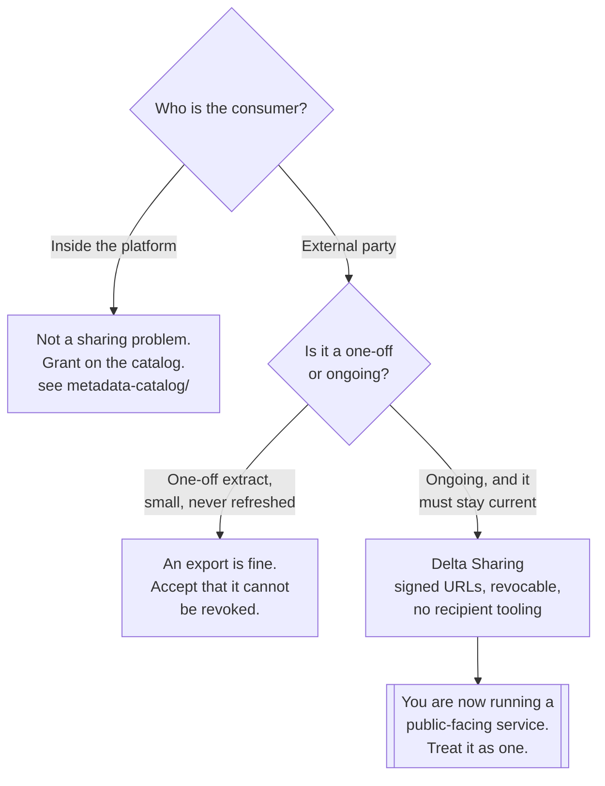

[← Lakehouse](../README.md)

# Sharing

Giving an external party access to data without copying it and without handing over bucket
credentials.

Tools covered: [`delta-sharing`](delta-sharing/README.md) — an open protocol for exactly this

## Contents

1. [The problem](#1-the-problem)
2. [The three usual answers, and why they are bad](#2-the-three-usual-answers-and-why-they-are-bad)
3. [How a sharing protocol works](#3-how-a-sharing-protocol-works)
4. [Decision tree](#4-decision-tree)
5. [Anti-patterns](#5-anti-patterns)
6. [How this applies to pikakube](#6-how-this-applies-to-pikakube)

---

## 1. The problem

A partner, a customer, a regulator or another business unit needs a dataset that lives in your
object storage. They are **outside the platform** — different organisation, different cloud,
possibly different tooling entirely.

What is actually being asked for is narrower than it first appears:

| Requirement | Why |
|---|---|
| **No copy** | a second copy diverges from the first the moment either changes |
| **No bucket credentials** | credentials to the bucket are credentials to everything in it |
| **Revocable** | access has to end when the relationship does |
| **Auditable** | who read what, and when |
| **Granular** | this table, not the prefix it happens to sit in |
| **No imposed tooling** | the recipient should not have to buy or run what you run |

Every one of those is a governance requirement rather than a technical one, which is why this sits
in [`data-governance/`](../../README.md) rather than under storage.

## 2. The three usual answers, and why they are bad

| Approach | What goes wrong |
|---|---|
| **Copy the files over** | two copies that diverge; no revocation — once they have it, they have it; and you pay egress for the whole dataset every refresh |
| **Give them bucket credentials** | no granularity (a key is scoped to a bucket or a prefix, not a table), no audit of what they read, and rotation means coordinating with an external party |
| **Build a query API** | you now run a service — availability, scaling, pagination, authentication, and a bespoke contract nobody else implements |

The copy is the most common and the worst. It fails the requirement people actually care about:
**revocation**. There is no way to un-send a Parquet file, and there is no way to keep a copy in
sync without a pipeline that becomes another thing to operate.

The credentials answer fails on granularity and audit, and it fails badly. An access key that can
read the lakehouse bucket can read every table in it, including the ones nobody meant to share, and
the object storage access log is not a data-access audit trail.

The API answer is not wrong — it is just expensive. Building a service to serve data that already
exists as files means reimplementing paging, filtering and authentication, and the recipient still
has to write a client for a protocol only you speak.

## 3. How a sharing protocol works

The mechanism worth understanding, because it makes the trade-offs obvious:

```
1. The PROVIDER runs a sharing server that knows which tables are shared with whom
2. The RECIPIENT authenticates to that server and asks for a table
3. The server checks the grant, then returns SHORT-LIVED SIGNED URLS
   pointing directly at the underlying Parquet files
4. The recipient reads the files STRAIGHT FROM OBJECT STORAGE
```

The consequences of that design:

| Property | Because |
|---|---|
| **No copy** | the recipient reads the provider's files, in place |
| **Revocable** | remove the grant, and the next URL request fails; the URLs already issued expire |
| **Auditable** | every grant check goes through the server |
| **Granular** | the grant is per table or per share, not per bucket |
| **The server is not in the data path** | it hands out URLs; the bytes go straight from object storage, so it does not have to scale with data volume |
| Recipient tooling is free | signed HTTPS URLs to Parquet files — anything can read that |

That fifth row is the design's best property. The sharing server handles metadata and
authorisation only. The actual transfer is object storage doing what it already does, which means
one small service can serve very large datasets.

The cost is honest and should be stated: **you are running a server**, it is a
public-facing authentication surface, and short-lived URLs are still URLs — anyone holding one can
read that file until it expires.

## 4. Decision tree



The left branch is worth taking seriously. **Most "sharing" requests are internal**, and internal
access is a catalog and permissions question — see
[`metadata-catalog/`](../../metadata-catalog/README.md) — not a protocol question. Running a
sharing server for another team in the same cluster is machinery for nothing.

## 5. Anti-patterns

| Anti-pattern | Why it is bad | What to do instead |
|---|---|---|
| **Sharing by copying files** | two copies that diverge, and no revocation | a sharing protocol, or accept the export is permanent |
| Handing over bucket credentials | no granularity, no audit, painful rotation | per-table grants |
| A bespoke export pipeline per partner | N pipelines, each one an integration to maintain | one protocol, N grants |
| Sharing a table with no lifecycle on it | the shared dataset grows without bound | [`storage/`](../storage/README.md) lifecycle policies |
| Sharing raw tables with personal data in them | the grant is per table, not per column | share a curated view, and see [`anonymization/`](../../anonymization/README.md) |
| Treating signed URLs as access control | a URL that leaks is readable until it expires | short expiry, and audit the grants |
| A sharing server with no monitoring | it is the front door to your data, exposed publicly | treat it as production infrastructure |
| Using a protocol for internal consumers | machinery for a permissions problem | grant on the catalog |

## 6. How this applies to pikakube

Mapped, not deployed — and the honest reading is that this platform has no external recipient
today. The value of the folder is that the **mechanism** is worth understanding before the request
arrives, because the fallback when it arrives unprepared is always the copy, and the copy is the
one option that cannot be undone.

[Delta Sharing](delta-sharing/README.md) is the only entry, which reflects the state of the space
rather than an omission — it is the open protocol with an actual specification and multiple
implementations.

The dependency worth noting: the protocol shares tables from object storage, so it sits on top of
[`storage/`](../storage/README.md) and the [table format](../table-formats/README.md) rather than
replacing either. And there is a wrinkle recorded on the tool page — the protocol is named for
Delta, and this platform's recorded direction is Iceberg. Read that page before assuming it drops in.

---

[← Lakehouse](../README.md)
