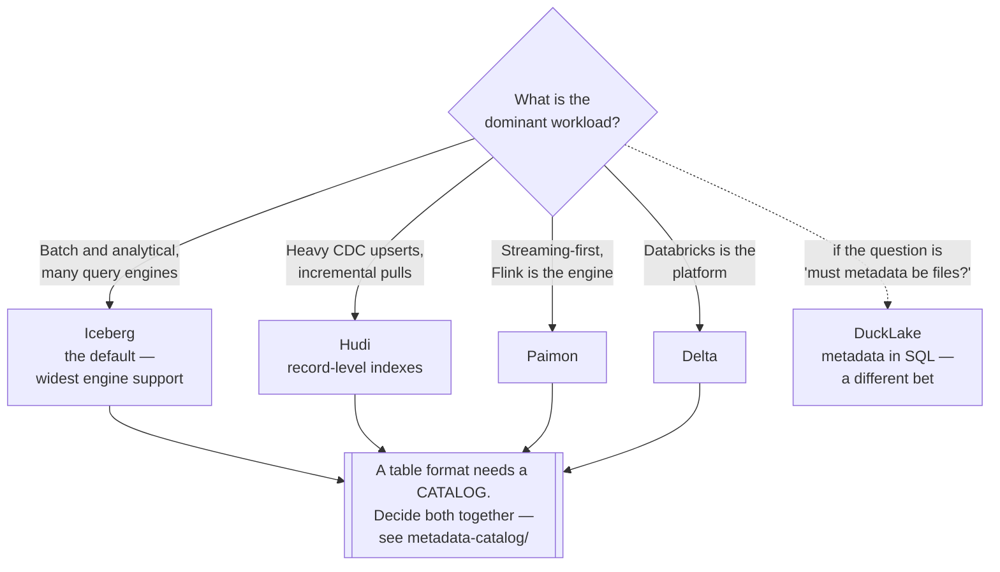

[← Lakehouse](../README.md)

# Table formats

What turns a folder of Parquet files into a table with transactions, schema evolution and time
travel.

Tools covered: [`iceberg`](iceberg/README.md) · [`delta`](delta/README.md) ·
[`hudi`](hudi/README.md) · [`paimon`](paimon/README.md) · [`ducklake`](ducklake/README.md)

## Contents

1. [The problem with a folder of Parquet](#1-the-problem-with-a-folder-of-parquet)
2. [What a table format adds](#2-what-a-table-format-adds)
3. [The formats](#3-the-formats)
4. [Decision tree](#4-decision-tree)
5. [The part everyone forgets: maintenance](#5-the-part-everyone-forgets-maintenance)
6. [Anti-patterns](#6-anti-patterns)
7. [How this applies to pikakube](#7-how-this-applies-to-pikakube)

---

## 1. The problem with a folder of Parquet

Parquet is an excellent file format and a poor table. A directory of Parquet files on object
storage has no concept of a transaction, so:

| Problem | What it looks like |
|---|---|
| **No atomicity** | a reader queries mid-write and sees half a load |
| **No consistent listing** | object storage listings are eventually consistent, so "which files are in this table" has no reliable answer |
| No updates or deletes | correcting one row means rewriting a partition, or the table |
| No schema evolution | adding a column means every reader must tolerate both shapes |
| No history | "what did this look like last Tuesday" is unanswerable |
| **Small files** | streaming writes produce thousands of tiny files, and query time collapses |

The listing problem is the subtle one and the reason the formats exist at all. Without a manifest,
determining a table's contents means listing a prefix — which is slow at scale and not guaranteed
to be current.

A table format is a **metadata layer** over the same Parquet files: a manifest saying which files
constitute the table right now, and a protocol for changing that manifest atomically.

## 2. What a table format adds

| Capability | What it enables |
|---|---|
| **ACID transactions** | concurrent readers and writers without partial reads |
| **Schema evolution** | add, drop and rename columns without rewriting |
| **Time travel** | query the table as of a timestamp or a version |
| Upserts and deletes | `MERGE INTO`, which is also how GDPR erasure becomes possible |
| **Partition evolution** | change the partitioning without rewriting history (Iceberg) |
| Compaction | small files merged into large ones |
| Statistics | file-level min/max, so scans skip data |

**Deletes deserve a specific mention.** "Delete this user's rows" is a legal requirement in most
jurisdictions and is effectively impossible on immutable Parquet without rewriting whole
partitions. A table format makes it a statement.

## 3. The formats

| Format | Origin | Where it shines | Detail |
|---|---|---|---|
| **Iceberg** | Netflix, Apache | **the emerging default** — hidden partitioning, partition evolution, and the broadest engine support | [→](iceberg/README.md) |
| **Delta Lake** | Databricks, LF | the Databricks ecosystem; excellent Spark integration, and `delta-rs` for non-JVM access | [→](delta/README.md) |
| **Hudi** | Uber, Apache | **incremental processing** — upsert-heavy CDC ingestion, and record-level indexes | [→](hudi/README.md) |
| **Paimon** | Apache, from Flink | **streaming-first** — built for Flink, with a changelog as a first-class concept | [→](paimon/README.md) |
| **DuckLake** | DuckDB | a radical simplification: the metadata lives in a **SQL database**, not in files | [→](ducklake/README.md) |

### Iceberg's two real differentiators

Worth understanding rather than accepting on reputation:

**Hidden partitioning.** In Hive-style layouts a query must filter on the partition column
explicitly, in exactly the right form, or it scans everything — and that requirement leaks into
every query anyone writes. Iceberg records the partition transform in metadata and applies it
automatically: filter on the timestamp, and the right partitions are pruned.

**Partition evolution.** Changing partitioning from daily to hourly normally means rewriting the
table. Iceberg applies the new scheme to new data and keeps reading the old, which turns an
irreversible decision into a reversible one.

Between them, those two remove the most expensive mistakes in lakehouse design.

### DuckLake is a different idea

Not a variation. The other four store metadata as files alongside the data, which is what forces
the catalog question and produces the manifest-listing overhead.

DuckLake puts the metadata in a **transactional SQL database** and keeps only the data in object
storage. That makes the metadata operations genuinely transactional and very fast, at the cost of
a database that must exist and be operated. Whether the trade is right is not yet settled — it is
worth understanding as an argument about where metadata belongs.

## 4. Decision tree

**The catalog box is not decoration.** Iceberg without a catalog is a set of files that different
engines will disagree about. The format and the catalog are one decision — see
[`metadata-catalog/`](../../metadata-catalog/README.md).

## 5. The part everyone forgets: maintenance

Table formats are usually adopted for their features and then run without the operations those
features require. Four jobs that must be scheduled:

| Job | What happens without it |
|---|---|
| **Compaction** | thousands of small files; query planning takes longer than the scan |
| **Snapshot expiry** | history grows forever, and storage costs with it |
| **Orphan file cleanup** | files from failed writes are never referenced and never deleted |
| Manifest rewriting | metadata itself becomes slow to read |

The **small-files problem** is the one that actually degrades platforms. A streaming write
committing every minute produces 1,440 files a day per partition, and query time becomes
dominated by opening files rather than reading them. Compaction is not an optimisation — it is
the maintenance that keeps the table usable.

[Amoro](../interoperability/amoro/README.md) exists partly to automate this, and some catalogs
now offer it as a service.

## 6. Anti-patterns

| Anti-pattern | Why it is bad | What to do instead |
|---|---|---|
| A table format with no catalog | engines disagree about what the table is | decide both together |
| No compaction schedule | the small-files problem, and it arrives gradually | schedule it from day one |
| Snapshots never expired | storage grows without bound | a retention policy, set deliberately |
| Over-partitioning | thousands of tiny partitions, worse than none | partition by what is filtered, coarsely |
| Choosing a format from a benchmark | benchmarks measure the author's workload | test yours |
| Multiple formats in one platform | every engine, tool and pipeline must handle both | one, unless there is a specific reason |
| Time travel treated as backup | snapshots expire, and it does not survive a bucket deletion | actual backups |
| Assuming every engine supports it fully | write support in particular varies a lot | verify the specific engine and version |
| Streaming writes without compaction | the fastest route to an unusable table | compact, or write in larger batches |

## 7. How this applies to pikakube

All five are mapped, and the notes recorded from actually integrating them are the useful part —
particularly because the difficulty is never the format itself, it is the storage and catalog
integration.

| Format | Recorded state |
|---|---|
| [Iceberg](iceberg/README.md) | mapped with HMS registration, branching and CDC references |
| [Delta](delta/README.md) | S3/MinIO and Hive Metastore integration; `delta-rs` and `kafka-delta-ingest` noted |
| [Hudi](hudi/README.md) | S3/MinIO and HMS integration attempted — **documentation recorded as very poor** for exactly those cases |
| [Paimon](paimon/README.md) | **local works; S3 and Hive documentation unusable**, and no Azure or GCP support |
| [DuckLake](ducklake/README.md) | tracked as an idea, with the DuckDB discussions |

That pattern is worth stating plainly: **the format is the easy part, the storage integration is
where the time goes.** Three of the five have recorded documentation failures at precisely the
step of connecting to object storage, which is not a coincidence — it is the least-tested path in
most of these projects.

**Iceberg is the right default here**, for the reason in section 3: the widest engine support,
and hidden partitioning removes a class of query mistakes. The platform already has the
supporting pieces — [MinIO](../storage/minio/README.md) for storage, and three Iceberg REST
catalog options under
[`metadata-catalog/iceberg/`](../../metadata-catalog/iceberg/README.md).

The related capability worth reading alongside this one:
[`version-control/`](../version-control/README.md), where Iceberg's native branching, Nessie and
lakeFS are three different answers to "can I test a change before publishing it".

---

[← Lakehouse](../README.md)
