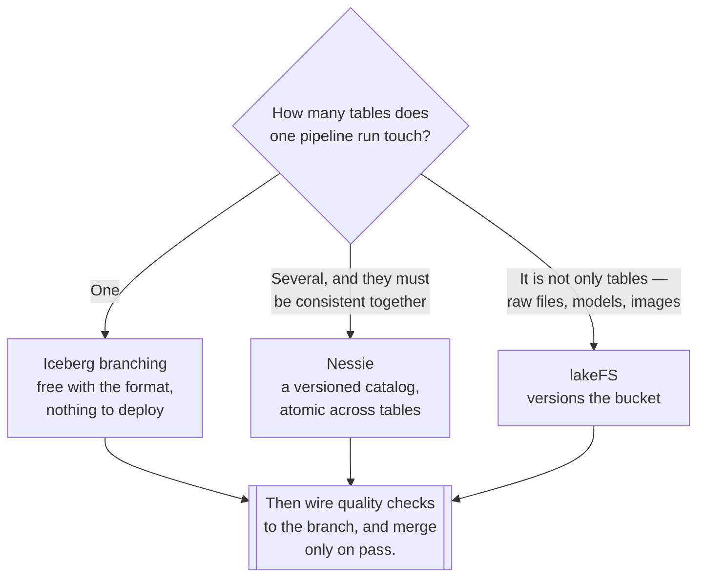

[← Lakehouse](../README.md)

# Version control for data

Testing a change before anyone sees it — the improvement CI brought to code, applied to data.

Tools covered: [`iceberg`](iceberg/README.md) — native branching ·
[`nessie`](nessie/README.md) — a versioned catalog · [`lakefs`](lakefs/README.md) — Git for the
whole lake

## Contents

1. [The problem](#1-the-problem)
2. [Write-audit-publish](#2-write-audit-publish)
3. [Three scopes](#3-three-scopes)
4. [Decision tree](#4-decision-tree)
5. [Anti-patterns](#5-anti-patterns)
6. [How this applies to pikakube](#6-how-this-applies-to-pikakube)

---

## 1. The problem

A pipeline writes to a table. If the data is wrong, it is wrong **in production**, and the fix is a
backfill — during which consumers are reading something nobody has verified.

Compare that with code, where the same situation was solved decades ago: work on a branch, run the
checks, merge only if they pass.

| | Without versioning | With it |
|---|---|---|
| Bad data | published, then backfilled | **never merged** |
| Testing a change | on a copy, or in production | on a branch of the real data |
| Reverting | a restore, or a rewrite | **reset the branch** |
| Reproducing a report | "what did this look like in March?" | a tag |
| Multi-table consistency | best effort | **one atomic merge** |

The last row is the underrated one. A pipeline updating five tables either succeeds entirely or
leaves the warehouse in a state no query expects. Branch-level merge makes that atomic across
tables, which no single table format does.

## 2. Write-audit-publish

The pattern all three tools enable, and the reason to care about any of them:

```
1. WRITE    the pipeline writes to a branch — nobody reads it
2. AUDIT    quality checks run against the branch
3. PUBLISH  checks pass → merge to main, atomically
            checks fail → discard the branch, alert
```

That converts *"we published bad data and are now backfilling"* into *"the branch failed its checks
and was never merged"* — a change in kind, not degree.

It also completes the story that [`quality/`](../../quality/README.md) starts. Quality checks are
most valuable **before** the write is visible, and without branching the only options are checking
after publication or writing to a staging table and copying. Branching makes the check a gate.

## 3. Three scopes

The tools differ in what they version, and that is the whole decision:

| | [Iceberg branching](iceberg/README.md) | [Nessie](nessie/README.md) | [lakeFS](lakefs/README.md) |
|---|---|---|---|
| Scope | **one table** | **a catalog** — many tables | **the whole bucket** |
| Multi-table transactions | no | **yes** | **yes** |
| Formats | Iceberg only | Iceberg, Delta | **any file** |
| Extra service | **none** | a catalog service | a service, in the data path |
| Where it sits | in the table's metadata | replaces the catalog | in front of object storage |
| Cost | free with the format | a catalog to run | a component every read passes through |

**Iceberg branching is free** and covers a single table. If the pipeline writes one table, that is
the whole answer and nothing needs deploying.

**Nessie versions the catalog**, so a branch spans every table in it and a merge is atomic across
them. That is the multi-table case, and it is a catalog rather than an extra layer — it replaces
the one you would otherwise run.

**lakeFS versions the bucket**, including files no table format manages — raw landing data, models,
images. Its cost is that it sits in the data path.

## 4. Decision tree



## 5. Anti-patterns

| Anti-pattern | Why it is bad | What to do instead |
|---|---|---|
| Branching adopted without checks | branches that always merge are ceremony | wire [`quality/`](../../quality/README.md) to the gate |
| Branches never deleted | metadata and storage grow without bound | expire them, on a schedule |
| Time travel treated as backup | snapshots expire and do not survive a deleted bucket | real backups |
| lakeFS for a single Iceberg table | a service in the data path for something the format does free | Iceberg branching |
| Long-lived branches | they diverge, and the merge becomes the problem | short-lived, per run |
| A branch per developer, permanently | storage and confusion | per pipeline run |
| Merging without atomicity across tables | partial state that no query expects | Nessie, or one table |

## 6. How this applies to pikakube

The lakehouse substrate here is [Iceberg](../table-formats/iceberg/README.md) on
[MinIO](../storage/minio/README.md), which makes **Iceberg branching the free starting point** —
no service, no new dependency, and it covers the single-table case.

[lakeFS](lakefs/README.md) is the one with recorded hands-on work: its
**MinIO integration is marked done**, with Spark and Delta notebooks and the client library. That
is more than a mapping.

[Nessie](nessie/README.md) is mapped with MinIO and Iceberg integration noted.

The sequence worth following:

1. **Iceberg branching** for single-table pipelines — costs nothing
2. **Quality checks against the branch**, using [Soda](../../quality/soda/README.md) as an
   [Airflow](../../../data-engineering/orchestration/airflow/README.md) task
3. **Merge on pass, discard on fail**
4. **Nessie** only if a pipeline run must update several tables atomically

Step 2 is what makes the rest worth doing. Branching without a gate is a feature nobody uses; the
combination is what turns [`quality/`](../../quality/README.md) from a report into a control.

---

[← Lakehouse](../README.md)
