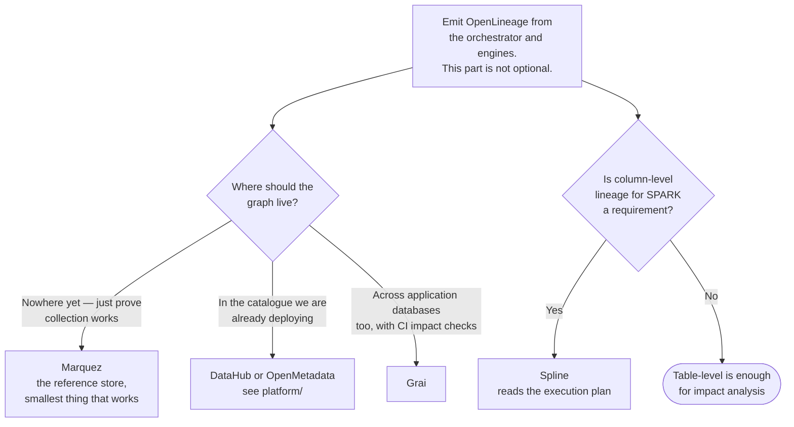

[← Data governance](../README.md)

# Data lineage

Where did this number come from, and what breaks if I change this table?

Tools covered: [`open-lineage`](open-lineage/README.md) · [`marquez`](marquez/README.md) ·
[`spline`](spline/README.md) · [`grai`](grai/README.md) · [`egeria`](egeria/README.md)

## Contents

1. [The two questions](#1-the-two-questions)
2. [Table-level and column-level](#2-table-level-and-column-level)
3. [The only thing that matters: automatic collection](#3-the-only-thing-that-matters-automatic-collection)
4. [The tools](#4-the-tools)
5. [Decision tree](#5-decision-tree)
6. [Anti-patterns](#6-anti-patterns)
7. [How this applies to pikakube](#7-how-this-applies-to-pikakube)

---

## 1. The two questions

Lineage is a graph of datasets and the jobs that produce them, and it exists to answer two
questions that are asked constantly and answered badly:

| Direction | Question | Asked when |
|---|---|---|
| **Upstream** | where did this number come from? | a figure looks wrong, and trust is at stake |
| **Downstream** | what breaks if I change this? | before a schema change, or during an incident |

The second is the one with immediate operational value. "We are dropping this column" is a
sentence that either has a known blast radius or does not, and without lineage the answer comes
from asking around — which finds the consumers people remember, not the ones that exist.

The first is what turns a distrusted dashboard into a resolvable question. Without it, "is this
number right?" is answered by rebuilding the calculation by hand.

## 2. Table-level and column-level

A real distinction in cost and in value:

| | **Table-level** | **Column-level** |
|---|---|---|
| Granularity | this job read A and B, wrote C | this column of C came from that column of A |
| Answers | what breaks if the table changes | what breaks if the **column** changes |
| Collection | straightforward — the job knows its inputs and outputs | requires parsing the query or the plan |
| Support | broad | **patchy, and this is the recurring disappointment** |
| Enough for | impact analysis, debugging a pipeline | compliance, PII tracing, precise impact |

Column-level lineage is what everyone wants and what most tools deliver only for some engines.
The pattern is consistent: SQL-based sources parse well, and Spark jobs — where the
transformation is code rather than a query — do not.

That gap is worth knowing before adopting anything on the promise of column-level lineage,
because the answer to "does it work for Spark?" is frequently no.

## 3. The only thing that matters: automatic collection

Lineage documentation that is maintained by hand is wrong within a month, and it is
*confidently* wrong — which is worse than absent, because people act on it.

So the only question that decides whether a lineage tool is worth deploying:

> **Does it collect lineage automatically from the systems that already run the jobs?**

If the answer involves anyone drawing a diagram or filling in a form, the project has already
failed. It just has not failed visibly yet.

This is why **OpenLineage** matters more than any of the tools that store or display lineage: it
is the standard the producers emit. Airflow, Spark, dbt, Flink and Trino all speak it with
configuration rather than code, which is what makes collection automatic rather than aspirational.

| Layer | What it is | Example |
|---|---|---|
| **Specification** | the event format everything agrees on | [OpenLineage](open-lineage/README.md) |
| **Integrations** | emitters inside the tools that run jobs | Airflow, Spark, dbt, Flink |
| **Store and UI** | receives events, builds the graph, shows it | [Marquez](marquez/README.md), DataHub, OpenMetadata |

Separating those three layers is the useful mental model. The specification is the decision that
matters; the store is replaceable.

## 4. The tools

| Tool | Layer | Where it shines | Detail |
|---|---|---|---|
| **OpenLineage** | specification | **the standard** — emitted by Airflow, Spark, dbt, Flink, Trino | [→](open-lineage/README.md) |
| **Marquez** | store and UI | the reference implementation of OpenLineage; the simplest way to see the graph | [→](marquez/README.md) |
| **Spline** | collector and UI | **Spark specifically** — captures the execution plan, so it gets column-level where others do not | [→](spline/README.md) |
| **Grai** | store and UI | lineage across the **whole stack**, including application databases, with CI impact checks | [→](grai/README.md) |
| **Egeria** | framework | enterprise metadata governance — a standards body's answer, and correspondingly large | [→](egeria/README.md) |

**Spline** is the interesting exception. It hooks into Spark's query execution listener and reads
the logical plan, which is how it produces column-level lineage for Spark jobs — the case that
defeats most tools. If the platform is Spark-centric and column-level matters, it is the direct
answer.

**Egeria** is the odd entry and worth understanding rather than adopting: it is an ODPi project
building an open metadata standard and integration framework for large enterprises. Genuinely
ambitious, and far too large for anything that is not a metadata programme with headcount.

Note that [`platform/`](../platform/README.md) tools — DataHub, OpenMetadata — also store and
display lineage, ingesting OpenLineage events. So the practical choice is often not "which
lineage tool" but "do I want a dedicated store, or the one inside the catalogue I am already
deploying".

## 5. Decision tree

## 6. Anti-patterns

| Anti-pattern | Why it is bad | What to do instead |
|---|---|---|
| Lineage drawn by hand | wrong within a month, and confidently so | emit it from the pipeline |
| A lineage tool without emitters configured | an empty graph, and the discipline gets blamed | integrations first, UI second |
| Adopting a proprietary lineage format | the store becomes impossible to change | OpenLineage |
| Expecting column-level everywhere | support is patchy, especially for Spark | verify for **your** engines before promising it |
| Lineage only for the warehouse | the pipeline that populates it is where breakage originates | instrument the orchestrator too |
| Treating lineage as documentation | it is an operational tool for impact analysis | wire it into schema-change review |
| A graph nobody consults during incidents | it was built and then forgotten | make it the first stop for "what broke" |
| Ignoring the application databases | lineage that starts at the warehouse misses the source | see [Grai](grai/README.md) |

## 7. How this applies to pikakube

**This is the clearest gap in [`data-governance/`](../README.md), and it is the cheapest to
close.**

The platform already runs the three systems that emit OpenLineage with configuration alone:

| System | Integration |
|---|---|
| [Airflow](../../data-engineering/orchestration/airflow/README.md) | an OpenLineage provider package plus config — no DAG changes |
| [Spark](../../data-engineering/processing/spark/README.md) | a listener JAR and a few Spark properties |
| [dbt](../../analytics-engineering/transform/dbt/README.md) | `dbt-ol`, wrapping the normal command |

Nothing here requires writing code. The lineage is a by-product of jobs that already run, which
is exactly the "automatic collection" property section 3 says is the only one that matters.

**Marquez is the right first store** — it is the reference implementation, it exists to receive
these events, and it proves the collection works before any decision is made about a full
catalogue. Its recorded limitation is worth knowing:
[input is via API only](marquez/README.md), which is fine when the input is emitted events and
awkward for anything else.

If [DataHub](../platform/datahub/README.md) or
[OpenMetadata](../platform/open-metadata/README.md) is eventually adopted, both ingest the same
OpenLineage events — so starting with the specification means the store stays a replaceable
decision rather than a commitment.

For the Spark-heavy parts of this platform, [Spline](spline/README.md) is the alternative worth
evaluating specifically because it reaches column level where the generic path does not.

---

[← Data governance](../README.md)
