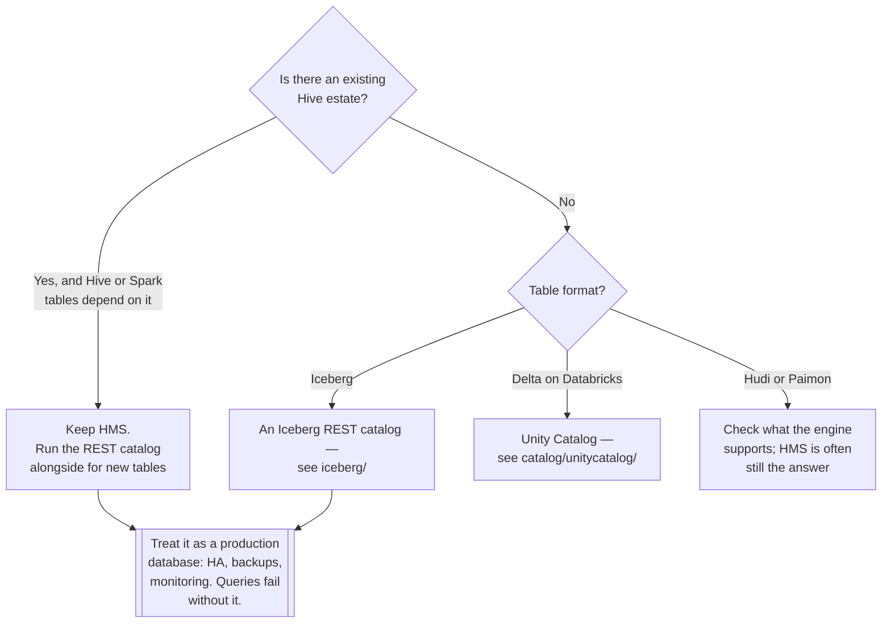

[← Data governance](../README.md)

# Metadata catalog

The technical catalog — what query engines ask to find out where a table's files are.

Subfolders: [`iceberg/`](iceberg/README.md) — the REST catalog options ·
[`hms/`](hms/README.md) — Hive Metastore, the incumbent

## Contents

1. [Not the same as a data catalogue](#1-not-the-same-as-a-data-catalogue)
2. [What it actually does](#2-what-it-actually-does)
3. [Hive Metastore, and why it is being replaced](#3-hive-metastore-and-why-it-is-being-replaced)
4. [The Iceberg REST catalog](#4-the-iceberg-rest-catalog)
5. [Decision tree](#5-decision-tree)
6. [Anti-patterns](#6-anti-patterns)
7. [How this applies to pikakube](#7-how-this-applies-to-pikakube)

---

## 1. Not the same as a data catalogue

The distinction from [`catalog/`](../catalog/README.md) and
[`platform/`](../platform/README.md), restated because the shared word causes real confusion:

| | **This folder** | [`platform/`](../platform/README.md) |
|---|---|---|
| Answers | *where are the files, and what is the current snapshot?* | *what does this mean, who owns it, can I trust it?* |
| Consumed by | **query engines** | **people** |
| If it is down | **every query fails** | discovery is inconvenient |
| Updated by | writes to the table | ingestion and human input |
| Is | infrastructure, in the data path | a product, beside it |

The third row is the one to internalise. A metadata catalog is a **production dependency of every
query**. It needs the availability, backup and monitoring treatment of a database, because it
effectively is one.

## 2. What it actually does

For each table it holds the pointer to the current state, and it makes changing that pointer
atomic:

| Responsibility | Detail |
|---|---|
| **Namespace and table registry** | which tables exist, under which names |
| **Current metadata pointer** | for Iceberg, which metadata file is current |
| **Atomic commit** | swapping that pointer, so concurrent writers cannot corrupt the table |
| Schema | the columns, as the engine sees them |
| Partitioning | the transforms |
| Increasingly, access control | who may read or write which table |

The atomic-commit row is the reason a catalog is mandatory rather than convenient. Two engines
writing to the same Iceberg table rely on the catalog to serialise the commit — without it, one
overwrites the other's metadata and the table is inconsistent.

## 3. Hive Metastore, and why it is being replaced

HMS is the incumbent: a Java service backed by a relational database, holding table definitions,
originally for Hive and adopted by everything since.

It works, it is everywhere, and it is being replaced for concrete reasons:

| Problem | Detail |
|---|---|
| **A whole database to operate** | MySQL or Postgres, backed up, monitored, migrated |
| Thrift protocol | not HTTP; awkward through proxies, gateways and service meshes |
| **A directory-based model** | the table is a directory, which is Hive's assumption, not Iceberg's |
| No native access control | authorisation is bolted on |
| Operational weight | a JVM service plus a database, for a lookup table |

The directory assumption is the deep mismatch. HMS thinks a table is a path and its partitions
are subdirectories; Iceberg's whole design is that the file list lives in a manifest. HMS can
store an Iceberg pointer, and it is doing so as a key-value store rather than as what it was
built for.

## 4. The Iceberg REST catalog

The replacement is a **specification**, not a product: an HTTP API that any catalog can implement
and any engine can speak.

| Property | Consequence |
|---|---|
| **HTTP** | works through every proxy, gateway and mesh |
| **A specification** | the implementation is replaceable |
| Server-side logic | credential vending, access control, and maintenance can live in the catalog |
| No client-side storage credentials | the catalog can hand out scoped, temporary access to the files |

Credential vending is the underrated one. Without it, every engine that queries a table needs
object-storage credentials configured, which is a distribution problem and an authorisation
problem. With it, the engine authenticates to the catalog and receives scoped, temporary access
to exactly the files it needs.

The implementations here — [Polaris](iceberg/polaris/README.md),
[Lakekeeper](iceberg/lakekeeper/README.md), [Gravitino](iceberg/gravitino/README.md) — differ in
maturity and packaging rather than in protocol, which is the point of a specification.

## 5. Decision tree

## 6. Anti-patterns

| Anti-pattern | Why it is bad | What to do instead |
|---|---|---|
| Treating it as optional infrastructure | every query depends on it | HA, backups, monitoring |
| No backup of the metastore database | the tables' definitions are gone; the files are unreadable as tables | back it up like any database |
| Storage credentials on every engine | a distribution and authorisation problem that grows with each engine | credential vending, via REST |
| Several catalogs for the same tables | they disagree, and the disagreement is discovered during a query | one catalog per table |
| Confusing it with a data catalogue | expecting a query engine to read a discovery UI | see section 1 |
| Adopting a catalog whose packaging is unfinished | it is in the query path; a broken chart is a broken platform | check the deployment story first |
| HMS kept because it is familiar | a JVM service and a database, for a lookup | evaluate REST for new tables |

## 7. How this applies to pikakube

Both generations are mapped, and the notes are mostly about **packaging maturity** — which for a
component in the query path is the deciding factor rather than a detail.

| Option | Recorded state |
|---|---|
| [HMS](hms/README.md) | working, with AWS and Azure variants and MySQL-backed schema init |
| [Polaris](iceberg/polaris/README.md) | **no OCI Helm support; no Helm repository at all** |
| [Lakekeeper](iceberg/lakekeeper/README.md) | charts and an operator exist; **no OCI support** |
| [Gravitino](iceberg/gravitino/README.md) | OCI chart recently created, **very low maturity** |

That is a genuinely awkward position, and it is worth stating rather than glossing: the direction
of travel is clearly the REST catalog, and all three implementations have deployment friction in
a GitOps setup that expects OCI-packaged charts.

**The honest recommendation for this platform:** HMS is what currently works, and the REST
catalog is what to move to — with Lakekeeper as the most complete of the three, since it ships
both charts and an operator. The blocker is packaging rather than the software.

Whichever is chosen, section 6's first row applies: this is not a supporting service. If it is
down, [Trino](../../data-engineering/query-engine/README.md),
[Spark](../../data-engineering/processing/spark/README.md) and every other engine stop being able
to resolve a table.

---

[← Data governance](../README.md)
