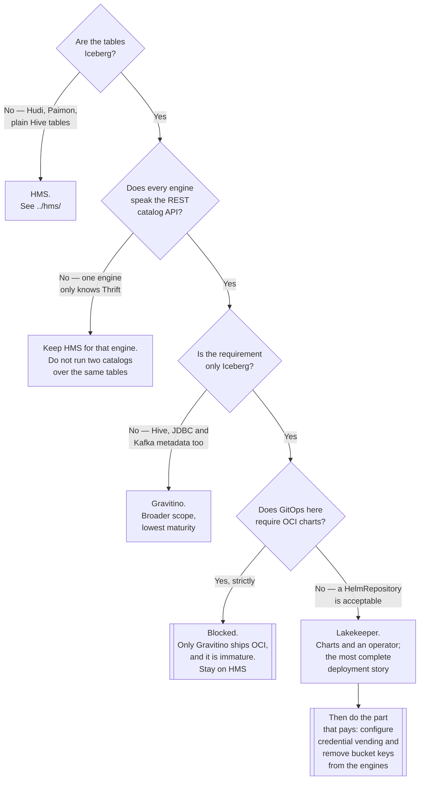

[← Metadata catalog](../README.md)

# Iceberg REST catalogs

The three open-source implementations of the Iceberg REST catalog specification — and their
packaging problems, which is what actually decides between them.

Implementations: [`polaris/`](polaris/README.md) — Apache, Snowflake-donated ·
[`lakekeeper/`](lakekeeper/README.md) — Rust, charts and an operator ·
[`gravitino/`](gravitino/README.md) — Apache, multi-source metadata

## Contents

1. [A specification, not a product](#1-a-specification-not-a-product)
2. [What the API actually does](#2-what-the-api-actually-does)
3. [Credential vending](#3-credential-vending)
4. [The three implementations](#4-the-three-implementations)
5. [Decision tree](#5-decision-tree)
6. [Anti-patterns](#6-anti-patterns)
7. [How this applies to pikakube](#7-how-this-applies-to-pikakube)

---

## 1. A specification, not a product

The most important property of the Iceberg REST catalog is one people miss because it is packaged
as three separate products: **it is an OpenAPI specification, published in the Iceberg project.**
Any server can implement it, any engine can speak it, and neither knows which implementation is on
the other end.

<https://github.com/apache/iceberg/blob/main/open-api/rest-catalog-open-api.yaml>

| Consequence | Detail |
|---|---|
| **The implementation is replaceable** | Trino, Spark and Flink are configured with a URL, not with a vendor client |
| **HTTP** | works through every ingress, proxy, gateway and service mesh — unlike Thrift |
| **Server-side logic** | authorisation, credential vending and maintenance can live behind the API |
| **Migration is bounded** | changing catalog changes a URL and moves the table registry, not the table format |

That last row is what makes the immaturity recorded on all three pages tolerable. Adopting a
metastore has historically been a decade-long commitment; adopting a REST catalog is closer to
choosing which implementation of an interface to run this year. Choosing wrong is recoverable in a
way that choosing wrong about the **table format** — see
[`lakehouse/table-formats/iceberg/`](../../lakehouse/table-formats/iceberg/README.md) — is not.

Contrast with [HMS](../hms/README.md), which is not a specification. It is one Java implementation
and a Thrift interface, and everything that speaks "the Hive Metastore protocol" speaks to that
implementation.

## 2. What the API actually does

The API surface is small, which is the point:

| Operation | Purpose |
|---|---|
| List / create / drop **namespaces** | the database level |
| List / create / drop **tables** | the registry |
| **Load table** | returns the current metadata location and the table's schema |
| **Commit** | swap the current metadata pointer — atomically, with an expected-current check |
| **Load credentials** | scoped, temporary storage access for the files (see section 3) |

The commit operation is the reason a catalog is mandatory rather than convenient. Iceberg writers
produce a new metadata file and then ask the catalog to move the pointer from the version they
read to the one they wrote. If the pointer moved in between, the commit is rejected and the writer
retries. That compare-and-swap is what makes concurrent writes safe, and object storage cannot
provide it on its own.

Everything else in Iceberg — snapshots, manifests, schema evolution, time travel — is in the files.
The catalog holds one pointer per table and serialises changes to it.

## 3. Credential vending

The underrated feature, and the one that changes the security model rather than the deployment
diagram.

**Without it**, every engine that queries a table needs object-storage credentials configured
locally:

- Trino has S3 keys. Spark has S3 keys. Flink has S3 keys. Every notebook has S3 keys.
- Those credentials are **bucket-scoped at best** — an engine that can read one table can usually
  read every table in the bucket
- Rotating them means touching every engine
- Table-level authorisation is impossible, because authorisation is happening at the bucket

**With it**, the engine authenticates to the **catalog**, asks to load a table, and receives back
along with the metadata pointer a set of **scoped, short-lived storage credentials** — an STS token
for exactly the prefix that table occupies, valid for minutes.

| Property | Effect |
|---|---|
| The engine holds **no** long-lived storage credentials | nothing to distribute, nothing to rotate |
| Access is **scoped to the table's prefix** | reading table A does not grant table B |
| Access is **time-limited** | a leaked token expires |
| Authorisation happens in **one place** | the catalog decides, not each engine's config |
| Revocation is real | remove the grant in the catalog and the next `loadTable` returns nothing |

This is what makes the REST catalog a governance component and not just a replacement metastore.
It is the mechanism that turns *"who can read this table"* from a bucket policy nobody can read
into a grant in a system that knows what a table is.

It is also the direct answer to the configuration recorded in [`../hms/`](../hms/README.md), where
the metastore and every engine hold static keys in `core-site.xml`.

Note the requirement it imposes: the catalog now needs a credential-issuing relationship with the
object store (an IAM role it can assume, a MinIO policy it can scope). That configuration is real
work and is the part most often skipped, which is how people end up running a REST catalog and
still distributing bucket keys.

## 4. The three implementations

Same protocol. The differences are in maturity, scope and — decisively here — packaging.

| | [Polaris](polaris/README.md) | [Lakekeeper](lakekeeper/README.md) | [Gravitino](gravitino/README.md) |
|---|---|---|---|
| Origin | Snowflake → Apache | Lakekeeper (independent) | Datastrato → Apache |
| Language | Java | **Rust** | Java |
| Scope | Iceberg REST catalog | Iceberg REST catalog | **multi-source metadata**, with Iceberg REST as one interface |
| Backing store | relational database | **PostgreSQL** | relational database |
| Chart source in this repo | Apache download page (`HelmRepository`) | GitHub Pages (`HelmRepository`) | **Docker Hub (`OCIRepository`)** |
| Operator | no | **yes** | no |
| Recorded verdict | no OCI, no Helm repository, poor console | charts + operator, **no OCI** | OCI chart exists, **very low maturity** |

**Read that bottom row as the actual state of this capability.** Every one of the three has a
packaging complaint recorded against it, which is unusual for software that sits in the query
path.

Gravitino is also the odd one out on scope: it is a **metadata lake** that federates Hive, Iceberg,
JDBC sources and message systems, and exposes an Iceberg REST endpoint among other interfaces. It
solves a broader problem, which is a reason to look at it and a reason not to adopt it *only* as a
REST catalog.

## 5. Decision tree

## 6. Anti-patterns

| Anti-pattern | Why it is bad | What to do instead |
|---|---|---|
| Running a REST catalog and still distributing bucket keys | the main benefit is unclaimed; authorisation is still the bucket policy | configure credential vending, then remove the keys |
| Two catalogs registering the same tables | they disagree about the current snapshot, and it surfaces as a corrupt read | one catalog owns a table; migrate, do not mirror |
| Treating it as a stateless microservice | it is a database front end in the query path | HA, backups and monitoring for its PostgreSQL |
| No backup of the catalog database | files remain, tables do not; the pointers are gone | back it up like production |
| Choosing on feature comparison | the protocol is a specification — features barely differ | choose on maturity and deployability |
| Adopting one whose chart is unfinished | a broken chart in the query path is a broken platform | check the deployment story before the docs |
| Exposing it without authentication | anyone who can reach it can drop a namespace, and now vends credentials | OIDC in front, from day one |
| Assuming the catalog holds the data | it holds one pointer per table; everything else is in object storage | back up the metadata **and** the files |
| Using it as a data catalogue | no glossary, no ownership, no search for humans | [`platform/`](../../platform/README.md) |

## 7. How this applies to pikakube

All three are mapped, none is in service, and the reason is packaging rather than the software —
which is worth stating bluntly because it is an uncomfortable position for a component in the
query path.

| Implementation | Deployment here | Recorded finding |
|---|---|---|
| [Polaris](polaris/README.md) | `HelmRepository` pointing at `downloads.apache.org/polaris/helm-chart`, chart 1.6.0 | **no Helm OCI support**; a UI exists and is bad enough that there is no Helm repository proper, let alone OCI |
| [Lakekeeper](lakekeeper/README.md) | `HelmRepository` + chart 0.11.0 + a CloudNativePG cluster with an `ExternalSecret`-generated password | charts and an operator exist; **no OCI support**; the Iceberg integration is untested |
| [Gravitino](gravitino/README.md) | `OCIRepository` on `registry-1.docker.io/apache/gravitino-helm`, tag 1.3.11 | OCI chart **recently created, very low maturity** |

The Lakekeeper manifests are the most complete piece of work in this folder — an external
PostgreSQL via [CloudNativePG](../../../databases/sql/postgresql/operator/cnpg/README.md), a
generated password delivered through External Secrets, and Prometheus scrape annotations
switched on. That is a deployment someone intended to run, and its `values` are otherwise
unconfigured: no warehouse, no object-storage credentials, no OIDC.

**The honest recommendation.** Lakekeeper is the one to pursue — it is the only implementation
here that ships both charts and an operator, and it is the only one whose manifests already have a
real database behind them. The blocker is that it publishes over a plain `HelmRepository` rather
than OCI, which is a GitOps inconvenience rather than a defect, and is a much smaller problem than
Gravitino's maturity or Polaris's packaging.

Until then [HMS](../hms/README.md) is what answers queries, exactly as
[`../README.md`](../README.md#7-how-this-applies-to-pikakube) records. The work that would make
any of this worthwhile is section 3: **switching on credential vending and taking the static S3
keys out of** [`hms-aws/hive/configmap.yaml`](../hms/hms-aws/hive/configmap.yaml) **and out of
every engine.** That is the change with real value here; swapping one catalog for another without
it is a lateral move.

---

[← Metadata catalog](../README.md)
