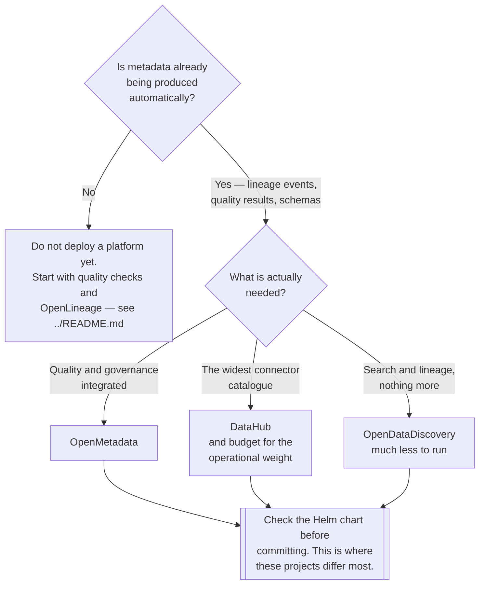

[← Data governance](../README.md)

# Governance platforms

The integrated products — catalogue, lineage, quality and ownership in one system.

Tools covered: [`open-metadata`](open-metadata/README.md) · [`datahub`](datahub/README.md) ·
[`opendatadiscovery`](opendatadiscovery/README.md)

## Contents

1. [What they bundle](#1-what-they-bundle)
2. [The trap](#2-the-trap)
3. [The tools](#3-the-tools)
4. [Decision tree](#4-decision-tree)
5. [What to evaluate](#5-what-to-evaluate)
6. [Anti-patterns](#6-anti-patterns)
7. [How this applies to pikakube](#7-how-this-applies-to-pikakube)

---

## 1. What they bundle

Where [`catalog/`](../catalog/README.md), [`lineage/`](../lineage/README.md) and
[`quality/`](../quality/README.md) are separate capabilities, these products offer all of them
behind one interface:

| Capability | What the platform adds |
|---|---|
| **Discovery** | search across every dataset, with descriptions and tags |
| **Lineage** | ingested from OpenLineage and from source-system parsing |
| **Ownership** | a name attached to every dataset — the field that matters most |
| Glossary | business terms mapped to physical columns |
| **Classification** | PII tagging, often automatic |
| Quality | test results surfaced beside the dataset |
| Profiling | distributions, null rates, cardinality |
| Access requests | a workflow for getting access, in some |

The genuine argument for a platform over assembled parts is the **join**: seeing a dataset's
owner, its lineage, its quality results and its PII classification on one page is more useful
than four systems that each know one of those things.

## 2. The trap

These products are the most common way data governance is attempted and abandoned, and the
failure is predictable:

1. A platform is deployed, because it is the visible artefact
2. It is populated by hand, once, in an enthusiastic week
3. Nothing keeps it current
4. Six months later it is confidently wrong, and nobody opens it
5. The conclusion drawn is that "data governance does not work here"

The cause is doing it in the wrong order. A catalogue is a **view over metadata that already
exists** — and if no metadata is being produced automatically, deploying a viewer produces an
empty product with a search box.

The order that works is in [`../README.md`](../README.md#5-the-order-that-works): quality checks
first, then automatic lineage, then contracts, and a platform once there is something to browse.

## 3. The tools

| Tool | Where it shines | Detail |
|---|---|---|
| **OpenMetadata** | **the most complete and the most coherent** — catalogue, lineage, quality, glossary and classification designed together | [→](open-metadata/README.md) |
| **DataHub** | the largest ecosystem and connector catalogue; LinkedIn's, widely deployed | [→](datahub/README.md) |
| **OpenDataDiscovery** | **lighter** — discovery and lineage without the surface area of the other two | [→](opendatadiscovery/README.md) |

**OpenMetadata** is the one to evaluate first. Its data-quality features are built in rather than
integrated, which means test results appear beside the dataset without a separate system, and its
API and ingestion model are consistent across entity types.

**DataHub** has the broader connector catalogue and a very active community. Its architecture is
also considerably larger — Kafka, Elasticsearch, a relational store and several services — which
is where the operational difficulty comes from.

**OpenDataDiscovery** is the reasonable choice when the requirement is genuinely discovery and
lineage, and the glossary, classification and access-request features would go unused. Less to
run, less to populate, less to abandon.

## 4. Decision tree

## 5. What to evaluate

The marketing pages are indistinguishable. The things that actually differ:

| Question | Why it decides the outcome |
|---|---|
| **Does the Helm chart work?** | the single biggest practical difference between these projects |
| **Which connectors are real?** | "supports 50 sources" and "supports your source well" are different claims |
| **Column-level lineage, for your engines** | universally promised, unevenly delivered — Spark especially |
| Ingestion scheduling | how metadata stays current; if it is manual, see section 2 |
| Authentication | SSO, or a shared admin login |
| Upgrade path | these projects move fast, and upgrades can be disruptive |
| Storage footprint | DataHub in particular brings several stateful systems |

The first row deserves the emphasis. Every one of these is a large distributed application, and
the difference between an afternoon and a fortnight is entirely whether the packaging works.

## 6. Anti-patterns

| Anti-pattern | Why it is bad | What to do instead |
|---|---|---|
| Deploying before metadata exists | an empty product, and the discipline gets blamed | automatic collection first |
| Populating by hand | correct for a week | ingest from the systems that know |
| No ownership recorded | the most valuable field left blank, so questions still route by memory | make ownership mandatory |
| Ingestion run once, manually | stale within a month | schedule it |
| Adopting for column-level lineage without checking | frequently unavailable for the engine that matters | verify before promising |
| Two platforms, because neither quite fits | twice the ingestion, and two disagreeing answers | one, or none |
| A glossary with no link to physical columns | a dictionary nobody consults | map terms to columns |
| Treating it as a compliance artefact | built, screenshotted, abandoned | make it the place people actually search |

## 7. How this applies to pikakube

All three are mapped, and the recorded findings are unusually direct — this is a category where
the difference between the tools is almost entirely operational.

**[DataHub](datahub/README.md)** — the notes are blunt: full of bugs, and the Helm chart
*"never works"*
([acryldata/datahub-helm#347](https://github.com/acryldata/datahub-helm/issues/347)). A Spark
lineage run through Jupyter produced nothing visible in the UI. And the specific limitation worth
carrying forward: **column-level lineage is available for Snowflake and Looker, not Spark** —
which is the exact gap section 5 warns about, found the hard way.

**[OpenMetadata](open-metadata/README.md)** — it runs, and the recorded issues are about
packaging and specific bugs rather than the product being unusable. No OCI Helm support
([#344](https://github.com/open-metadata/openmetadata-helm-charts/issues/344)), and a stale-auth
config bug ([#29597](https://github.com/open-metadata/OpenMetadata/issues/29597)).

**[OpenDataDiscovery](opendatadiscovery/README.md)** — mapped, with charts available.

On that evidence, **OpenMetadata is the one to pursue** for this platform. Not because it is
better in the abstract, but because it installs and DataHub did not — which for a large
distributed application is most of the evaluation.

The precondition still applies, and it is the reason none of this is deployed: **there is no
automatic metadata being produced yet.** The platform runs Airflow, Spark and dbt, none of which
currently emit [OpenLineage](../lineage/README.md). Switching that on is the step that makes a
catalogue worth deploying — and doing it in the other order is the failure in section 2.

---

[← Data governance](../README.md)
