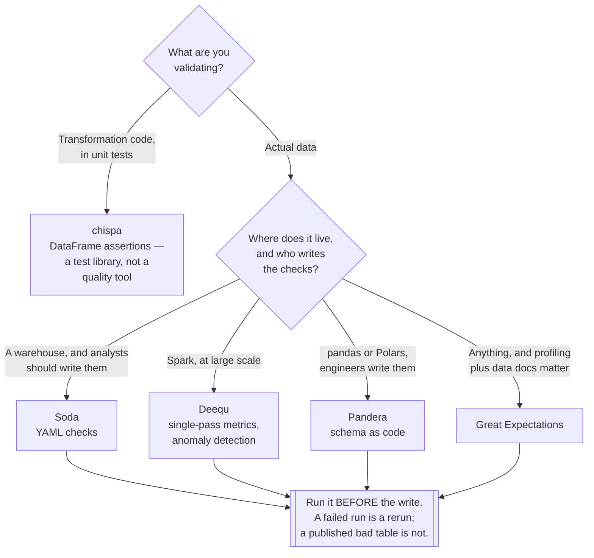

[← Data governance](../README.md)

# Data quality

Finding out the data is wrong before the business does.

Tools covered: [`great-expectations`](great-expectations/README.md) · [`soda`](soda/README.md) ·
[`deequ`](deequ/README.md) · [`pandera`](pandera/README.md) · [`chispa`](chispa/README.md)

## Contents

1. [Why this is the place to start](#1-why-this-is-the-place-to-start)
2. [What to check](#2-what-to-check)
3. [Where the check runs](#3-where-the-check-runs)
4. [The tools](#4-the-tools)
5. [Decision tree](#5-decision-tree)
6. [What to do when a check fails](#6-what-to-do-when-a-check-fails)
7. [Anti-patterns](#7-anti-patterns)
8. [How this applies to pikakube](#8-how-this-applies-to-pikakube)

---

## 1. Why this is the place to start

Of every capability in [`data-governance/`](../README.md), this is the one with the fastest
payback — because it is the only one that changes an outcome rather than answering a question.

The failure it prevents is specific and expensive: a pipeline succeeds, the data is wrong, and
nobody finds out until somebody makes a decision on it. Airflow shows green. The dashboard shows
a number. The number is not right.

| Without quality checks | The discovery path |
|---|---|
| A source silently starts sending nulls | someone notices the chart looks odd, three weeks later |
| A join begins duplicating rows | revenue is overstated, and it is reported |
| An upstream schema change drops a column | a downstream model fails, or worse, does not |
| A load runs against an empty file | yesterday's numbers, presented as today's |

Every one of these is a check that takes minutes to write. The reason they are not written is
that nothing forces the question until after the incident.

## 2. What to check

Not everything. The checks that catch real incidents fall into a short list:

| Category | Example | Catches |
|---|---|---|
| **Freshness** | max timestamp is within 24 hours | the pipeline that silently stopped |
| **Volume** | row count within an expected range | empty loads, and duplicated loads |
| **Nulls** | a required column is never null | an upstream field that stopped being populated |
| **Uniqueness** | the primary key is unique | a join that started fanning out |
| Range | an amount is not negative | corrupted or misparsed values |
| Referential | every foreign key resolves | orphaned records |
| Distribution | today's average is not 10× yesterday's | the subtle breakage nothing else catches |
| Schema | the columns are the expected ones, with the expected types | upstream changes |

**Freshness and volume are the two that earn their keep first.** Between them they catch the
majority of real pipeline failures, they are trivial to express, and they require no
understanding of the business meaning of the data.

Distribution checks are the most valuable and the hardest to tune — they catch the failure that
passes every other check, at the cost of false alarms until the thresholds settle.

## 3. Where the check runs

The same check has different value depending on where it sits:

| Position | Catches | Cost of failure |
|---|---|---|
| **In the pipeline, before writing** | bad data before it lands | the run fails; nothing downstream is affected |
| After writing, before publishing | bad data before consumers see it | a quarantine step, and a decision |
| Scheduled, against the table | drift and slow degradation | consumers may already have read it |
| **At the producer**, as a contract | the problem at its source | see [`contract/`](../contract/README.md) |

Running checks *before* the write is the one worth defaulting to. A failed write is a rerun; a
published bad table is a set of decisions that were already made.

The last row is where this discipline is heading — a check at the consumer finds a problem the
producer created, which is late by definition. See [`contract/`](../contract/README.md).

## 4. The tools

| Tool | Runs on | Where it shines | Detail |
|---|---|---|---|
| **Soda** | SQL, Spark, many sources | **checks as YAML** — readable by people who do not write Python, and it runs against the warehouse | [→](soda/README.md) |
| **Great Expectations** | pandas, Spark, SQL | the most complete — profiling, data docs, a large expectation library | [→](great-expectations/README.md) |
| **Deequ** | **Spark, at scale** | AWS's; computes metrics in a single pass and supports anomaly detection over history | [→](deequ/README.md) |
| **Pandera** | pandas, Polars | **schema validation as code** — typed, close to the DataFrame, excellent in tests | [→](pandera/README.md) |
| **chispa** | Spark, in tests | **assertions for PySpark unit tests** — comparing DataFrames, not validating production data | [→](chispa/README.md) |

**chispa is a different category** and worth separating explicitly: it is a testing library for
PySpark code, used in `pytest` to assert two DataFrames are equal. The others validate *data*;
chispa validates *transformations*. Both matter, and conflating them leads to expecting one to
do the other's job.

**Soda's YAML** is the property that decides most adoptions. A check written as YAML can be
reviewed, and in some organisations written, by an analyst — which is where the knowledge of what
"correct" means actually lives.

**Great Expectations** is the most capable and the heaviest. Its data docs and profiling are
genuinely useful; its configuration surface is large enough that adoption often stalls before the
first check runs.

**Deequ** is the one for volume. It computes all its metrics in a single pass over the data,
which matters when the table is large enough that a second scan is a real cost.

## 5. Decision tree

## 6. What to do when a check fails

The part that is usually left undecided, and it is the part that determines whether any of this
works.

| Response | When it fits |
|---|---|
| **Fail the pipeline** | the data is unusable; downstream must not run |
| **Quarantine** | write to a side location, publish nothing, alert |
| Publish with a warning | rarely correct — consumers do not read warnings |
| Log it | this is the same as having no check |

Deciding this per check, in advance, is what separates a quality setup from a dashboard of red
squares. The default should be to fail: a check with no consequence trains everyone to ignore it,
and then the one that mattered is ignored too.

The alerting belongs in the platform's existing path — see
[`observability/alerting/`](../../observability/alerting/README.md) — rather than in a separate
channel the data team invents.

## 7. Anti-patterns

| Anti-pattern | Why it is bad | What to do instead |
|---|---|---|
| Checks that only warn | ignored within a fortnight, including the important ones | fail, or quarantine |
| Checking everything | slow, noisy, and the real failures get buried | freshness, volume, nulls, uniqueness first |
| Checks after publishing | consumers already read it | before the write |
| Thresholds never tuned | false alarms, then muted alerts | revisit them after the first month |
| Quality owned by the consuming team | they find problems they cannot fix | push to the producer — [`contract/`](../contract/README.md) |
| A quality dashboard nobody opens | reporting is not enforcement | wire failures into alerting |
| No freshness check | the most common real failure is a pipeline that stopped | check `max(timestamp)` |
| Testing code and calling it data quality | chispa proves the transformation works on fixtures, not that production data is sane | both, deliberately |
| Row counts compared to a hardcoded number | it breaks on the first legitimate growth | a range, or an anomaly check |

## 8. How this applies to pikakube

Well mapped, and the practical work recorded here is around **Soda** —
[`soda/postgres/`](soda/README.md) has a complete working example with the connection
configuration and the scan commands, and [`soda/airflow/`](soda/README.md) covers orchestrating
scans from a DAG.

That combination is the realistic shape for this platform: checks defined as YAML, executed as a
task in [Airflow](../../data-engineering/orchestration/airflow/README.md), failing the DAG when
they fail.

For the Spark side, [Deequ](deequ/README.md) and [chispa](chispa/README.md) cover the two
different jobs — validating the data at scale, and unit-testing the transformations that produce
it.

The gap: **checks are not wired to alerting.** A failed scan should reach the same path as every
other platform alert — [`alerting/`](../../observability/alerting/README.md) — rather than being
visible only in an Airflow task log. That is the difference between a check and a control.

Note also the connection to [`contract/`](../contract/README.md), where the same Soda engine is
used from the other direction: the producer declares what it promises, and the check runs in
their CI rather than in the consumer's pipeline.

---

[← Data governance](../README.md)
