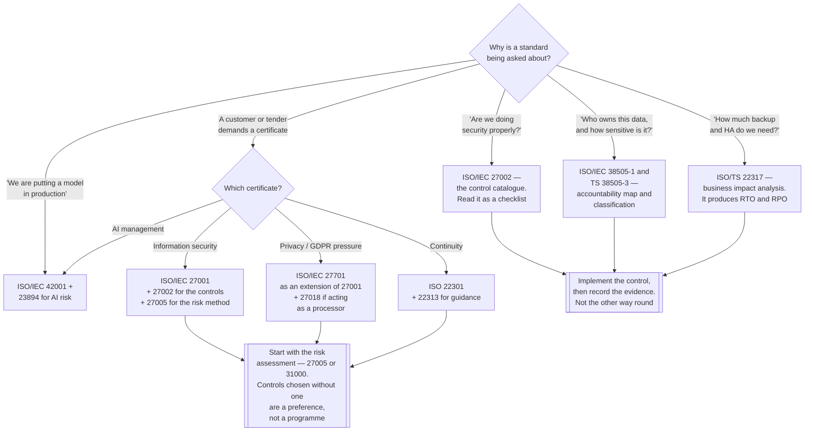

[← Data governance](../README.md)

# Standards

The external frameworks a data platform gets measured against — what each one is actually for, and
which of them change how a platform is built rather than how it is documented.

Reference: <https://www.iso.org/standards.html> ·
[NIST SP 800-207](https://csrc.nist.gov/pubs/sp/800/207/final)

## Contents

1. [What a standard is for](#1-what-a-standard-is-for)
2. [Information security — the ISO/IEC 27000 family](#2-information-security--the-isoiec-27000-family)
3. [Cloud and privacy](#3-cloud-and-privacy)
4. [Governance of IT, and of data](#4-governance-of-it-and-of-data)
5. [Artificial intelligence](#5-artificial-intelligence)
6. [Business continuity and risk](#6-business-continuity-and-risk)
7. [Zero Trust — NIST SP 800-207](#7-zero-trust--nist-sp-800-207)
8. [Which of these matter to a data platform](#8-which-of-these-matter-to-a-data-platform)
9. [Decision tree](#9-decision-tree)
10. [Anti-patterns](#10-anti-patterns)
11. [How this applies to pikakube](#11-how-this-applies-to-pikakube)

---

## 1. What a standard is for

A standard is somebody else's list of the things that go wrong, written down after they went wrong
to a lot of organisations. That is its actual value, and it is why reading one is useful even when
nobody intends to certify against it.

The distinction to hold on to while reading the tables below:

| Type | What it is | Examples |
|---|---|---|
| **Requirements** | *shall* statements — auditable, and the only kind you can be **certified** against | 27001, 22301, 42001 |
| **Guidance / code of practice** | *should* statements — the how, not the what; **not certifiable** | 27002, 27003, 27005, 22313, 31000 |
| **Technical report (TR) / specification (TS)** | narrower, informative, often newer ground | 38505-2, 38505-3, 22317 |
| **Framework** | an architectural model rather than a management system | NIST SP 800-207 |

Only a handful are certifiable. Most of the numbers below are the supporting material that
explains how to satisfy the few that are — which is why a list of standards is a poor deliverable
and a mapped set of controls is a good one.

The second thing worth knowing: **certification is of a management system, not of a platform.**
An ISO/IEC 27001 certificate says an organisation runs a process for identifying and treating
information security risk. It does not say the Kubernetes cluster is well configured. Confusing
those two is the most common way this subject wastes engineering time.

## 2. Information security — the ISO/IEC 27000 family

The core family, and the only one most organisations ever encounter. **27001 is the certifiable
one**; everything else in this section supports it.

| Standard | Full title | What it is actually for |
|---|---|---|
| **ISO/IEC 27001:2022** | Information security, cybersecurity and privacy protection — Information security management systems — **Requirements** | **The certifiable one.** Defines the management system: scope, risk assessment, a statement of applicability, internal audit, management review. Annex A lists 93 controls to select from |
| **ISO/IEC 27002:2022** | Information security, cybersecurity and privacy protection — **Information security controls** | The control catalogue explained. For each of 27001's Annex A controls: what it means, why it exists, how to implement it. **This is the one engineers should read** — it is the practical half |
| ISO/IEC 27003:2017 | Information technology — Security techniques — Information security management systems — **Guidance** | How to actually implement a 27001 programme, clause by clause. Useful once, during setup |
| ISO/IEC 27004:2016 | Information technology — Security techniques — Information security management — **Monitoring, measurement, analysis and evaluation** | How to measure whether the controls work. The clause everyone skips, and the reason certified organisations get breached |
| **ISO/IEC 27005:2022** | Information security, cybersecurity and privacy protection — **Guidance on managing information security risks** | The risk method: identify assets and threats, assess likelihood and impact, decide to treat, accept, transfer or avoid. **Risk assessment is where 27001 actually starts** |
| ISO/IEC 27006-1:2024 | Requirements for bodies providing **audit and certification** of information security management systems | For the certification bodies, not for you. Useful only to understand what an auditor is bound by |
| ISO/IEC 27007:2020 | Guidelines for information security management systems **auditing** | How to run the internal audit that 27001 requires |

**The two that repay reading directly are 27002 and 27005.** 27002 is a genuinely good checklist of
things a platform should have thought about — access control, logging, cryptography, supplier
relationships, secure development. 27005 is the method that decides *which* of those to do first,
and without it a control selection is just a preference.

## 3. Cloud and privacy

Extensions to the same family, for two contexts the base standard treats generically.

| Standard | Full title | What it is actually for |
|---|---|---|
| **ISO/IEC 27017:2015** | Code of practice for information security controls based on ISO/IEC 27002 **for cloud services** | 27002's controls reinterpreted for cloud, plus cloud-specific ones. The valuable part is the **shared responsibility** treatment: which controls are the provider's and which remain yours |
| **ISO/IEC 27018:2019** | Code of practice for protection of **personally identifiable information (PII) in public clouds** acting as PII processors | What a **processor** must do with personal data in a public cloud: no use for advertising, disclosure obligations, deletion and return, sub-processor transparency |
| **ISO/IEC 27701:2019** | Extension to ISO/IEC 27001 and 27002 for **privacy information management** — Requirements and guidelines | Turns an ISMS into a **privacy** information management system. Maps well onto GDPR/LGPD obligations: controller and processor roles, data subject rights, records of processing |

27701 is the bridge between security and privacy law. It is not GDPR certification — no such thing
exists — but the control set aligns closely enough that most privacy programmes use it as the
skeleton.

For a data platform, 27018's framing is the one that bites: **a platform holding customer data on
behalf of business units is a processor**, and processor obligations are concrete — purpose
limitation, deletion, no secondary use. That is the standards-shaped argument behind
[`anonymization/`](../anonymization/README.md).

## 4. Governance of IT, and of data

A different family with a different audience. The 27000s are for the security function; the 38500s
are for **the board**.

| Standard | Full title | What it is actually for |
|---|---|---|
| ISO/IEC 38500:2024 | Information technology — **Governance of IT for the organization** | The board-level model: **evaluate, direct, monitor**. Six principles — responsibility, strategy, acquisition, performance, conformance, human behaviour. Deliberately abstract |
| **ISO/IEC 38505-1:2017** | Governance of IT — **Governance of data** | 38500 applied to data. Introduces the **data accountability map** — for each data category: who collects it, who stores it, who uses it, who reports on it, who disposes of it |
| ISO/IEC TR 38505-2:2018 | Governance of data Part 2: **Implications of 38505-1 for data management** | The technical report translating the board's model into what data management has to do. The bridge between governance language and platform work |
| **ISO/IEC TS 38505-3:2021** | Governance of data Part 3: **Guidelines for data classification** | How to classify data — the practical output that everything downstream depends on |
| **ISO 8000-51:2023** | **Data quality** Part 51: Data governance: **Exchange of data policy statements** | How to state, machine-readably, the policies attached to data being exchanged — provenance, quality expectations, permitted use. **This is the standards-body version of a data contract** |

Three of these are directly useful to a platform rather than to a committee:

- **38505-1's accountability map** is the closest thing in the standards world to *"fill in the
  owner field"* — the single most valuable and most commonly blank field in any catalogue, per
  [`../README.md`](../README.md#6-anti-patterns)
- **38505-3's classification** is what makes access control and masking decidable. Without a
  classification scheme, *"is this table sensitive?"* is answered per-request by whoever is asked
- **8000-51** is worth knowing about when reading [`contract/`](../contract/README.md): data
  contracts are the engineering-native expression of the same idea, and they exist because the
  standards-native version was never adopted by tooling

## 5. Artificial intelligence

The newest family, and the one most likely to be asked about next.

| Standard | Full title | What it is actually for |
|---|---|---|
| **ISO/IEC 42001:2023** | Information technology — Artificial intelligence — **Management system** | **Certifiable.** An AI management system, structured like 27001: scope, risk, controls, audit — applied to AI systems. Impact assessment, data governance for training data, transparency, human oversight |
| ISO/IEC 23894:2023 | Artificial intelligence — **Guidance on risk management** | 31000's risk process applied to AI-specific risks: bias, drift, explainability, misuse, training-data provenance. Guidance, not certifiable |

42001 is worth tracking for one reason that is directly a platform concern: **it puts training-data
provenance and data governance inside the AI management system.** Answering *"where did this
training set come from, and what was in it"* is a
[lineage](../lineage/README.md) and [catalogue](../catalog/README.md) problem — the same
capabilities this discipline already builds, asked by a different auditor.

## 6. Business continuity and risk

| Standard | Full title | What it is actually for |
|---|---|---|
| **ISO 22301:2019** | Security and resilience — **Business continuity management systems — Requirements** | **Certifiable.** The management system for continuing to operate through disruption: recovery objectives, plans, exercises |
| ISO 22313:2020 | Business continuity management systems — **Guidance on the use of** 22301 | The how, for each of 22301's clauses |
| **ISO/TS 22317:2021** | Business continuity — **Guidelines for business impact analysis** | How to run a **BIA**: which processes matter, how long they can be down, what they depend on. The BIA is what produces RTO and RPO |
| **ISO 31000:2018** | **Risk management — Guidelines** | The generic risk process underneath all of the above — establish context, identify, analyse, evaluate, treat, monitor. Deliberately not certifiable |

22317 is the one that translates most directly into engineering. A business impact analysis is
where **RTO and RPO** come from, and those two numbers are what decide backup frequency, replica
counts and whether a single-instance PostgreSQL is acceptable.

That is a live question in this repository rather than a hypothetical one: the
[metadata catalog](../metadata-catalog/README.md) is a single point of failure for every query,
and both its recorded deployments — [HMS on MySQL](../metadata-catalog/hms/README.md) and
[Lakekeeper on PostgreSQL](../metadata-catalog/iceberg/lakekeeper/README.md) — run one replica
with no backup. A BIA is the process that turns *"we should probably back that up"* into a number
somebody signed.

## 7. Zero Trust — NIST SP 800-207

<https://csrc.nist.gov/pubs/sp/800/207/final>

The only non-ISO entry, and a different kind of document: **an architecture**, not a management
system. Nothing certifies against it.

Its premise is that network location grants no trust. There is no trusted internal network; every
request is authenticated, authorised and encrypted on its own merits, per-session, against policy
that considers identity, device and context.

| Concept | What it means in practice |
|---|---|
| **Policy Decision Point** | the thing that decides whether a request is allowed |
| **Policy Enforcement Point** | the thing in the path that enforces the decision |
| Per-session authorisation | access is granted per request, not per connection or per network |
| Assume breach | the internal network is treated as hostile |
| Continuous verification | trust is re-evaluated, not granted once at login |

It is the most directly implementable document on this page, because its concepts map onto things
that already exist in a Kubernetes platform: OIDC as identity, NetworkPolicies and a service mesh
as enforcement points, short-lived credentials instead of static keys.

And that last one connects straight to
[`metadata-catalog/iceberg/`](../metadata-catalog/iceberg/README.md#3-credential-vending):
**credential vending is a zero-trust pattern.** An engine holding a long-lived S3 key is trusted
because of where it runs; an engine receiving a scoped, minutes-long token after authenticating to
the catalog is authorised per request against policy. That is the same idea, arrived at from the
data side.

## 8. Which of these matter to a data platform

Most of the list above is organisational. These are the ones that change technical decisions:

| Standard | What it makes you build |
|---|---|
| **ISO/IEC 27002** | the control checklist — access control, logging, crypto, secrets, secure development |
| **ISO/IEC 27005** | the risk assessment that decides which of those come first |
| **ISO/IEC TS 38505-3** | a **data classification scheme** — the precondition for access control and masking |
| **ISO/IEC 38505-1** | the **accountability map** — data ownership, which is the field catalogues are missing |
| **ISO 8000-51** | policy statements travelling with data — i.e. [data contracts](../contract/README.md) |
| **ISO/IEC 27018** | processor obligations on personal data — deletion, purpose limitation, no secondary use |
| **ISO/TS 22317** | RTO and RPO, from which backup and replication requirements follow |
| **NIST SP 800-207** | short-lived scoped credentials instead of distributed static keys |

The rest — 27001, 27003, 27006-1, 27007, 38500, 22301, 22313, 31000, 42001, 23894, 27701 — matter
enormously to whoever owns the programme, and produce documents rather than platform changes. That
is not a criticism; it is the division of labour. Knowing which side a standard falls on is what
stops an engineering team from spending a quarter writing policy.

## 9. Decision tree

## 10. Anti-patterns

| Anti-pattern | Why it is bad | What to do instead |
|---|---|---|
| **Certification pursued without the controls** | a certificate for a management system that describes work nobody does; the first incident exposes it, and the audit trail proves it was known | implement, measure, then certify — 27004 exists precisely for the measuring |
| **A standard treated as a checklist** | Annex A is a menu to select from after a risk assessment, not 93 tasks; ticking all of them costs a fortune and still misses the actual risk | 27005 first — let risk decide which controls apply |
| Buying the PDF and filing it | the standard is a method, not a deliverable; nothing changes because a document was purchased | pick the two that apply and map them to real controls |
| Engineering asked to "become ISO compliant" | a platform cannot be certified — the organisation's management system is | scope the ISMS, then ask engineering for specific controls |
| A classification scheme with five levels | nobody can tell level 3 from level 4, so everything gets labelled internal and the scheme is decorative | two or three levels people can apply without asking |
| Policy written, controls never verified | 27004's clause is skipped, so nothing measures whether the control works | monitor the control, not the policy document |
| Zero trust bought as a product | 800-207 is an architecture; no product implements it | identity, enforcement points, short-lived credentials |
| Continuity plans never exercised | the plan is wrong and it is discovered during the incident | exercise it; 22301 requires it for a reason |
| Data ownership assigned to a team that does not know | the accountability map is filled in and false, which is worse than blank | 38505-1's map, agreed with the people named |
| AI governance started at deployment | training-data provenance cannot be reconstructed afterwards | lineage and cataloguing before the model, not after |
| The same evidence produced by hand each audit | a quarter of an engineer, annually, forever | generate evidence from the systems that hold it |

## 11. How this applies to pikakube

Nothing here is deployable — this folder holds no manifests and never will. It is the reference
axis: the external frameworks that explain **why** the rest of
[`data-governance/`](../README.md) exists, for the corporate case this repository models.

The useful exercise is the reverse mapping — what this platform already builds, and which standard
asks for it:

| Capability here | The standard that asks for it |
|---|---|
| [`quality/`](../quality/README.md) | ISO 8000 data quality; 27004's *measure whether it works* |
| [`lineage/`](../lineage/README.md) | 38505-1's accountability map; 42001's training-data provenance |
| [`contract/`](../contract/README.md) | **ISO 8000-51** — policy statements exchanged with data |
| [`catalog/`](../catalog/README.md), [`platform/`](../platform/README.md) | 38505-1 — what data exists, who is accountable for it |
| [`anonymization/`](../anonymization/README.md) | 27018 and 27701 — processor obligations on personal data |
| [`metadata-catalog/`](../metadata-catalog/README.md) | 22301 and 22317 — it is in the query path; its RTO is not optional |
| Credential vending in [`metadata-catalog/iceberg/`](../metadata-catalog/iceberg/README.md) | **NIST SP 800-207** — short-lived scoped credentials |
| Access control, secrets and certificates in `security/` | 27002's control set, and 27017 for the cloud split |

Read that table in the direction that is useful: the standards are not extra work bolted onto the
platform, they are the reason the capabilities are the ones they are. A catalogue with an owner
field is 38505-1. A data contract is 8000-51. Credential vending is zero trust.

**Two gaps this folder makes visible**, both already named elsewhere in this discipline:

1. **Nothing is classified.** 38505-3 is the standard, and without a classification scheme the
   masking decisions in [`anonymization/`](../anonymization/README.md) and any table-level
   authorisation in the [Iceberg catalogs](../metadata-catalog/iceberg/README.md) have no input.
   This is the cheapest missing piece on the list — two or three levels, applied to the tables that
   exist
2. **Nothing produces evidence automatically.** Which is the same finding as
   [`../README.md`](../README.md#7-how-this-applies-to-pikakube)'s named gap — lineage is not
   emitted anywhere. An audit asking *"where did this figure come from"* and a data engineer asking
   the same question want the identical answer, and neither can get it today

The framing worth keeping: **a standard is a list of failures other people have already had.** Read
27002 and 800-207 as engineering documents, treat the certifiable ones as somebody else's job, and
ignore the rest until a customer asks.

---

[← Data governance](../README.md)
