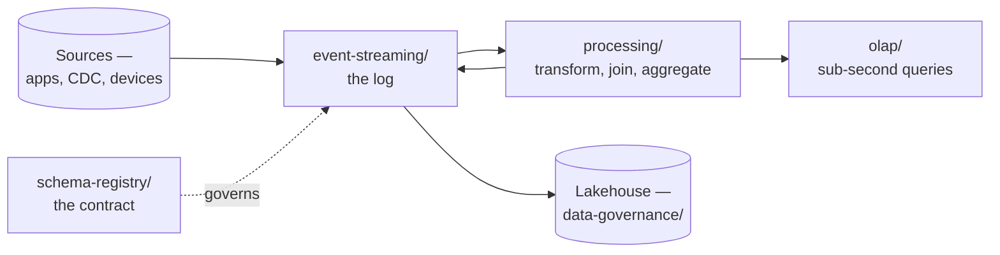

# Data Streaming

Data in motion — events, real-time processing, and analytics that cannot wait for a batch
window.

## How this folder is organised

One axis: **capability**. Each subfolder answers a distinct question, and a tool is filed by
**where it shines** rather than by everything it can do.

## The map

| Folder | The question it answers |
|---|---|
| [`event-streaming/`](event-streaming/README.md) | where do events live, durably and in order? |
| [`schema-registry/`](schema-registry/README.md) | what shape are they, and who is allowed to change it? |
| [`processing/`](processing/README.md) | how are they transformed, joined and aggregated in flight? |
| [`olap/`](olap/README.md) | how are they queried at low latency, at scale? |
| [`platforms/`](platforms/README.md) | managed and packaged distributions of the above |
| [`migration/`](migration/README.md) | how do you move between brokers without losing events? |

## The pipeline

Two things in that diagram are worth noticing.

**Processing writes back to the log.** Stream processing is usually stream-in, stream-out —
enriched or aggregated topics feeding other consumers. It is not a one-way path to a database.

**The schema registry governs the log, not the processor.** It is the contract between producer
and consumer, and it is the piece most often added late, after a producer has already broken
every consumer once.

## Streaming or batch

The honest question, because streaming is more expensive in every dimension — operationally,
cognitively, and in engineering time:

| Choose streaming when | Choose batch when |
|---|---|
| The value of the data decays in minutes | daily or hourly is genuinely enough |
| Events are the source of truth — an event log, not a table | the source is a table you can re-read |
| The system reacts, rather than reports | humans read the output |
| Reprocessing must replay history | reprocessing means re-running a query |

The failure mode is adopting streaming for data that is consumed once a day on a dashboard.
That buys latency nobody uses and pays for it with exactly-once semantics, state management,
watermarks and a broker to operate.

The reverse failure is rarer but real: forcing an event-shaped problem into nightly batches and
rediscovering event ordering by hand.

## The three hard problems

Everything difficult in this folder reduces to one of these:

| Problem | Why it is hard |
|---|---|
| **Ordering** | guaranteed only within a partition — so the partition key decides correctness, not just distribution |
| **Delivery semantics** | at-least-once is the default and means duplicates; exactly-once is possible and costs throughput and complexity |
| **Time** | event time and processing time differ, so late events either arrive after the window closed or force the window to stay open |

None of these are tool choices. They are properties of the problem that every tool here makes
you confront.

## Where the boundaries are

| Concern | Where |
|---|---|
| Batch processing and orchestration | [`data-engineering/`](../data-engineering/README.md) |
| SQL modelling and BI | [`analytics-engineering/`](../analytics-engineering/README.md) |
| Table formats, lineage, contracts | [`data-governance/`](../data-governance/) |
| Databases as systems of record | [`databases/`](../databases/README.md) |
| CDC as an ingestion mechanism | here, and [`analytics-engineering/integration/`](../analytics-engineering/integration/README.md) for the batch equivalent |

## How this applies to pikakube

**Kafka on Kubernetes with Strimzi** is the one with real operational history — including the
restore procedure recorded in
[Velero](../site-reliability-engineering/backup/velero/README.md), where the operator has to be
paused or it recreates the volume before the restore lands.

Alongside it: **Flink** for processing, **Debezium** for CDC, and consumers writing into
Iceberg and Delta.

Everything else — the alternative brokers, the OLAP engines, the processing frameworks — is
mapped for comparison rather than deployed.
