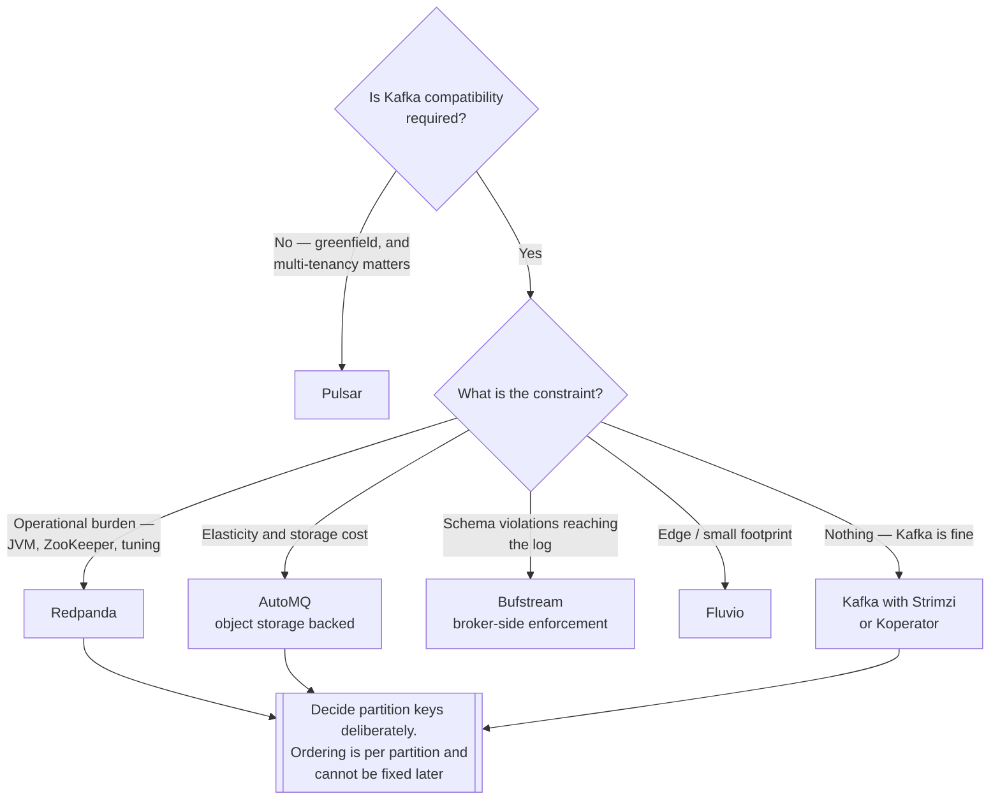

[← Data Streaming](../README.md)

# Event streaming

The log — where events live, durably, in order.

Tools covered: [`redpanda`](redpanda/README.md) · [`pulsar`](pulsar/README.md) · [`automq`](automq/README.md) ·
[`koperator`](koperator/README.md) · [`fluvio`](fluvio/README.md) · [`bufstream`](bufstream/README.md)

## Contents

1. [What "the log" actually means](#1-what-the-log-actually-means)
2. [The properties that decide everything](#2-the-properties-that-decide-everything)
3. [The tools](#3-the-tools)
4. [Decision tree](#4-decision-tree)
5. [Anti-patterns](#5-anti-patterns)
6. [How this applies to pikakube](#6-how-this-applies-to-pikakube)

---

## 1. What "the log" actually means

A message queue delivers a message and forgets it. An event log **retains** events and lets
many independent consumers read at their own position.

That difference is why this is infrastructure rather than plumbing:

| Property | Consequence |
|---|---|
| **Retention** | consumers can be added later and read history they were not present for |
| **Replay** | reprocessing is rewinding an offset, not rebuilding a pipeline |
| **Independent consumers** | one topic, many readers, no coordination between them |
| **Ordering per partition** | the only ordering guarantee, and the reason partition keys matter |

Replay is the property that makes event streaming worth its cost. A bug in a consumer is fixed
by resetting an offset, not by asking the source system to send everything again.

## 2. The properties that decide everything

**Ordering is per partition, not per topic.** Events for the same entity must share a partition
key, or they are reordered. This is a correctness property disguised as a performance setting,
and it is decided when the topic is created.

**Delivery is at-least-once by default.** Consumers see duplicates. Either make processing
idempotent or pay for exactly-once semantics, which costs throughput and adds transactional
complexity.

**Retention is a cost and a liability.** Long retention means replay is possible; it also means
personal data lives in the log for that long, which is a compliance question rather than a
storage one.

**Storage and compute are increasingly separate.** The newer entrants here write to object
storage rather than to broker disks, which changes the operational model entirely — rebalancing
stops being a data-movement problem.

## 3. The tools

| Tool | Model | Shines when | Do not use when | Detail |
|---|---|---|---|---|
| **Redpanda** | Kafka-compatible, C++, no JVM, no ZooKeeper | you want Kafka semantics with a much smaller operational surface and lower latency | you depend on the JVM ecosystem around Kafka | [→](redpanda/README.md) |
| **Pulsar** | segment-based, native multi-tenancy, tiered storage | **multi-tenancy** and geo-replication are first-order requirements | you want the ecosystem — Kafka's is far larger |  [→](pulsar/README.md) |
| **AutoMQ** | Kafka protocol on **object storage** | elasticity and cost matter; scaling stops meaning data movement | you need on-prem with no object storage | [→](automq/README.md) |
| **Koperator** | Kafka operator (Banzai) with fine-grained broker control | per-broker configuration and rolling operations need more control than a standard operator gives | Strimzi covers it — it is the more common choice | [→](koperator/README.md) |
| **Fluvio** | Rust, with programmable in-broker processing | edge and IoT, where the footprint matters | you want a mature ecosystem | [→](fluvio/README.md) |
| **Bufstream** | Kafka-compatible, schema-aware at the broker | **schema enforcement in the broker**, not just at the client | a conventional registry is enough | [→](bufstream/README.md) |

Two ideas here are genuinely different rather than variations:

- **AutoMQ** decouples storage from brokers by writing to S3. Rebalancing and scaling become configuration rather than a data-copy operation — which is the single most painful part of operating Kafka.
- **Bufstream** validates schemas **at the broker**. In a conventional setup a producer can bypass the registry and publish garbage; here it cannot.

## 4. Decision tree

## 5. Anti-patterns

| Anti-pattern | Why it is bad | What to do instead |
|---|---|---|
| Ignoring partition keys | events for one entity get reordered — a correctness bug, not a tuning issue | key by the entity |
| Assuming exactly-once by default | consumers see duplicates and quietly double-count | idempotent processing, or enable it deliberately |
| Infinite retention with no review | personal data persists as long as the topic does | retention as a policy, including a compliance view |
| Using it as a database | it is a log, not an indexed store | project into [`olap/`](../olap/README.md) or a database |
| One giant topic for everything | consumers filter what they do not need, and coupling grows | topics by domain |
| No schema registry | one producer change breaks every consumer | [`schema-registry/`](../schema-registry/README.md) |
| Too many partitions "for scale" | rebalancing, file handles and latency all suffer | size from measured throughput |

## 6. How this applies to pikakube

**Kafka with Strimzi** is what has real history here — running on Kubernetes, with topic and
user management, governance rules for access, and consumers writing into Delta and Iceberg.

The operational detail worth carrying: restoring a Kafka PVC requires **pausing the operator**
first, or it recreates an empty volume — recorded in
[Velero](../../site-reliability-engineering/backup/velero/README.md).

The alternatives are mapped for what they change rather than as a list. **Redpanda** for the
operational surface, **AutoMQ** for the storage model, **Pulsar** for multi-tenancy — each
addresses a specific thing that is genuinely painful about operating Kafka.

---

[← Data Streaming](../README.md)
