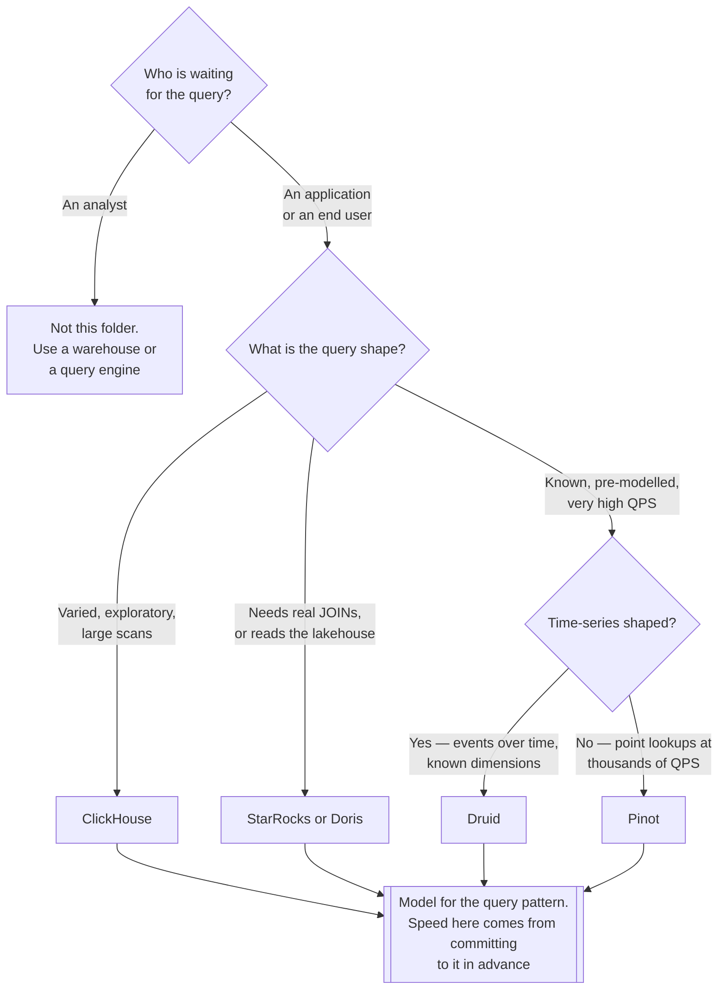

[← Data Streaming](../README.md)

# OLAP

Sub-second analytical queries, at scale, on data that keeps arriving.

Tools covered: [`clickhouse`](clickhouse/README.md) · [`starrocks`](starrocks/README.md) ·
[`doris`](doris/README.md) · [`druid`](druid/README.md) · [`pinot`](pinot/README.md)

## Contents

1. [Why this is not the warehouse](#1-why-this-is-not-the-warehouse)
2. [What makes them fast](#2-what-makes-them-fast)
3. [The tools](#3-the-tools)
4. [Decision tree](#4-decision-tree)
5. [Anti-patterns](#5-anti-patterns)
6. [How this applies to pikakube](#6-how-this-applies-to-pikakube)

---

## 1. Why this is not the warehouse

A warehouse or a [query engine](../../data-engineering/query-engine/README.md) answers
analytical questions in seconds to minutes, over data loaded in batches. That is fine when a
human is reading a dashboard.

It is not fine when the query is **inside a product**: a customer-facing analytics page, a
real-time monitoring view, a personalisation lookup. Those need **tens of milliseconds**, at
high concurrency, on data that is seconds old.

That is the gap these engines fill:

| | Warehouse / query engine | OLAP engine |
|---|---|---|
| Latency | seconds to minutes | **milliseconds** |
| Concurrency | tens of queries | thousands |
| Freshness | batch, minutes to hours | seconds — ingests from the stream directly |
| Query shape | arbitrary, ad-hoc | known patterns, pre-modelled |
| Consumer | analysts | **applications and end users** |

The distinguishing phrase is **user-facing analytics**. When the person waiting for the query is
a customer rather than an analyst, the latency budget changes by two orders of magnitude.

## 2. What makes them fast

Understanding this explains the constraints:

- **Columnar storage** with aggressive compression — only the columns in the query are read
- **Pre-aggregation and materialised views** — the expensive work happens at ingest, not at query
- **Sorted and indexed by the query pattern** — which means the pattern has to be known in advance
- **Streaming ingest** — consuming Kafka directly rather than waiting for a batch load

The trade is explicit: speed comes from **committing to a query shape**. An OLAP engine is
excellent at the queries it was modelled for and mediocre at everything else — the opposite of
a query engine, which is uniformly reasonable at anything.

## 3. The tools

| Tool | Model | Shines when | Do not use when | Detail |
|---|---|---|---|---|
| **ClickHouse** | general-purpose columnar OLAP, extremely fast scans | **the default** — broadest use, largest community, strong for logs, events and analytics | you need high-QPS point lookups on pre-aggregated data | [→](clickhouse/README.md) |
| **StarRocks** | MPP, strong **joins**, lakehouse-aware | you need real joins at speed, or to query Iceberg/Hudi directly | a single denormalised table is enough | [→](starrocks/README.md) |
| **Doris** | MPP, similar family to StarRocks, MySQL protocol | you want a familiar SQL surface and unified batch/real-time serving | you need ClickHouse's raw scan performance | [→](doris/README.md) |
| **Druid** | time-series-oriented, pre-aggregated at ingest | **time-series event analytics** at very high concurrency, with known dimensions | ad-hoc queries and joins | [→](druid/README.md) |
| **Pinot** | ultra-low-latency, high-QPS, index-heavy | **user-facing** queries at thousands of QPS — its original purpose | complex analytical SQL | [→](pinot/README.md) |

The split worth remembering:

- **ClickHouse** is the generalist. Fastest path to useful, and the right default unless a specific constraint says otherwise.
- **StarRocks and Doris** bring proper join support and lakehouse integration — the closest to "a warehouse that is fast enough for a product".
- **Druid and Pinot** are specialists for very high concurrency on pre-modelled data, and are where the "commit to the query shape" trade is most explicit.

## 4. Decision tree

## 5. Anti-patterns

| Anti-pattern | Why it is bad | What to do instead |
|---|---|---|
| Using it as the warehouse | ad-hoc and evolving queries are the one thing it is bad at | a query engine or warehouse for analysts |
| No pre-modelling | the speed depends on sort keys and aggregation matching the query | model for the pattern |
| Unbounded retention | fast storage is expensive storage | TTL, and tier the cold data out |
| Ingesting raw events with no schema | schema drift breaks ingestion at 3am | a [schema registry](../schema-registry/README.md) |
| Adopting one before the latency requirement exists | a specialised engine for queries a warehouse already answers | measure the requirement first |
| Joins on Druid or Pinot | they are not built for it | StarRocks, Doris, or denormalise at ingest |

## 6. How this applies to pikakube

Nothing deployed. **StarRocks** is the one with a documented rationale in this repository —
real-time user-facing analytics — and it is the natural fit here because it does not force the
choice between join support and speed.

The honest note for a data platform: this layer is only needed when queries become
**product-facing**. For analysts and dashboards, [Trino](../../data-engineering/query-engine/README.md)
over the lakehouse is already the answer, and adding an OLAP engine before that constraint
exists is a second serving layer to keep in sync.

---

[← Data Streaming](../README.md)
