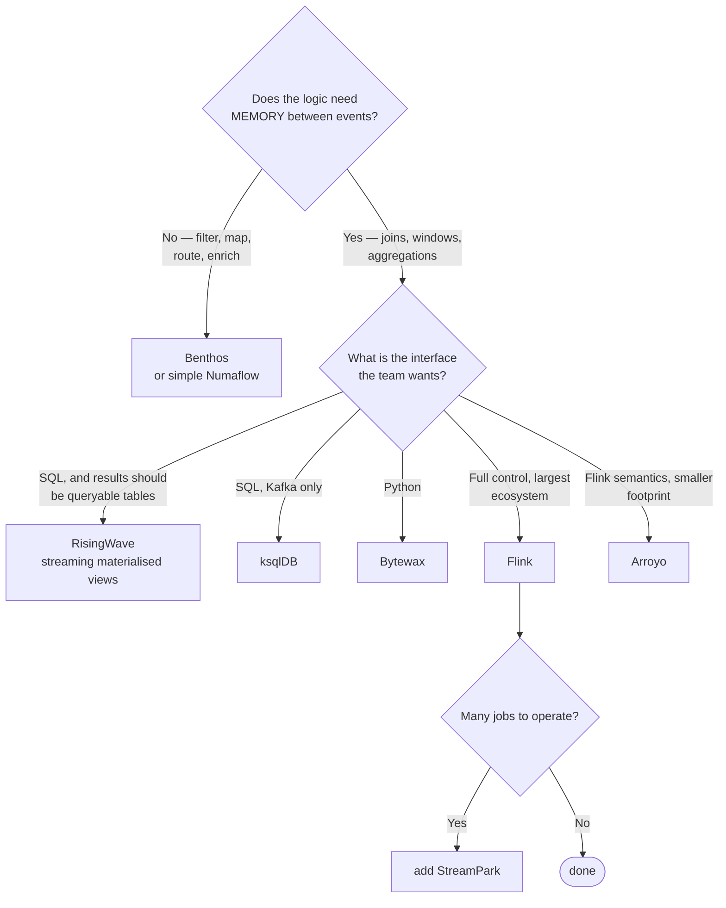

[← Data Streaming](../README.md)

# Stream processing

Transforming, joining and aggregating events in flight.

Tools covered: [`flink`](flink/README.md) · [`risingwave`](risingwave/README.md) · [`benthos`](benthos/README.md) ·
[`ksqldb`](ksqldb/README.md) · [`arroyo`](arroyo/README.md) · [`bytewax`](bytewax/README.md) ·
[`numaflow`](numaflow/README.md) · [`glassflow`](glassflow/README.md) · [`quix`](quix/README.md) ·
[`streampark`](streampark/README.md) · [`fluss`](fluss/README.md)

## Contents

1. [Why this is harder than batch](#1-why-this-is-harder-than-batch)
2. [Stateless or stateful](#2-stateless-or-stateful)
3. [The tools](#3-the-tools)
4. [Decision tree](#4-decision-tree)
5. [Anti-patterns](#5-anti-patterns)
6. [How this applies to pikakube](#6-how-this-applies-to-pikakube)

---

## 1. Why this is harder than batch

A batch job sees a complete dataset. A stream processor sees an unbounded sequence and must
decide, continuously, when it has seen enough to produce an answer.

Three problems follow, and no tool removes them:

**Event time versus processing time.** An event that happened at 10:00 may arrive at 10:07.
Aggregating "the 10:00 hour" means deciding how long to wait for stragglers — a **watermark** —
and what to do with anything later than that.

**State.** A join or an aggregation must remember things between events. That state has to
survive restarts, be checkpointed somewhere, and be recovered correctly — which is most of what
a stateful stream processor actually is.

**Delivery semantics.** At-least-once means duplicates; exactly-once costs throughput and
requires coordination with sinks that support it.

## 2. Stateless or stateful

The split that decides which tool fits:

| | Stateless | Stateful |
|---|---|---|
| Does | filter, map, route, enrich from a lookup | join streams, aggregate over windows, deduplicate |
| Remembers | nothing between events | a keyed store, checkpointed |
| Restart cost | trivial | recover state, then resume |
| Tools | Benthos, simple Numaflow pipelines | Flink, RisingWave, ksqlDB, Arroyo |

A large share of real streaming work is stateless — reshape a payload, route by field, enrich
and forward. Reaching for Flink to do that is the same category of mistake as reaching for
Spark to process a gigabyte.

## 3. The tools

| Tool | Model | Shines when | Do not use when | Detail |
|---|---|---|---|---|
| **Flink** | the reference stateful engine — event time, watermarks, exactly-once | serious stateful processing: joins, windows, large state | the job is stateless reshaping | [→](flink/README.md) |
| **RisingWave** | streaming database — **materialised views** over streams, in SQL | you want continuously-updated results queryable as tables, without managing a job | you need arbitrary logic rather than SQL | [→](risingwave/README.md) |
| **Benthos** | stateless stream plumbing, declarative | routing, reshaping and enrichment — the majority of real pipelines | stateful joins and windows | [→](benthos/README.md) |
| **ksqlDB** | SQL over Kafka topics | Kafka-only, and SQL is the preferred interface | the estate is not Kafka-centric | [→](ksqldb/README.md) |
| **Arroyo** | Rust, SQL-first stateful processing | Flink-class semantics with a much smaller footprint | you need Flink's ecosystem and connectors | [→](arroyo/README.md) |
| **Bytewax** | Python-native stateful processing | the team is Python, and the logic belongs in Python | JVM performance characteristics matter | [→](bytewax/README.md) |
| **Numaflow** | Kubernetes-native pipelines as CRDs | pipelines should be Kubernetes objects, language-agnostic | you want SQL or a mature streaming engine | [→](numaflow/README.md) |
| **StreamPark** | management platform for Flink and Spark jobs | operating **many** Flink jobs — submission, versioning, monitoring | one or two jobs | [→](streampark/README.md) |
| **Fluss** | streaming storage for real-time analytics | you want a streaming-native storage layer feeding OLAP | conventional topic storage is enough | [→](fluss/README.md) |
| **GlassFlow** | Python-first managed-style pipelines | quick Python transformations without operating an engine | production-scale stateful work | [→](glassflow/README.md) |
| **Quix** | Python streaming with a platform around it | Python teams wanting tooling as well as a library | JVM ecosystem alignment | [→](quix/README.md) |

**RisingWave is the conceptually interesting one.** Instead of writing a job that maintains
state, you define a materialised view in SQL and it stays current. For a data platform that
already thinks in SQL, that is a much smaller conceptual jump than Flink.

## 4. Decision tree

## 5. Anti-patterns

| Anti-pattern | Why it is bad | What to do instead |
|---|---|---|
| Flink for stateless reshaping | an engine, checkpoints and state backend for a `map()` | Benthos |
| Ignoring event time | results are wrong whenever anything arrives late, and silently so | watermarks, and a policy for late data |
| Unbounded state | a keyed aggregation with no TTL grows until the job dies | state TTL, always |
| No checkpointing strategy | a restart reprocesses from the beginning, or loses state | configure it before production, not after |
| Assuming exactly-once end to end | it requires sink support, not only engine support | verify the whole path |
| Streaming for a daily dashboard | maximum complexity for latency nobody uses | batch |
| Stream processing as a substitute for modelling | business logic scattered across jobs | model it — [`analytics-engineering/transform/`](../../analytics-engineering/transform/README.md) |

## 6. How this applies to pikakube

**Flink on Kubernetes** is the one with real history — real-time processing on the cluster,
alongside Kafka and consumers writing into Iceberg and Delta.

The alternatives are mapped by what they change. **Benthos** is the honest counterweight: most
streaming work is stateless, and running Flink for it is the same overreach as running Spark on
a gigabyte. **RisingWave** is the one worth evaluating properly — streaming materialised views
in SQL fit a platform that already thinks in dbt models better than a job-based engine does.

---

[← Data Streaming](../README.md)
