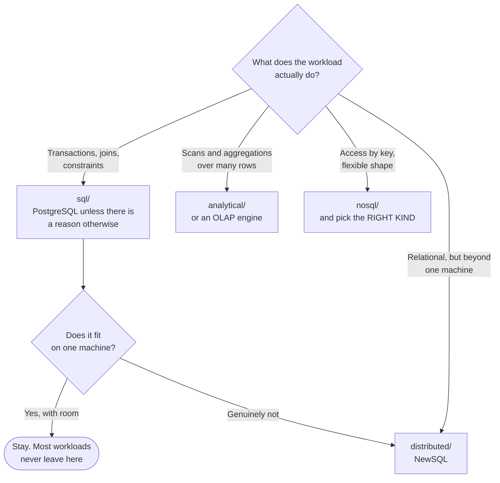

# Databases

Systems of record — and the tooling around them.

## How this folder is organised

One axis: **capability**. Each subfolder answers a distinct question, and a tool is filed by
**where it shines** rather than by everything it can do.

## The map

| Folder | The question it answers |
|---|---|
| [`sql/`](sql/README.md) | the relational default — Postgres, MySQL, and friends |
| [`nosql/`](nosql/README.md) | when the relational model is the wrong shape |
| [`distributed/`](distributed/README.md) | when one machine is not enough, and you still want SQL |
| [`analytical/`](analytical/README.md) | when the workload is scans and aggregations, not transactions |
| [`platform/`](platform/README.md) | running databases as a managed capability on Kubernetes |
| [`tooling/`](tooling/README.md) | migrations, pooling, monitoring, management — the parts that decide whether it survives |

## The decision, in one question

**What shape is the access pattern?**

The first branch is the one that matters, and the honest answer for most workloads is
**PostgreSQL**. It does JSON, full-text search, geospatial, time-series with extensions, and
queues — adequately enough that a second database is often a cost rather than a capability.

The reason to leave is a **specific constraint**, not a preference: a genuine scale ceiling, an
access pattern the relational model handles badly, or a workload shape that is analytical
rather than transactional.

## Polyglot persistence, honestly

The idea that each workload gets the database that suits it is correct, and its cost is
routinely understated:

| Each new database means | Ongoing |
|---|---|
| Backup and restore procedures | tested, not assumed |
| Monitoring, alerting, dashboards | per engine |
| Upgrade path and version policy | per engine |
| Someone who understands it at 3am | per engine |
| Failure modes nobody has seen yet | per engine |

Three databases is three of everything above. The question is never "is this database better
for the workload" — it is **"is it better by enough to justify operating it"**.

## Where the boundaries are

| Concern | Where |
|---|---|
| Query engines over the lakehouse | [`data-engineering/query-engine/`](../data-engineering/query-engine/README.md) |
| Real-time serving OLAP | [`data-streaming/olap/`](../data-streaming/olap/README.md) |
| Table formats and catalogue | [`data-governance/`](../data-governance/) |
| Where the volumes live | [`site-reliability-engineering/storage/`](../site-reliability-engineering/storage/README.md) |
| Backup and restore | [`site-reliability-engineering/backup/`](../site-reliability-engineering/backup/README.md) |
| Metrics and exporters | [`observability/metrics/exporters/`](../observability/metrics/exporters/README.md) |

The overlap with `data-streaming/olap/` is deliberate and worth stating: **ClickHouse appears in
both discussions** because it is a database and a serving engine. It is filed there when the
consumer is an application, and considered here when it is the analytical store.

## Databases on Kubernetes

Running stateful workloads on Kubernetes stopped being controversial, and the reason is
**operators**: CloudNativePG, the MongoDB and Redis operators, Vitess, and the rest encode
failover, backup and upgrade as controller logic rather than as runbooks.

What still decides whether it works:

- **storage.** An RWO volume pins a pod to a node — see [`storage/`](../site-reliability-engineering/storage/README.md)
- **restore, tested.** With the operator paused, or it recreates the volume first — see [Velero](../site-reliability-engineering/backup/velero/README.md)
- **connection pooling.** Postgres runs out of connections long before it runs out of capacity — see [`tooling/pooler/`](tooling/pooler/)

## How this applies to pikakube

**CloudNativePG** is the one with real history — PostgreSQL on Kubernetes, plus the migration
procedure and the monitoring around it. **MongoDB**, **Redis** and **Neo4j** have standardised
deployments recorded.

The rest of this folder is a catalogue: the distributed engines, the NoSQL families and the
analytical stores, mapped so that the question *"do we actually need a different database"* has
a documented answer rather than an opinion.
