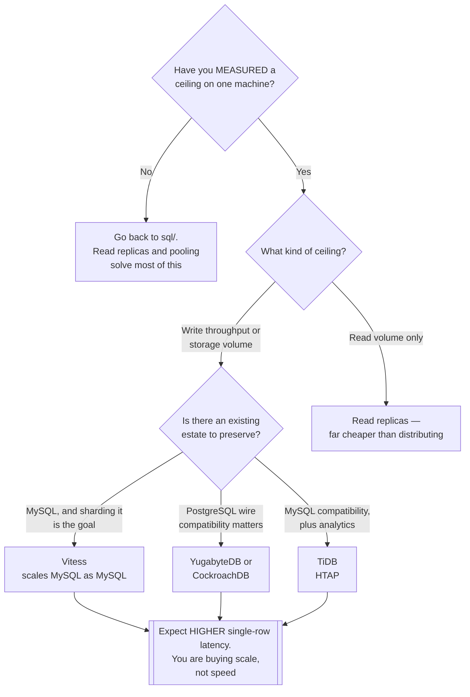

[← Databases](../README.md)

# Distributed databases

When one machine is genuinely not enough, and you still want SQL.

Subfolders: [`newsql/`](newsql/README.md) · [`key-value/`](key-value/README.md)

## Contents

1. [The problem they solve](#1-the-problem-they-solve)
2. [The cost, stated first](#2-the-cost-stated-first)
3. [Two families](#3-two-families)
4. [Decision tree](#4-decision-tree)
5. [Anti-patterns](#5-anti-patterns)
6. [How this applies to pikakube](#6-how-this-applies-to-pikakube)

---

## 1. The problem they solve

A single-primary relational database has a ceiling. Reads scale with replicas; **writes do
not**, and neither does the storage on one machine.

The traditional answers were sharding in the application — which pushes routing, rebalancing
and cross-shard queries into code nobody wants to own — or giving up transactions.

NewSQL declines both: horizontal scale **and** ACID transactions **and** SQL, by distributing
consensus rather than avoiding it.

| Property | How |
|---|---|
| Horizontal writes | data is partitioned across nodes automatically |
| ACID across partitions | distributed consensus, usually Raft |
| SQL | a real query layer, not a key-value API |
| Survives node loss | replicas per partition, with automatic failover |

## 2. The cost, stated first

Because this is where the decision actually gets made:

| Cost | Detail |
|---|---|
| **Latency** | a transaction spanning partitions needs consensus round trips. Single-row writes are slower than on Postgres |
| **Operational complexity** | several components, rebalancing, and failure modes that are genuinely distributed |
| **Ecosystem gaps** | extensions, tooling and ORM support are thinner than PostgreSQL's |
| **Expertise** | debugging a distributed transaction is a different skill from debugging a slow query |

The consequence is that these are **not a drop-in upgrade**. A workload that fits comfortably
on one machine will usually be *slower* here, not faster.

The threshold is a measured ceiling — write throughput or data volume that one machine
genuinely cannot hold — not an expectation of future growth.

## 3. Two families

| Family | What it is | Folder |
|---|---|---|
| **NewSQL** | distributed SQL with ACID transactions — CockroachDB, TiDB, YugabyteDB, Vitess, and others | [→](newsql/README.md) |
| **Distributed key-value** | the consensus layer itself — etcd, TiKV, FoundationDB | [→](key-value/README.md) |

The second family is worth understanding rather than deploying directly. **etcd** is what
Kubernetes stores its state in; **TiKV** is what TiDB is built on; **FoundationDB** is a
transactional substrate other systems are built upon.

They are the layer underneath, and knowing that explains a great deal about how the NewSQL
engines behave — including why their latency profile is what it is.

## 4. Decision tree

## 5. Anti-patterns

| Anti-pattern | Why it is bad | What to do instead |
|---|---|---|
| Adopting it for anticipated growth | operating a distributed system for a load that never arrives | measure, then move |
| Expecting it to be faster | consensus adds latency to every write | it buys scale and availability, not speed |
| Cross-partition transactions everywhere | every one is a distributed transaction, and the cost compounds | model so that transactions stay local |
| Treating it as PostgreSQL | compatible wire protocol, different performance characteristics and gaps in extensions | test the actual workload |
| Running it on unreliable storage | consensus assumes durable writes | proper storage, and understand the guarantees |
| Ignoring clock requirements | some designs depend on bounded clock skew | NTP, and check what the engine assumes |

## 6. How this applies to pikakube

Nothing here is deployed, and for a single Kind cluster nothing should be.

The catalogue is unusually complete for a reason worth stating: this is the category where
adopting the wrong thing is most expensive, and where "we might need to scale" produces the
most unnecessary complexity. Having the trade-offs written down is the point — the folder
mostly exists to answer *"not yet, and here is why"*.

**etcd** is the exception in a sense: it is already running, as the store behind Kubernetes
itself.

---

[← Databases](../README.md)
