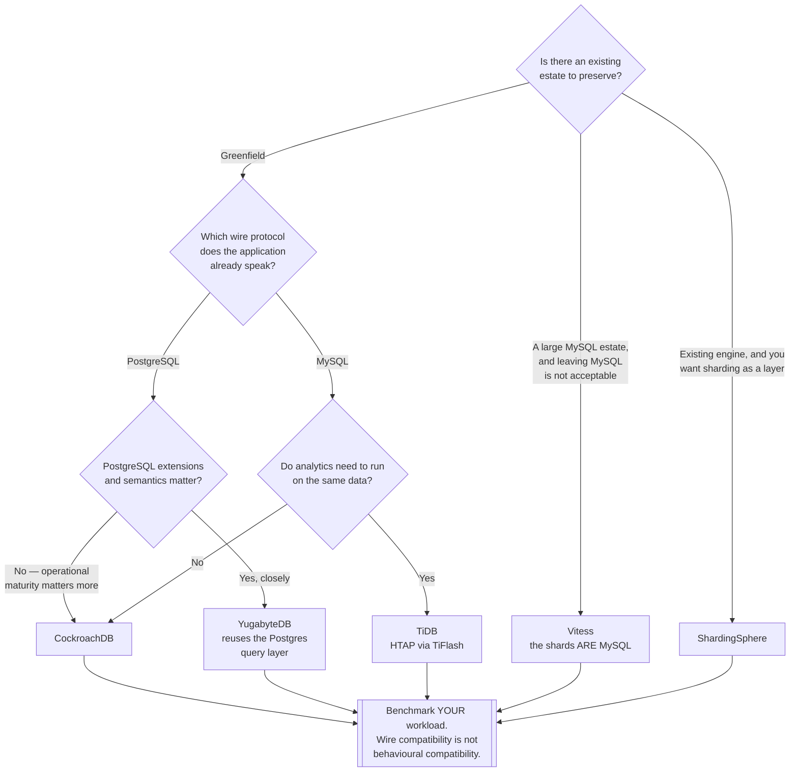

[← Distributed databases](../README.md)

# NewSQL

Horizontal scale, ACID transactions and SQL — refusing to give up any of the three.

Tools covered: [`cockroachdb`](cockroachdb/README.md) · [`tidb`](tidb/README.md) ·
[`yugabytedb`](yugabytedb/README.md) · [`vitess`](vitess/README.md) ·
[`multigres`](multigres/README.md) · [`crate`](crate/README.md) ·
[`oceanbase`](oceanbase/README.md) · [`ydb`](ydb/README.md) ·
[`shardingsphere`](shardingsphere/README.md)

## Contents

1. [What they all do](#1-what-they-all-do)
2. [Two architectures, and the difference matters](#2-two-architectures-and-the-difference-matters)
3. [The tools](#3-the-tools)
4. [Decision tree](#4-decision-tree)
5. [What to model differently](#5-what-to-model-differently)
6. [Anti-patterns](#6-anti-patterns)
7. [How this applies to pikakube](#7-how-this-applies-to-pikakube)

---

## 1. What they all do

Data is split into ranges across nodes, each range is replicated, and consensus — usually Raft —
keeps the replicas agreed. Transactions spanning ranges use a distributed commit protocol
rather than being forbidden.

The result is a database that scales writes by adding nodes and survives losing one, while
still answering SQL and honouring transactions.

The cost is stated in [`../README.md`](../README.md#2-the-cost-stated-first) and is worth
repeating in one line: **single-row writes are slower than on PostgreSQL**, because a write is a
consensus round trip rather than an `fsync`.

## 2. Two architectures, and the difference matters

The tools here are not variations on one design. There are two, with different consequences:

| | **Natively distributed** | **Sharding an existing engine** |
|---|---|---|
| Examples | CockroachDB, TiDB, YugabyteDB, YDB, CrateDB | Vitess, ShardingSphere, [Multigres](multigres/README.md) (Postgres, early) |
| The database is | built distributed from the storage layer up | real MySQL instances, with a routing layer in front |
| Transactions | distributed, across any rows | local to a shard; cross-shard is limited or costly |
| Rebalancing | automatic, by the system | a managed operation |
| Compatibility | a wire protocol, with gaps | **actual MySQL**, including its quirks |
| Migration from an existing estate | a migration | comparatively incremental |

The second column is the pragmatic path and is routinely overlooked. **Vitess scales MySQL as
MySQL** — the shards are MySQL, so the tooling, the backups and the operational knowledge all
still apply. YouTube ran on it, which is the answer to whether it is real.

The trade is that you must choose a sharding key, cross-shard queries are constrained, and the
routing layer becomes something to operate. That is a different set of problems from
CockroachDB's, not a smaller one.

One asymmetry in that table is worth naming, because it quietly biases decisions: **the second
column has been MySQL-only.** A Postgres estate outgrowing one machine has had no equivalent to
Vitess, which is why those conversations jump straight to replacing the engine.
[Multigres](multigres/README.md) is the first serious attempt to close that gap — the Vitess
architecture, by people who built it, applied to PostgreSQL — and it is early enough that today it
changes how you *plan*, not what you deploy.

## 3. The tools

| Tool | Compatibility | Where it shines | Detail |
|---|---|---|---|
| **CockroachDB** | PostgreSQL wire | the most polished operationally — geo-partitioning, survivability goals as configuration | [→](cockroachdb/README.md) |
| **TiDB** | MySQL wire | **HTAP** — a row store and a column store over the same data, so analytics do not need a separate system | [→](tidb/README.md) |
| **YugabyteDB** | PostgreSQL, reusing its query layer | the closest to real PostgreSQL semantics, including many extensions | [→](yugabytedb/README.md) |
| **Vitess** | **is** MySQL | scaling an existing MySQL estate without leaving MySQL | [→](vitess/README.md) |
| **ShardingSphere** | MySQL, PostgreSQL | sharding as a **layer** — a proxy or a JDBC driver, not a database | [→](shardingsphere/README.md) |
| **Multigres** | **is** PostgreSQL | the Vitess architecture applied to Postgres — the missing entry in the right-hand column of §2. **Early stage**, not production | [→](multigres/README.md) |
| **CrateDB** | PostgreSQL wire | distributed SQL over time-series and semi-structured data, with search built in | [→](crate/README.md) |
| **OceanBase** | MySQL, Oracle | very large scale, proven in Chinese finance | [→](oceanbase/README.md) |
| **YDB** | its own, plus PostgreSQL | Yandex's, proven at their scale | [→](ydb/README.md) |

TiDB's HTAP claim is the one worth understanding rather than skimming. TiFlash keeps a columnar
replica of the same data, updated from the same Raft groups, so an analytical query reads columns
while transactions keep writing rows — no ETL, no separate warehouse, no staleness window. When
it fits, it removes a whole pipeline; the caveat is that it is a second storage layer to run.

## 4. Decision tree

## 5. What to model differently

Adopting one of these and modelling as if it were PostgreSQL is the reliable way to be
disappointed. Four things change:

**Primary keys.** A monotonically increasing key sends every insert to the same range, and that
range's leader becomes the whole cluster's write bottleneck. UUIDs, or hash-sharded keys,
distribute. This is the single most common cause of "we scaled out and it got slower".

**Transaction locality.** A transaction touching rows on one node commits locally. One spanning
three nodes needs coordination. Co-locating related rows — by tenant, by customer — is the
difference between good and mediocre performance, and CockroachDB and YugabyteDB both expose
explicit controls for it.

**Latency budgets.** Every cross-node write pays a round trip. Code written for a 1 ms local
commit and executed in a tight loop performs very differently at 5 ms. Batching stops being an
optimisation.

**Schema changes.** Online, non-blocking, and asynchronous. They complete on their own schedule
rather than when the statement returns, which changes how migrations are sequenced — see
[`tooling/migration/`](../../tooling/migration/README.md).

## 6. Anti-patterns

| Anti-pattern | Why it is bad | What to do instead |
|---|---|---|
| Adopting it for growth that has not happened | a distributed system operated for a load that never arrives | measure the ceiling first |
| A sequential primary key | one range takes every write; the cluster does not help | UUID or hash-sharded |
| Assuming wire compatibility means compatibility | extensions, plan shapes and edge semantics differ | test the real workload |
| Cross-node transactions everywhere | every commit is a distributed commit | co-locate related data |
| Three nodes and calling it highly available | a single node loss can lose quorum during maintenance | five, if availability is the goal |
| One region, for a geo-distributed feature set | you pay the design's cost and get none of its benefit | either use the capability or do not adopt it |
| No clock synchronisation | several designs assume bounded skew, and violations corrupt ordering | NTP, monitored |
| Expecting it to be faster | consensus adds latency to every write | it buys scale and survivability |

## 7. How this applies to pikakube

Nothing here is deployed, and on a single Kind cluster nothing should be — a three-node
consensus group on one machine demonstrates the API and none of the properties.

The catalogue is deliberately complete because this is the category where the wrong adoption is
most expensive. Its practical function is to answer *"not yet, and here is what it would cost"*
with specifics.

Two deployment notes are recorded in the tool pages and worth carrying up here, because both are
the kind of thing discovered at the worst moment:

- [TiDB](tidb/README.md) requires its **CRDs installed before** the operator, and the
  documentation is not emphatic about it
- [CrateDB](crate/README.md) creates a `LoadBalancer` service automatically when a cluster is
  created through its CRD, with no evident way to disable it

If any of these were ever seriously evaluated here, **Vitess** is the interesting one for a data
platform — because MySQL appears in this repository as a *source system*, and Vitess is the only
option that scales it without ceasing to be MySQL.

---

[← Distributed databases](../README.md)
