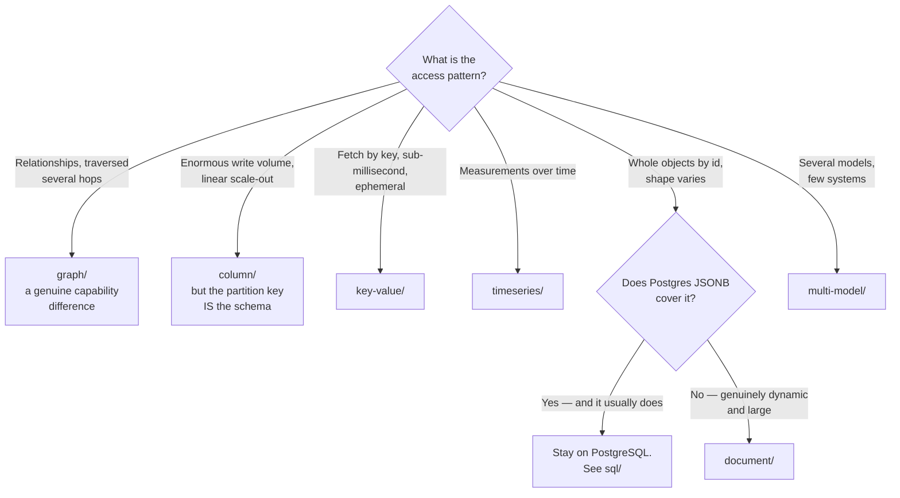

[← Databases](../README.md)

# NoSQL

When the relational model is the wrong shape — and the six different things that means.

Subfolders: [`document/`](document/README.md) · [`key-value/`](key-value/README.md) ·
[`column/`](column/README.md) · [`graph/`](graph/README.md) ·
[`timeseries/`](timeseries/README.md) · [`multi-model/`](multi-model/README.md)

## Contents

1. ["NoSQL" is not a category](#1-nosql-is-not-a-category)
2. [The six families](#2-the-six-families)
3. [Decision tree](#3-decision-tree)
4. [What you give up](#4-what-you-give-up)
5. [Anti-patterns](#5-anti-patterns)
6. [How this applies to pikakube](#6-how-this-applies-to-pikakube)

---

## 1. "NoSQL" is not a category

It is a negation, and it groups systems with nothing in common except that they are not
relational. Redis and Neo4j share no properties, no use cases and no failure modes.

The useful question is never "SQL or NoSQL". It is **which data model matches the access
pattern** — and the six subfolders here are six genuinely different answers.

## 2. The six families

| Family | Data model | Access pattern it serves | Folder |
|---|---|---|---|
| **Document** | nested JSON-like documents | fetch a whole object by id; the shape varies per record | [→](document/README.md) |
| **Key-value** | opaque value by key | cache, session, counter, queue — the fastest possible lookup | [→](key-value/README.md) |
| **Column** | wide rows, partitioned by key | enormous write volume, queried by partition, linear scale-out | [→](column/README.md) |
| **Graph** | nodes and edges as first-class | relationships traversed many hops deep | [→](graph/README.md) |
| **Time-series** | measurements over time | append-heavy, queried by time range, downsampled | [→](timeseries/README.md) |
| **Multi-model** | several of the above in one engine | you want more than one model and fewer systems | [→](multi-model/README.md) |

### The two where the choice is genuinely forced

Most of these can be approximated in PostgreSQL — see
[`sql/`](../sql/README.md#2-postgresql-is-usually-the-answer). Two cannot:

**Graph.** A query like "find every account within four hops of this one" is a self-join per
hop in SQL, and it degrades badly. A graph database traverses it natively. If relationships are
the primary thing being queried, this is a real capability difference.

**Column.** Cassandra-family stores accept writes at a volume and with an availability profile
that a single-primary relational database cannot match, and scale linearly by adding nodes. The
cost is that you must know the query in advance, because the partition key **is** the schema.

The others are usually a matter of degree rather than kind.

## 3. Decision tree

The `document/` branch is the one worth pausing on: it is the most common reason people leave
relational, and the one most often reversible. `JSONB` with indexes covers a large share of
"we need a document store".

## 4. What you give up

Stated plainly, because it is usually discovered later:

| Given up | Consequence |
|---|---|
| **Joins** | relationships get resolved in application code, per query, inconsistently |
| **Transactions across entities** | partial writes become a case the application must handle |
| **Constraints** | invalid data is prevented by convention, or not at all |
| **Ad-hoc querying** | queries not anticipated by the data model are slow or impossible |
| **A schema you can inspect** | the shape lives in application code and in people's memory |

The last row is the expensive one over time. "Schemaless" means the schema is undocumented, not
absent — and three years later nobody knows which fields are guaranteed.

## 5. Anti-patterns

| Anti-pattern | Why it is bad | What to do instead |
|---|---|---|
| Choosing NoSQL to avoid schema design | the schema still exists, now undocumented and unenforced | design it either way |
| A document store for relational data | joins reappear in application code, slower and buggier | relational |
| A column store without knowing the queries | the partition key cannot be changed later, and it decides everything | model the query first |
| Redis as a system of record | it is a cache with persistence bolted on, and it is treated as ephemeral by everyone | a durable store |
| One database per microservice by default | operational cost multiplies with no measured benefit | shared where it makes sense |
| Multi-model as a way to avoid deciding | you get several models operated by a team that has mastered none | decide, then adopt |

## 6. How this applies to pikakube

**MongoDB**, **Redis** and **Neo4j** have standardised deployments recorded here — document,
key-value and graph respectively.

Redis is the one genuinely used in the platform sense: caching and ephemeral state, which is
what it is for. Mongo and Neo4j are mapped as standard deployments rather than as systems of
record.

The rest of the folder is a catalogue, and its real purpose is answering *"do we actually need
this"* with something better than an opinion — because for most of these families the honest
answer for a data platform is [PostgreSQL](../sql/README.md).

---

[← Databases](../README.md)
