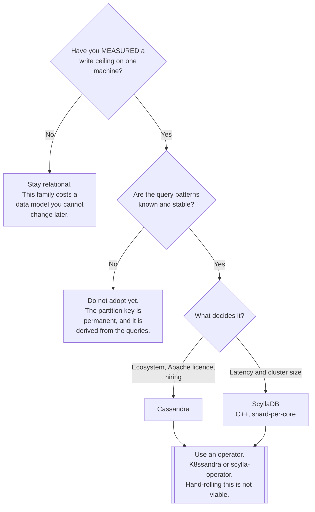

[← NoSQL](../README.md)

# Wide-column stores

Enormous write volume and linear scale-out — bought by deciding the query in advance.

Tools covered: [`cassandra`](cassandra/README.md) · [`scylladb`](scylladb/README.md)

## Contents

1. [The capability that is genuinely different](#1-the-capability-that-is-genuinely-different)
2. [The partition key IS the schema](#2-the-partition-key-is-the-schema)
3. [Consistency is a per-query setting](#3-consistency-is-a-per-query-setting)
4. [The tools](#4-the-tools)
5. [Decision tree](#5-decision-tree)
6. [Anti-patterns](#6-anti-patterns)
7. [How this applies to pikakube](#7-how-this-applies-to-pikakube)

---

## 1. The capability that is genuinely different

Along with [graph](../graph/README.md), this is one of the two NoSQL families where PostgreSQL
is not a substitute — and the reason is the write path.

A single-primary relational database accepts writes at one node. Replicas scale reads; nothing
scales writes except a bigger machine. Cassandra-family stores have **no primary**: every node
accepts writes, data is distributed by a hash of the partition key, and adding nodes adds write
capacity approximately linearly.

| Property | Consequence |
|---|---|
| **Masterless** | any node accepts a write; there is no failover, because there is nothing to fail over |
| **Linear scale-out** | doubling the nodes roughly doubles the throughput |
| **Multi-datacentre** | replication across regions is a configuration, not a project |
| Availability | a node loss is a reduced quorum, not an outage |
| Write path | append to a commit log and a memtable — very fast, and uniform |

The availability property is why these are chosen for systems that must not stop: there is no
window during which the cluster is electing anything.

## 2. The partition key IS the schema

This is the single most important thing about the family, and the most common way adoption fails.

The partition key determines which node holds the data. A query that specifies it goes to one
node and is fast. A query that does not must contact **every** node, and the database will
usually refuse.

The consequence is that the data model is derived from the queries, in a way that has no
relational equivalent:

| Relational | Wide-column |
|---|---|
| Model the entities, then query them | **Model the queries, then derive the tables** |
| A new query is a new `WHERE` clause | a new query may need a **new table** |
| Normalise, then join | **denormalise**; there are no joins |
| One table serves many access patterns | one table per access pattern |

Writing the same data to three tables to serve three queries is not a workaround here — it is the
intended design. Writes are cheap and that is what they are for.

And the constraint that makes this expensive to get wrong: **the partition key cannot be changed
later.** Changing it means creating a new table and migrating everything. The decision is made
before any data exists, on the basis of queries that may not all be known yet.

Two failure shapes to design against:

- **Hot partitions** — a key that concentrates traffic on one node, so the cluster's capacity is
  irrelevant
- **Unbounded partitions** — a partition that grows without limit, until reading it is slow and
  compaction struggles

## 3. Consistency is a per-query setting

Not a property of the database. Each read and write specifies how many replicas must respond:

| Level | Meaning |
|---|---|
| `ONE` | one replica; fastest, and it may be stale |
| `QUORUM` | a majority of replicas |
| `ALL` | every replica; any node down means failure |
| `LOCAL_QUORUM` | a majority within the local datacentre — the usual multi-region choice |

The rule worth memorising: **`R + W > RF` gives strong consistency.** Writing at `QUORUM` and
reading at `QUORUM` with replication factor 3 means the read always sees the write. Writing at
`ONE` and reading at `ONE` does not, and the resulting bug is intermittent and load-dependent.

This is a genuine feature — latency and consistency traded per query — and it is also the source
of "the database lost my write", which is almost always a consistency level nobody chose.

## 4. The tools

| Tool | Where it shines | Detail |
|---|---|---|
| **Cassandra** | the reference implementation — the largest ecosystem, the most operational knowledge, the widest deployment | [→](cassandra/README.md) |
| **ScyllaDB** | **the same thing in C++** — a drop-in rewrite with a shard-per-core architecture, substantially lower latency and fewer nodes for the same load | [→](scylladb/README.md) |

ScyllaDB is protocol-compatible with Cassandra, so drivers and queries work unchanged. Its
argument is operational: no JVM, no garbage-collection pauses, and a thread-per-core design that
uses hardware more efficiently — which typically means a smaller cluster.

The counter-argument is ecosystem and licensing. Cassandra is Apache-licensed with an enormous
community; Scylla's open-source edition has moved to a more restrictive position over time, and
that is worth checking against how the platform ships.

## 5. Decision tree

## 6. Anti-patterns

| Anti-pattern | Why it is bad | What to do instead |
|---|---|---|
| Adopting it before measuring a ceiling | a permanent data model, for a load that never arrives | measure first |
| Modelling entities instead of queries | queries that cannot be served, and the table cannot be re-keyed | model the query |
| A partition key with low cardinality | hot partitions; the cluster's size becomes irrelevant | high cardinality, evenly distributed |
| Unbounded partition growth | reads slow down and compaction struggles | bucket by time, or by something |
| Consistency level left at the default | intermittent stale reads under load | choose `R + W > RF` deliberately |
| `ALLOW FILTERING` in production | a full-cluster scan wearing a small syntax | a table modelled for the query |
| Secondary indexes as a general fix | they work against the distribution model | denormalise into another table |
| Deletes at high volume | tombstones accumulate and slow reads badly | model to avoid them, or use TTLs |
| Running it without an operator | bootstrapping, repair and node replacement are sequenced stateful procedures | K8ssandra, or scylla-operator |
| Repair never scheduled | replicas drift apart silently | anti-entropy repair, on a schedule |

## 7. How this applies to pikakube

Nothing here is deployed, and for a single Kind cluster nothing should be — a masterless
multi-node store on one machine demonstrates the API and none of the properties that justify it.

Both are mapped with their Kubernetes operators, which is the only realistic way to run either:
[K8ssandra](cassandra/README.md) for Cassandra, and the
[scylla-operator](scylladb/README.md).

The value of the folder is answering *"do we need this?"* with something specific. For a data
platform, the honest answer is usually no: the write volumes that justify a masterless store are
high, and the cost — a data model derived from queries and fixed permanently — is paid in full
whether or not the volume ever materialises.

Where it does apply is the read-heavy, extremely-available serving layer that a platform feeds
rather than owns. For analytics on the same data,
[`data-streaming/olap/`](../../../data-streaming/olap/README.md) is the relevant folder, and
ClickHouse or StarRocks answer a different question entirely.

---

[← NoSQL](../README.md)
