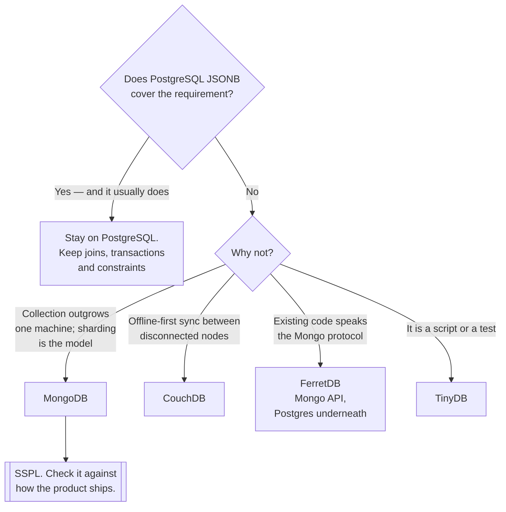

[← NoSQL](../README.md)

# Document stores

Whole objects by id, with a shape that varies — and the family most often adopted for the wrong
reason.

Tools covered: [`mongo`](mongo/README.md) · [`couchdb`](couchdb/README.md) ·
[`ferretdb`](ferretdb/README.md) · [`ravendb`](ravendb/README.md) ·
[`rethinkdb`](rethinkdb/README.md) · [`tinydb`](tinydb/README.md)

## Contents

1. [What the model is good at](#1-what-the-model-is-good-at)
2. [Ask PostgreSQL first](#2-ask-postgresql-first)
3. [The tools](#3-the-tools)
4. [Decision tree](#4-decision-tree)
5. [What actually goes wrong](#5-what-actually-goes-wrong)
6. [Anti-patterns](#6-anti-patterns)
7. [How this applies to pikakube](#7-how-this-applies-to-pikakube)

---

## 1. What the model is good at

A document is a nested structure — objects, arrays, values — stored and retrieved whole, under
an id. The model earns its place in three situations:

| Situation | Why the model fits |
|---|---|
| **The whole object is the unit of work** | one read returns everything; no joins to assemble it |
| **The shape genuinely varies per record** | product catalogues, event payloads, integrations with third parties |
| Deep nesting that is always read together | normalising it would mean reassembling it on every read |

The first row is the honest argument. When an application loads and saves a complete aggregate,
a document store matches the access pattern exactly, and the impedance mismatch that ORMs exist
to paper over disappears.

The reason usually *given*, however, is "we do not need a schema" — and that is a different claim
entirely, addressed in section 5.

## 2. Ask PostgreSQL first

`JSONB` stores documents, indexes inside them with GIN, and queries into nested fields. The
result is that PostgreSQL covers a very large share of "we need a document store", while keeping
transactions, joins and constraints for the parts of the data that are relational.

| | PostgreSQL `JSONB` | A document store |
|---|---|---|
| Nested documents | yes | yes |
| Indexes inside documents | yes, GIN | yes |
| Joins to relational data | **yes** | in application code |
| Transactions | **yes, always** | yes, with caveats |
| Constraints on document fields | yes, via `CHECK` | no |
| Horizontal sharding | not natively | **yes** |
| Very large single collections | possible, harder | its purpose |

The two rows that decide it are the last two. A document store is genuinely the better answer
when the collection outgrows one machine, or when sharding is the operating model rather than
a contingency.

Most applications reaching for one are not in that position — see
[`sql/`](../../sql/README.md#2-postgresql-is-usually-the-answer). The threshold is a measured
constraint, not the anticipation of one.

**FerretDB** is worth knowing about precisely here: it speaks the MongoDB wire protocol and
stores the data in PostgreSQL, which turns "we need Mongo" into a compatibility question rather
than a new system to operate.

## 3. The tools

| Tool | Where it shines | Detail |
|---|---|---|
| **MongoDB** | the default by an enormous margin — drivers, operators, tooling, and people who know it | [→](mongo/README.md) |
| **FerretDB** | MongoDB wire protocol **on top of PostgreSQL** — one fewer system, and Apache-licensed | [→](ferretdb/README.md) |
| **CouchDB** | replication and **offline-first** sync; multi-master by design, with an HTTP API | [→](couchdb/README.md) |
| **RavenDB** | .NET estates; ACID across documents, with a strong query story | [→](ravendb/README.md) |
| **RethinkDB** | live queries pushed to clients — a distinctive idea, largely historical now | [→](rethinkdb/README.md) |
| **TinyDB** | a document store **in a Python file** — for tests, scripts and small tools | [→](tinydb/README.md) |

MongoDB's licence is worth stating: **SSPL**, which is not OSI-approved and restricts offering it
as a service. That is what FerretDB exists to answer, and it is a real consideration for anything
that might be offered to others.

CouchDB's differentiator is unusual enough to name: it is built for **replication between
partially connected nodes**, including browsers and mobile devices. If the problem is
offline-first sync, it is a genuinely different capability rather than a variation.

TinyDB is not a competitor to any of the above and is included because it is the right answer
surprisingly often — a JSON document store with a query API and no server, for a script that
needs to remember something.

## 4. Decision tree

## 5. What actually goes wrong

Three failures, in the order they appear.

**"Schemaless" means undocumented, not absent.** The application still expects specific fields
with specific types. That expectation moved from the database into code, where it is enforced
inconsistently and cannot be queried. Three years later, `user.address` is a string in the oldest
documents, an object in most, and missing in some — and finding out requires scanning the
collection. Schema validation exists in MongoDB and is worth turning on for exactly this reason.

**Joins reappear, in application code.** Data that is related is still related. Without joins,
the application fetches documents in a loop — the N+1 problem, now over a network, with no query
planner to save it. `$lookup` exists and is deliberately limited.

**Transactions have caveats.** Multi-document transactions are supported in current versions, and
they are more expensive and more constrained than a relational transaction. Designs that assume
them freely tend to be surprised. The model's intent is that the *document* is the transactional
boundary.

The through-line: the constraints the relational model imposes are also services it performs, and
they do not disappear when the database stops providing them — they move into application code,
where they are re-implemented worse.

## 6. Anti-patterns

| Anti-pattern | Why it is bad | What to do instead |
|---|---|---|
| Choosing it to avoid schema design | the schema exists anyway, now unenforced and undocumented | design it, and enable validation |
| Relational data in documents | joins reappear in application code, slower and inconsistently | PostgreSQL |
| No schema validation | field types drift silently across a collection | JSON Schema validation, from the start |
| Unbounded arrays inside a document | documents have a size limit, and a growing array eventually hits it | a separate collection |
| Fetching in a loop instead of joining | N+1, over the network | model for the access pattern, or `$lookup` |
| Mongo with default settings | write concern and read preference decide durability, and the defaults are not obvious | set both explicitly |
| Ignoring SSPL | a licensing problem discovered at the worst possible moment | check it, or use FerretDB |
| No shard key strategy | it is chosen once and is expensive to change | model the access pattern first |
| Assuming it is faster than PostgreSQL | for most workloads it is not; it is differently shaped | benchmark the real workload |

## 7. How this applies to pikakube

**MongoDB is mapped as a standard deployment**, not as a system of record — several operator
options are recorded under [`mongo/`](mongo/README.md), including the official operator and
Percona's.

Its realistic role for a data platform is as a **source system**: an application database that
data is extracted from, via CDC into
[`data-streaming/`](../../../data-streaming/README.md) or through
[Airbyte](../../../analytics-engineering/integration/airbyte/README.md). That framing decides
what matters about it here — change streams and replication, rather than schema design.

**FerretDB is the interesting entry.** For this repository, where
[CloudNativePG](../../sql/postgresql/operator/cnpg/README.md) already runs PostgreSQL, it turns
a Mongo requirement into a compatibility layer over a database that is already operated, backed
up and monitored. That is one fewer stateful system, which on a single cluster is the whole
argument.

---

[← NoSQL](../README.md)
