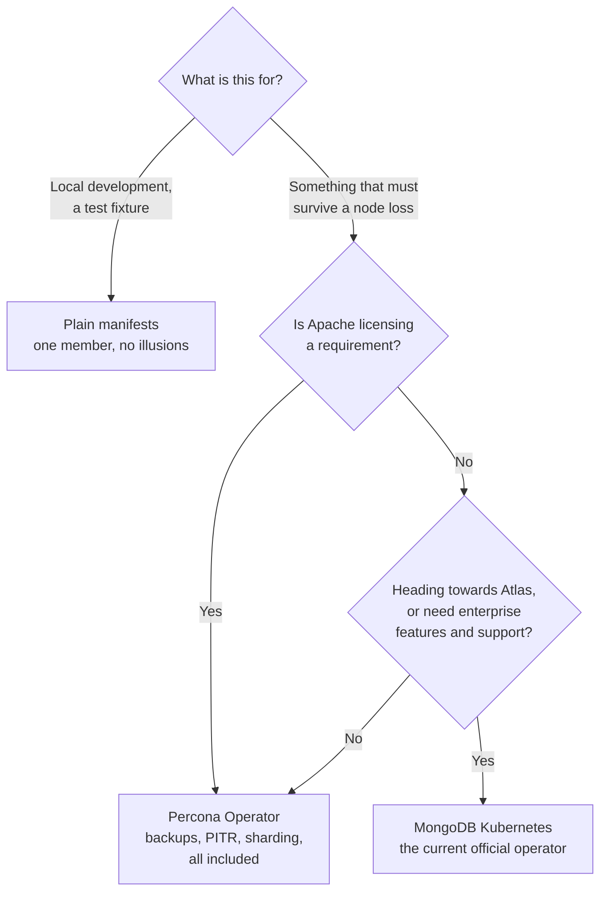

[← Document stores](../README.md)

# MongoDB

One database, four ways to run it on Kubernetes — and the choice is mostly about licensing.

Subfolders: [`mongodb/`](mongodb/README.md) — plain manifests ·
[`mongodb-operator/`](mongodb-operator/README.md) — the Community Operator ·
[`mongodb-kubernetes/`](mongodb-kubernetes/README.md) — the current official operator ·
[`percona-mongodb-operator/`](percona-mongodb-operator/README.md) — Percona's

---

## Why there are four

MongoDB's Kubernetes story is more confusing than it needs to be, because the official offering
has been renamed and restructured, and because the licence pushes people towards Percona.

| Option | What it is | Licence position |
|---|---|---|
| **Plain manifests** | a StatefulSet or Deployment you maintain | whatever image you run |
| **Community Operator** | `mongodb-kubernetes-operator` — replica sets, community edition | free, limited scope |
| **MongoDB Kubernetes** | the current official operator, unifying the community and enterprise lines | tiers, with enterprise features gated |
| **Percona Operator** | Percona Server for MongoDB | **Apache 2.0**, and the most complete free feature set |

The practical summary: **Percona's operator is usually the answer for self-hosting**. It is
permissively licensed, actively maintained, and includes backups, sharding and point-in-time
recovery without a commercial tier.

MongoDB's own operators are the right choice when the enterprise features or the support
relationship matter — or when Atlas is where this is heading and consistency with it is worth
something.

## What an operator actually gives you

Enough to make the plain-manifest option hard to justify beyond a demo:

| Capability | Why it is not worth hand-rolling |
|---|---|
| **Replica set orchestration** | initiating and reconfiguring a replica set is a sequenced, stateful procedure |
| **Automated failover** | primary election has to be reflected in what clients connect to |
| Backups and PITR | oplog-based recovery is not a `mongodump` in a CronJob |
| Rolling upgrades | version upgrades have ordering constraints between members |
| TLS and users | certificate rotation and user management as resources rather than shell scripts |
| Sharding | the config servers and routers are a deployment topology, not a flag |

A single-member Mongo in a StatefulSet is fine for local development, and it is worth being clear
that it is a development artefact — it has no failover, no backup and no story for what happens
when the node is drained.

## Decision tree

## What to decide deliberately

Four settings that determine behaviour and are rarely chosen on purpose:

| Setting | Why it matters |
|---|---|
| **Write concern** | `w:1` acknowledges from the primary only — a failover can lose it. `w:majority` is what "written" usually means |
| **Read preference** | reading from secondaries is stale reads, which is fine until it is not |
| **Schema validation** | JSON Schema per collection; the only thing preventing silent field drift |
| **Shard key** | chosen once, expensive to change, and it decides everything about scaling |

The first row is the one that produces "we lost data and MongoDB says it was written". Both
behaviours are documented and neither default is unreasonable — the failure is not choosing.

## Storage on Kubernetes

MongoDB is stateful, and the usual stateful caveats apply with full force:

- an RWO volume pins the pod to a node; node failure means waiting for detach — see
  [`storage/`](../../../../site-reliability-engineering/storage/README.md)
- a replica set spreads members across nodes, which is the point, so anti-affinity is not
  optional
- restores must be tested with the operator scaled down first, or it recreates an empty volume
  before the restore lands — see
  [Velero](../../../../site-reliability-engineering/backup/velero/README.md)

## How this applies to pikakube

MongoDB is mapped here as a **standard deployment** rather than as a system of record, and its
realistic role for a data platform is as a **source**: an application database read from, not
written to.

That makes two things the ones worth caring about:

- **Change streams**, which are how data leaves it — the CDC path into
  [`data-streaming/`](../../../../data-streaming/README.md), and the reason
  [mongo-kafka](https://github.com/mongodb/mongo-kafka) is recorded alongside the deployments
- **Extraction**, through
  [Airbyte](../../../../analytics-engineering/integration/airbyte/README.md) for batch loads

For browsing collections during development,
[mongo-express](../../../tooling/management/mongo-express/README.md) is the light option, with the
access caveats in [`management/`](../../../tooling/management/README.md).

And the alternative worth keeping visible: [FerretDB](../ferretdb/README.md) provides the same
wire protocol over PostgreSQL, which on this cluster means no additional stateful system to
operate.

---

[← Document stores](../README.md)
