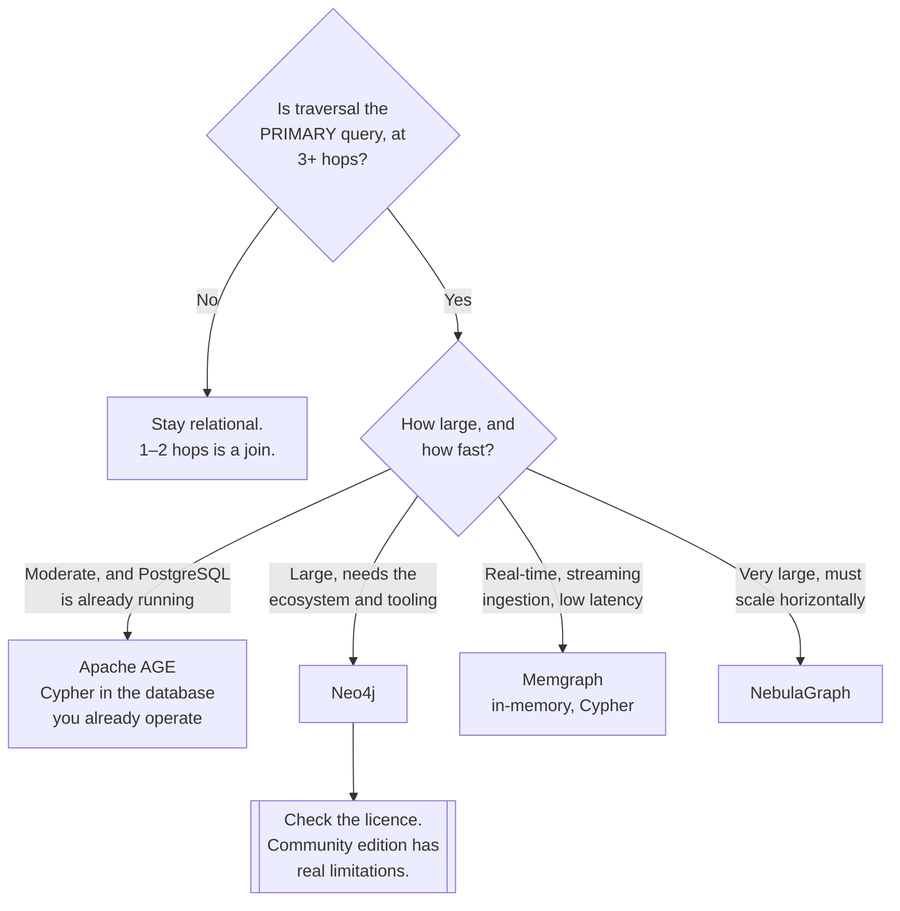

[← NoSQL](../README.md)

# Graph databases

The one NoSQL family where the choice is genuinely forced.

Tools covered: [`neo4j`](neo4j/README.md) · [`memgraph`](memgraph/README.md) ·
[`dgraph`](dgraph/README.md) · [`nebula`](nebula/README.md) · [`age`](age/README.md)

## Contents

1. [Why this one is different](#1-why-this-one-is-different)
2. [When the model actually fits](#2-when-the-model-actually-fits)
3. [Query languages](#3-query-languages)
4. [The tools](#4-the-tools)
5. [Decision tree](#5-decision-tree)
6. [Anti-patterns](#6-anti-patterns)
7. [How this applies to pikakube](#7-how-this-applies-to-pikakube)

---

## 1. Why this one is different

Most NoSQL families can be approximated in PostgreSQL — documents in `JSONB`, key-value in a
table, time-series with partitioning. See
[`sql/`](../../sql/README.md#2-postgresql-is-usually-the-answer).

Graph cannot, and the reason is arithmetic.

"Find every account within four hops of this one" is a self-join per hop in SQL. Each join
multiplies the intermediate result, and the query planner has no good options — at four hops
over a moderately connected dataset it is minutes or a timeout.

A graph database stores each node with direct pointers to its neighbours, so traversal is
following references rather than searching an index. The cost is proportional to the part of the
graph actually visited, not to the size of the tables.

| Depth | Relational | Graph |
|---|---|---|
| 1 hop | fine | fine |
| 2 hops | fine | fine |
| **3–4 hops** | **slow, and it degrades sharply** | fine |
| Variable depth | effectively impossible to express well | a natural query |

The last row matters as much as the performance. "Find any path between these two accounts,
however long" is not expressible in reasonable SQL, and it is one line of Cypher.

## 2. When the model actually fits

The test is not "is the data connected" — all data is connected. It is whether **traversal is the
primary query**:

| Use case | Why traversal is the point |
|---|---|
| **Fraud detection** | shared devices, addresses and accounts, several hops out |
| **Recommendations** | "people who bought this also bought", as a path |
| **Access control** | nested groups and inherited permissions |
| Network and dependency mapping | what breaks if this node fails |
| Knowledge graphs | entities and their relationships, queried by shape |
| Identity resolution | which records are the same person |

Where it does **not** fit: aggregating over many rows, transactional workloads, and anything
whose queries are "select these columns where this condition". A graph database is a poor
general-purpose database, and using it as one is the most common way this choice goes wrong.

The realistic pattern is a graph database **alongside** the relational one, holding the
relationships, not replacing it.

## 3. Query languages

Fragmented, which is a real adoption cost:

| Language | Used by | Note |
|---|---|---|
| **Cypher** | Neo4j, Memgraph, AGE | the de-facto standard; [openCypher](https://github.com/opencypher/opencypher) is the open specification |
| **Gremlin** | JanusGraph, and others | traversal-oriented, more imperative |
| **GQL** | emerging | ISO standard, based largely on Cypher |
| DQL | Dgraph | GraphQL-shaped, and specific to it |
| nGQL | NebulaGraph | its own |

**Cypher is the one to learn.** It has the widest adoption, GQL standardises largely on it, and
choosing a Cypher-speaking database keeps the query layer portable in a way the rest of this
category is not.

## 4. The tools

| Tool | Language | Where it shines | Detail |
|---|---|---|---|
| **Neo4j** | Cypher | **the default** — the largest ecosystem, the best tooling, and the most people who know it | [→](neo4j/README.md) |
| **Memgraph** | Cypher | **in-memory, real-time** — streaming ingestion and low-latency traversal; Cypher-compatible | [→](memgraph/README.md) |
| **NebulaGraph** | nGQL | **very large graphs** — distributed and horizontally scalable by design | [→](nebula/README.md) |
| **Dgraph** | DQL | GraphQL-native, distributed | [→](dgraph/README.md) |
| **Apache AGE** | Cypher | **a PostgreSQL extension** — graph queries in the database you already run | [→](age/README.md) |

**Apache AGE is the entry to consider first**, and it is easy to overlook. It adds Cypher to
PostgreSQL, so graph queries run against tables in the database that already exists — with its
transactions, its backups and its operator.

It does not match a native graph engine at depth or scale. It does remove the question of whether
a whole new stateful system is justified, which for a moderate graph is the more important
question.

**Memgraph** is the one with a distinct niche rather than a smaller version of Neo4j's: in-memory
and built for streaming ingestion, so the graph is updated continuously and queried with very low
latency. Fraud detection on live transactions is the archetypal case.

## 5. Decision tree

## 6. Anti-patterns

| Anti-pattern | Why it is bad | What to do instead |
|---|---|---|
| A graph database as the primary store | poor at aggregation and at transactional work | relational, with the graph beside it |
| Adopting it for 1–2 hop queries | a join does that, in a database you already run | PostgreSQL |
| Modelling everything as a graph | not all data is a traversal problem | model the query |
| Ignoring the licence | Neo4j Community lacks clustering and several features | read it before designing around it |
| Supernodes left unhandled | one node with a million edges makes every traversal through it slow | model around them, or cap the traversal |
| Unbounded traversal in production | `MATCH (a)-[*]-(b)` can walk the whole graph | always bound the depth |
| Syncing a graph copy by hand | it drifts from the source | CDC, or derive it on a schedule |
| Choosing a non-Cypher engine without reason | the query layer becomes non-portable | Cypher unless something forces otherwise |

## 7. How this applies to pikakube

**Neo4j is mapped as a standard deployment**, with the Helm chart, the Python driver, and
[a tutorial series](neo4j/README.md) covering fundamentals, queries, filtering, updates and
aggregation — which is more depth than most of this catalogue.

Its realistic role here is the same as MongoDB's: a **standard deployment** and a source system,
rather than a system of record for the platform.

Two things worth carrying forward:

**[openCypher](https://github.com/opencypher/opencypher)** is recorded alongside Neo4j, and it is
the reason the tutorial content transfers — the same queries run against
[Memgraph](memgraph/README.md) and [AGE](age/README.md).

**[Apache AGE](age/README.md) is the pragmatic option for this cluster.** With
[CloudNativePG](../../sql/postgresql/operator/cnpg/README.md) already running PostgreSQL, a graph
capability without a new stateful system is a genuinely different proposition from deploying
Neo4j — and for a graph that fits on one machine, it is the one that costs least.

---

[← NoSQL](../README.md)
