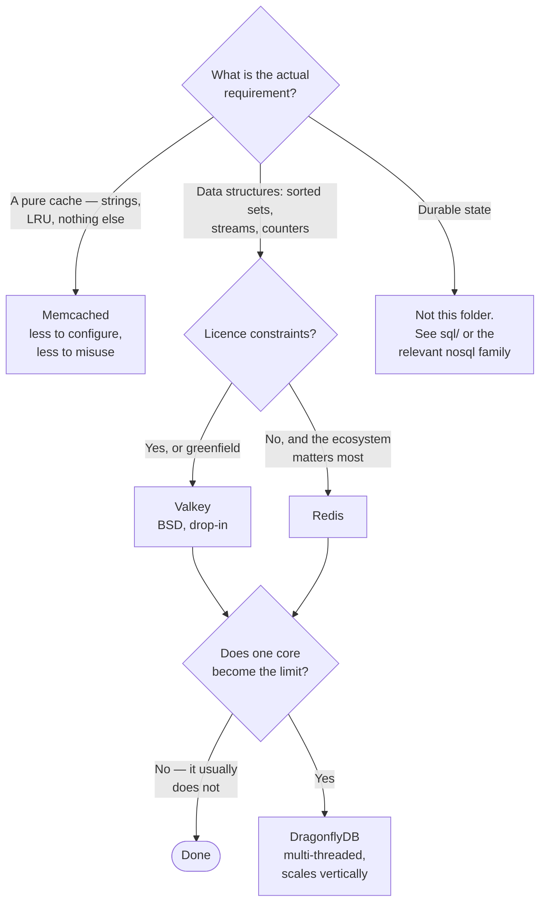

[← NoSQL](../README.md)

# Key-value stores

The fastest possible lookup — and the category most often mistaken for a database.

Tools covered: [`redis`](redis/README.md) · [`valkey`](valkey/README.md) ·
[`dragonflydb`](dragonflydb/README.md) · [`keydb`](keydb/README.md) ·
[`memcached`](memcached/README.md)

## Contents

1. [What they are for](#1-what-they-are-for)
2. [The licence split, which is why this folder is crowded](#2-the-licence-split-which-is-why-this-folder-is-crowded)
3. [The tools](#3-the-tools)
4. [Decision tree](#4-decision-tree)
5. [Persistence, and why it is not durability](#5-persistence-and-why-it-is-not-durability)
6. [Running them on Kubernetes](#6-running-them-on-kubernetes)
7. [Anti-patterns](#7-anti-patterns)
8. [How this applies to pikakube](#8-how-this-applies-to-pikakube)

---

## 1. What they are for

A key, a value, sub-millisecond access, and nothing else — no query planner, no joins, no schema.
That narrowness is the feature: there is very little between the request and the answer.

The jobs they genuinely do well:

| Job | Why here rather than in the database |
|---|---|
| **Cache** | the same query, thousands of times, against data that rarely changes |
| **Sessions** | short-lived, high-read, and nobody minds losing them on a bad day |
| Rate limiting | atomic counters with a TTL, which is exactly the primitive needed |
| Locks and leases | expiring keys, though see the caveat below |
| **Queues** | lists and streams — good enough for a great many work queues |
| Leaderboards | sorted sets, which is a genuinely awkward thing to do in SQL |
| Pub/sub | fan-out to subscribers, fire-and-forget |

The unifying property of the list is that **losing the data is survivable**. A cache repopulates,
a session forces a re-login, a rate-limit window resets. The moment something on this list stops
being survivable, it belongs in a durable store — which is the subject of section 5.

These are not the same as [`distributed/key-value/`](../../distributed/key-value/README.md).
Those are consensus-replicated and strictly durable, and correspondingly slow. Different tool,
similar name.

## 2. The licence split, which is why this folder is crowded

Five tools for one job needs an explanation, and the explanation is licensing.

Redis relicensed away from BSD in 2024 (RSAL/SSPL), which prompted a Linux Foundation fork —
**Valkey** — carrying the original BSD licence and the original maintainers. Redis subsequently
added AGPL as an option in 2025, which softened the position without undoing the fork.

| Tool | Licence | Position |
|---|---|---|
| Redis | RSALv2 / SSPL, plus AGPL since 2025 | the original |
| **Valkey** | **BSD** | the Linux Foundation fork, backed by AWS, Google, Oracle |
| KeyDB | BSD | an earlier multi-threaded fork, from Snap |
| DragonflyDB | BSL | a from-scratch rewrite, not a fork |
| Memcached | BSD | predates all of it, and is a different design |

For anything new, **Valkey is the safe default**: protocol-identical to Redis, permissively
licensed, and with the weight of the major clouds behind it. The practical migration cost from
Redis is close to zero because clients cannot tell them apart.

## 3. The tools

| Tool | Threading | Where it shines | Detail |
|---|---|---|---|
| **Redis** | single-threaded core | the ecosystem — every client, every framework, every tutorial assumes it | [→](redis/README.md) |
| **Valkey** | single-threaded, with I/O threads | the licence-clean drop-in; the default for new work | [→](valkey/README.md) |
| **DragonflyDB** | multi-threaded | vertical scale — one large machine instead of a Redis cluster | [→](dragonflydb/README.md) |
| **KeyDB** | multi-threaded | the earlier answer to the same problem; largely superseded | [→](keydb/README.md) |
| **Memcached** | multi-threaded | **pure caching** — no persistence, no data structures, no illusions | [→](memcached/README.md) |

**Memcached is the one worth defending.** It does less on purpose: strings by key, LRU eviction,
multi-threaded, no persistence at all. If the requirement is genuinely a cache, that simplicity
is an advantage — there is no persistence configuration to get wrong and no temptation to start
storing something important in it.

**DragonflyDB** is the interesting engineering position: Redis-compatible, but multi-threaded and
designed to use a whole machine. Where a Redis deployment would need clustering to grow, this
scales vertically instead — which is fewer moving parts, at the cost of a BSL licence and a
younger project.

## 4. Decision tree

The `STOP` branch is the one that matters most, and section 5 is why.

## 5. Persistence, and why it is not durability

Redis and Valkey can persist to disk, and this is the most misread feature in the category.

| Mechanism | What it does | What it loses |
|---|---|---|
| **RDB** | a point-in-time snapshot, periodically | everything since the last snapshot |
| **AOF** | appends every write to a log | up to `fsync` interval — 1 second by default |
| AOF with `always` | `fsync` per write | very little, and most of the throughput |

Default configurations lose data on an unclean shutdown. That is a deliberate trade — the whole
value proposition is speed — and it is the correct trade for a cache.

The failure is treating it as a database anyway. It usually arrives gradually: a cache, then a
session store, then "the only place the shopping cart lives", and nobody revisits the eviction
policy or the persistence setting.

Two specific traps:

**`maxmemory-policy`.** With an eviction policy set, keys are discarded under memory pressure —
including the ones somebody assumed were permanent. With `noeviction`, writes fail instead once
memory fills. Both are reasonable; neither is what "durable" means, and the default is rarely
chosen deliberately.

**Distributed locks.** Redis-based locking is widely used and correct only under assumptions
worth reading before relying on it — the [Redlock debate](https://github.com/redis/redis) is the
canonical discussion. For coordination that must be correct rather than usually correct,
[etcd](../../distributed/key-value/etcd/README.md) is the tool built for it.

## 6. Running them on Kubernetes

| Concern | What to do |
|---|---|
| **Memory limits** | set `maxmemory` **below** the container limit, or the kernel OOM-kills the pod before eviction ever runs |
| Eviction policy | choose it explicitly; the default surprises people |
| Persistence | decide whether it exists at all — a cache does not need a PVC |
| **Clustering** | Redis Cluster changes the client's behaviour and forbids cross-slot operations. Do not adopt it for availability alone |
| Sentinel vs. operator | an operator is usually simpler than assembling Sentinel by hand |
| `NetworkPolicy` | there is no authentication worth the name by default |

The first row is the single most common production failure in this folder. If `maxmemory` is
unset or equal to the container limit, memory pressure ends in an OOM kill rather than in
eviction — the pod restarts, the cache is empty, and the database receives the full load it was
shielded from.

## 7. Anti-patterns

| Anti-pattern | Why it is bad | What to do instead |
|---|---|---|
| Redis as a system of record | persistence is best-effort, and everyone treats it as ephemeral | a durable store |
| `maxmemory` unset or equal to the container limit | OOM kill instead of eviction | set it below the limit |
| Eviction policy left at the default | keys assumed permanent get discarded | choose it deliberately |
| No TTL on cached keys | memory grows until eviction decides for you | a TTL on everything cacheable |
| Redis Cluster for high availability | it is for sharding; it constrains the client and complicates operations | replicas, or an operator |
| `KEYS *` in production | O(n) on a single-threaded server, so it blocks everything | `SCAN` |
| Distributed locks assumed safe | correctness depends on assumptions rarely checked | etcd for correctness-critical locks |
| Large values | one big value blocks the event loop for every other client | keep values small |
| No authentication or `NetworkPolicy` | reachable in-cluster means reachable by anything in the cluster | both |
| A cache that has never been cold-started | the database has never seen real load, so restarting the cache is an outage | test it deliberately |

## 8. How this applies to pikakube

**Redis is the one genuinely used in the platform sense here** — caching and ephemeral state,
which is exactly what the category is for. The deployment variants are recorded under
[`redis/`](redis/README.md), from a plain Deployment through to an operator.

Two things this folder should influence going forward:

**Valkey for anything new.** The migration is a name change, and the licence question stops being
one. Redis staying where it is, with Valkey as the default for new use, is a defensible position
that costs nothing.

**The `maxmemory` check.** It is worth verifying on the existing deployment rather than assuming,
because the failure mode — OOM kill, cold cache, load lands on
[CloudNativePG](../../sql/postgresql/operator/cnpg/README.md) — is exactly the compound failure
this repository is meant to anticipate.

---

[← NoSQL](../README.md)
