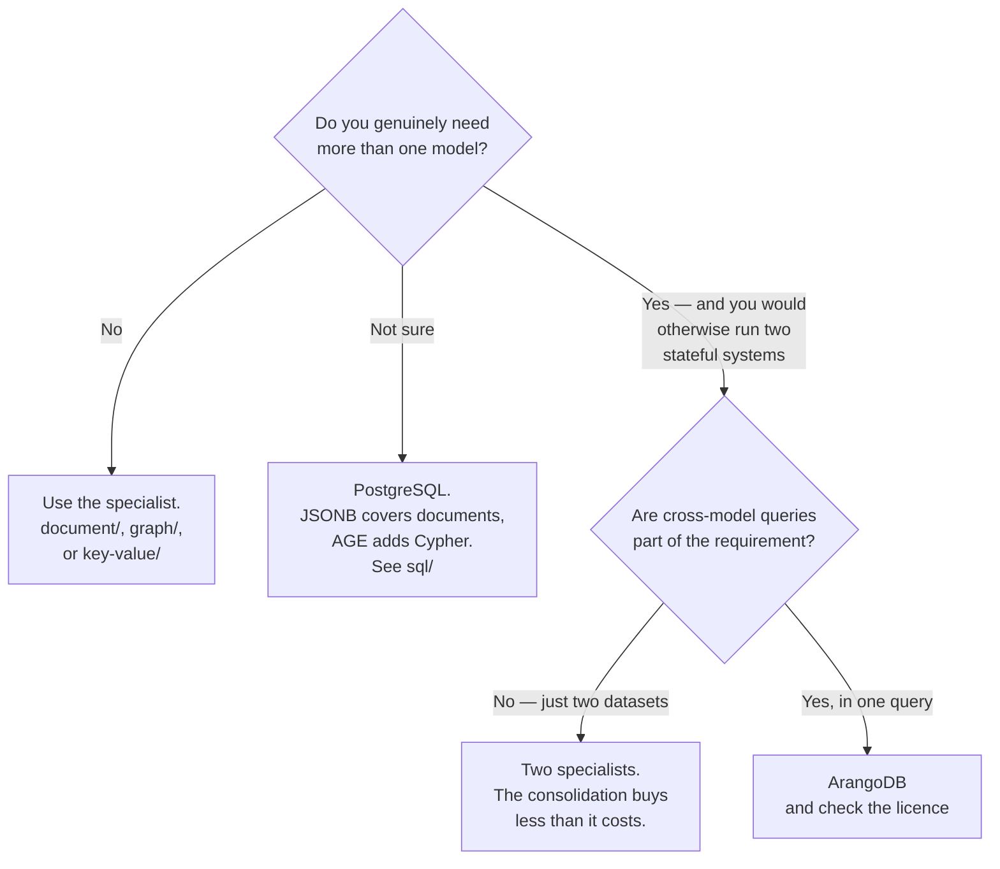

[← NoSQL](../README.md)

# Multi-model databases

Several data models in one engine — and the question of whether that is a solution or a way to
avoid deciding.

Tools covered: [`arangodb`](arangodb/README.md) · [`orientdb`](orientdb/README.md)

---

## The pitch

Documents, graphs and key-value in a single system, queried by one language, operated as one
thing.

The argument is real: a platform that needs a document store *and* a graph would otherwise run
two stateful systems — two backup strategies, two monitoring setups, two upgrade paths, and
application code stitching results together across them.

| | Two specialists | One multi-model engine |
|---|---|---|
| Systems to operate | 2 | **1** |
| Cross-model queries | in application code | **in the query language** |
| Backup and monitoring | twice | once |
| Depth per model | **best in class** | good, not best |
| Expertise required | two ecosystems | one |
| Ecosystem size | large, per model | smaller |

The row that decides it in practice is the last one but one: a specialist has more people who
know it, more answers online, and more tooling.

## The counter-argument

Stated plainly, because it is the more common outcome:

**Multi-model is often a way to avoid choosing.** The team does not want to decide whether the
problem is a document problem or a graph problem, so it adopts something that is both — and ends
up operating an engine nobody has mastered, in a small ecosystem, for a workload that a single
model would have served.

The second failure is subtler: the models are used *because they are there*. Data that should be
one shape gets split across two because both are available, and the resulting design is harder to
reason about than either would have been alone.

The test worth applying before adopting one:

> Would you deploy **two** databases for this? If not, you do not need one that is two.

## The tools

| Tool | Models | Where it shines | Detail |
|---|---|---|---|
| **ArangoDB** | document, graph, key-value | the credible one — **AQL queries across all three**, with a mature Kubernetes operator | [→](arangodb/README.md) |
| **OrientDB** | document, graph, object | historically significant; **effectively dormant** now | [→](orientdb/README.md) |

**ArangoDB** is the one to evaluate if this category is being considered at all. AQL genuinely
traverses a graph and filters documents in the same query, and `kube-arangodb` is a real operator
rather than a chart that starts a pod.

Its licence is worth checking — the community edition's terms have changed over time, and that
is the kind of thing best discovered before the design depends on it.

**OrientDB** is included for completeness and honesty. It was an early and influential
multi-model database; development has largely stalled, and adopting it now would be adopting a
project without momentum.

## Decision tree

The `PG` branch is worth taking seriously. PostgreSQL with `JSONB` and
[Apache AGE](../graph/age/README.md) is document plus graph in a database that is already
operated, backed up and monitored — which is the multi-model argument, made by an engine with a
vastly larger ecosystem.

## Anti-patterns

| Anti-pattern | Why it is bad | What to do instead |
|---|---|---|
| Adopting it to avoid deciding | an engine nobody has mastered, in a small ecosystem | decide the primary model |
| Using every model because they exist | a design split across shapes for no reason | model the access pattern |
| Expecting specialist depth | it is good at each, best at none | if one model dominates, use the specialist |
| Ignoring the licence | terms in this category have changed more than once | check before designing around it |
| Choosing a dormant project | no fixes, no security updates, no community | check commit activity |
| Overlooking PostgreSQL | `JSONB` plus AGE is multi-model with a large ecosystem | measure it first |

## How this applies to pikakube

Neither is deployed, and this is one of the clearer *"no"* answers in the catalogue.

The reason is specific to this platform rather than general: the models are already covered by
things that are running or trivially available.
[MongoDB](../document/mongo/README.md) and [Neo4j](../graph/neo4j/README.md) are mapped as
standard deployments, [Redis](../key-value/redis/README.md) is genuinely used, and
[PostgreSQL](../../sql/postgresql/README.md) with `JSONB` plus
[AGE](../graph/age/README.md) would cover document and graph in the database
[CloudNativePG](../../sql/postgresql/operator/cnpg/README.md) already operates.

Consolidating three into one multi-model engine would mean introducing a new stateful system to
reduce a count that is not currently causing pain — which is the test in the second section,
answered.

---

[← NoSQL](../README.md)
