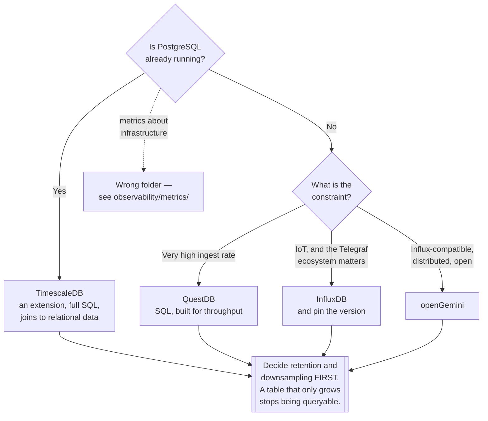

[← NoSQL](../README.md)

# Time-series databases

Append-heavy, queried by time range, and downsampled — the shape that general-purpose engines
handle badly.

Tools covered: [`timescaledb`](timescaledb/README.md) · [`influxdb`](influxdb/README.md) ·
[`questdb`](questdb/README.md) · [`opengemini`](opengemini/README.md)

## Contents

1. [What makes time-series different](#1-what-makes-time-series-different)
2. [Ask PostgreSQL first — and here the answer is often yes](#2-ask-postgresql-first--and-here-the-answer-is-often-yes)
3. [This is not the observability folder](#3-this-is-not-the-observability-folder)
4. [The tools](#4-the-tools)
5. [Decision tree](#5-decision-tree)
6. [Anti-patterns](#6-anti-patterns)
7. [How this applies to pikakube](#7-how-this-applies-to-pikakube)

---

## 1. What makes time-series different

The workload has a distinctive shape, and it is that shape rather than the data type that
justifies a specialised engine:

| Property | Consequence |
|---|---|
| **Writes are appends** | almost never updates; timestamps arrive roughly in order |
| **Queries are ranges** | "the last hour", "yesterday" — never "row 47" |
| **Recent data matters most** | and old data is queried at lower resolution, if at all |
| Values compress extremely well | consecutive readings differ slightly, so delta encoding is very effective |
| Volume is high and predictable | one device, one metric, one reading a second, forever |
| **Data ages out** | retention is a first-class requirement, not an afterthought |

A general-purpose database can store this. What it does badly is the combination of ingest rate,
time-ordered compression and automatic ageing — and the last one is what turns into an
operational problem, because a table that only grows eventually stops being queryable.

The capabilities that follow from the shape:

**Downsampling.** Per-second readings for a week, per-minute for a month, per-hour for a year.
This is the mechanism that makes long retention affordable, and doing it by hand is a scheduled
job nobody maintains.

**Retention policies.** Data older than N automatically deleted or rolled up, as a property of
the table rather than a cron job.

**Time-bucketed aggregation.** `time_bucket('5 minutes', ts)` and gap-filling — expressible in
plain SQL only awkwardly.

## 2. Ask PostgreSQL first — and here the answer is often yes

More than in any other NoSQL family, the incumbent is a serious answer.

**TimescaleDB is a PostgreSQL extension.** It is in this folder because it does the job, and it
does it inside the database that is probably already running — with the same SQL, the same
drivers, the same backups, the same operator, and joins to the relational data that gives the
measurements meaning.

| | TimescaleDB | A dedicated engine |
|---|---|---|
| Query language | **full SQL** | its own, or a subset |
| Joins to relational data | **yes** | no |
| Existing tooling | works unchanged | new |
| Operational cost | an extension | a new stateful system |
| Peak ingest | very good | better |

The join row is the practical one. Measurements are almost always interpreted against something
relational — which device, which customer, which site. In a separate system that join happens in
application code.

Even plain PostgreSQL with declarative partitioning covers a surprising amount, and is worth
measuring before adopting anything.

## 3. This is not the observability folder

A recurring confusion worth settling, because the tools overlap and the requirements do not:

| | This folder | [`observability/metrics/`](../../../observability/metrics/README.md) |
|---|---|---|
| Data | **application and business** time-series — sensors, prices, telemetry, usage | infrastructure and service metrics |
| Written by | applications and devices | exporters and agents |
| Queried by | applications, analysts, dashboards | Grafana, alerting rules |
| Retention | often years | often weeks |
| Tools | TimescaleDB, InfluxDB, QuestDB | Prometheus, VictoriaMetrics, Mimir, Thanos |

Prometheus is a time-series database and it is not in this folder, because it is built for a
different job: scraping, alerting and a short retention window. Storing five years of IoT
readings in it is a category error, and storing pod CPU in TimescaleDB is the same error
reversed.

## 4. The tools

| Tool | Interface | Where it shines | Detail |
|---|---|---|---|
| **TimescaleDB** | **SQL, as a Postgres extension** | the default — full SQL, joins to relational data, no new system | [→](timescaledb/README.md) |
| **InfluxDB** | Flux / InfluxQL / SQL, by version | the best-known dedicated engine; strong IoT ecosystem and Telegraf collectors | [→](influxdb/README.md) |
| **QuestDB** | **SQL, with time-series extensions** | **raw ingest speed** — very high throughput, and SQL rather than a bespoke language | [→](questdb/README.md) |
| **openGemini** | InfluxDB-compatible | a distributed, open-source alternative in the Influx ecosystem | [→](opengemini/README.md) |

**InfluxDB's version history is worth knowing before adopting it.** The 1.x → 2.x transition
introduced Flux, a new query language, and 3.x moved again towards SQL on a rewritten
storage engine. Documentation, tutorials and client libraries are split across those generations,
and matching them up is a real cost.

**QuestDB** is the one to look at when ingest rate is the constraint. It accepts the InfluxDB
line protocol, queries in SQL, and is built for very high write throughput — financial tick data
is its canonical case.

## 5. Decision tree

## 6. Anti-patterns

| Anti-pattern | Why it is bad | What to do instead |
|---|---|---|
| No retention policy | the table grows forever, and queries degrade with it | set it when the table is created |
| No downsampling | full-resolution data kept for years, at full cost | roll up on a schedule |
| A dedicated engine when Postgres would do | a new stateful system, and joins move into application code | measure TimescaleDB first |
| High-cardinality tags | one series per unique combination; cardinality explosion is the classic failure | keep tag cardinality bounded |
| Infrastructure metrics stored here | a category error; the tooling and retention do not match | [`observability/`](../../../observability/README.md) |
| Adopting InfluxDB without pinning the version | 1.x, 2.x and 3.x differ in query language and storage | decide the version deliberately |
| Out-of-order writes at volume | many engines handle them poorly, and the failure is quiet | check the engine's behaviour |
| Time-series in a plain table with no partitioning | the index grows until inserts slow down | partition by time, at minimum |
| Storing every reading forever "just in case" | cost grows without bound, and nobody queries year-old per-second data | downsample, and be explicit about what is lost |

## 7. How this applies to pikakube

All four are mapped, none deployed — and the reason is section 2.

For this platform the honest position is that **TimescaleDB is the answer if the requirement ever
appears**, because [CloudNativePG](../../sql/postgresql/operator/cnpg/README.md) already runs
PostgreSQL. A time-series capability that is an extension rather than a new stateful system is a
materially different proposition on a single cluster.

The confusion in section 3 is worth restating for this repository specifically, because both
sides exist here: metrics about the platform live in
[`observability/metrics/`](../../../observability/metrics/README.md) with Prometheus,
VictoriaMetrics, Mimir and Thanos — and that is the right place for them. This folder is for
time-series that are *data*, which the platform does not currently produce.

If it did — usage metering, device telemetry, price history — the sequence would be: measure
plain PostgreSQL with partitioning, then TimescaleDB, and only then consider a dedicated engine
with the ingest numbers to justify it.

---

[← NoSQL](../README.md)
