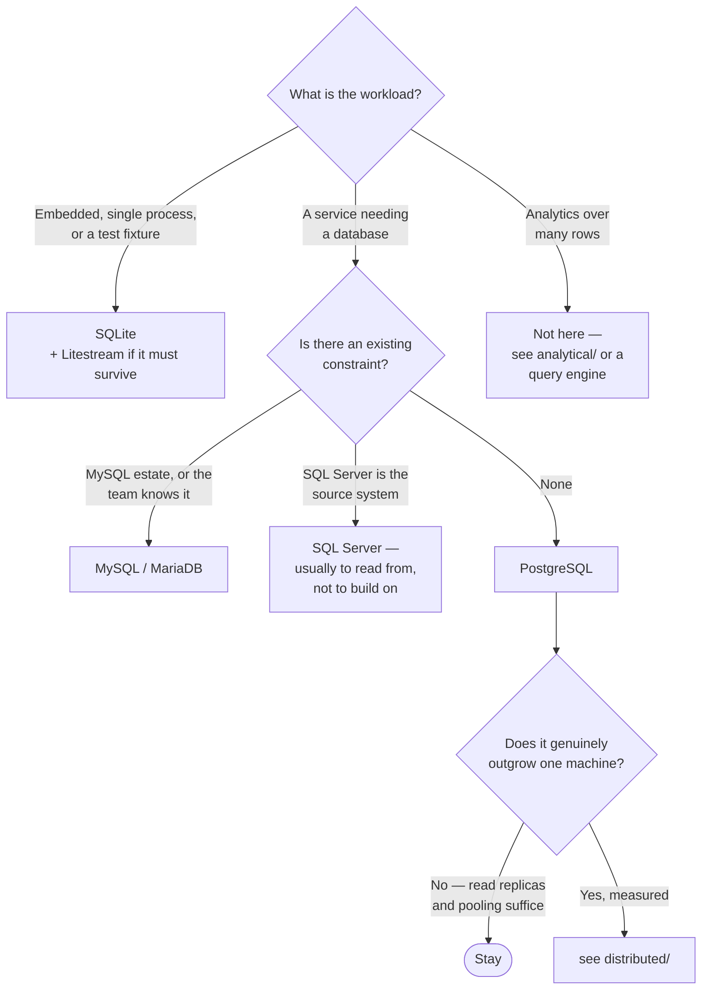

[← Databases](../README.md)

# SQL databases

The relational default, and the right answer more often than the alternatives suggest.

Tools covered: [`postgresql`](postgresql/README.md) · [`mysql`](mysql/README.md) ·
[`mariadb`](mariadb/README.md) · [`sqlite`](sqlite/README.md) · [`sqlserver`](sqlserver/)

## Contents

1. [Why this is the default](#1-why-this-is-the-default)
2. [PostgreSQL is usually the answer](#2-postgresql-is-usually-the-answer)
3. [The tools](#3-the-tools)
4. [Decision tree](#4-decision-tree)
5. [Running them on Kubernetes](#5-running-them-on-kubernetes)
6. [Anti-patterns](#6-anti-patterns)
7. [How this applies to pikakube](#7-how-this-applies-to-pikakube)

---

## 1. Why this is the default

Relational databases give four things that are hard to reproduce and easy to undervalue until
they are missing:

| Property | What it prevents |
|---|---|
| **Transactions** | partial writes leaving data in a state nobody designed |
| **Constraints** | invalid data existing at all, rather than being cleaned later |
| **Joins** | the same relationship re-implemented in application code, differently each time |
| **A declarative query language** | rewriting access logic every time a question changes |

The common argument against — "we do not need a schema" — usually means the schema moved into
application code, where it is enforced inconsistently and cannot be queried.

## 2. PostgreSQL is usually the answer

Not from preference. From the fact that it absorbs most of the reasons people reach for
something else:

| Requirement | Postgres handles it |
|---|---|
| Document storage | `JSONB`, with indexing |
| Full-text search | built in, adequate to a real scale |
| Geospatial | PostGIS, which is the reference implementation |
| Time-series | TimescaleDB, or partitioning |
| Queues | `SKIP LOCKED` — good enough for most work queues |
| Key-value | `UNLOGGED` tables, or just a table |

None of those beat a specialist at its specialty. The point is that they are **good enough**
often enough that adding a second database costs more than it returns — see the polyglot
persistence note in [`../README.md`](../README.md).

The threshold for leaving is a specific, measured constraint. Not a feeling that a different
model would be tidier.

## 3. The tools

| Tool | Notes | Detail |
|---|---|---|
| **PostgreSQL** | the default; extensions cover most adjacent needs, and the Kubernetes operators are mature | [→](postgresql/README.md) |
| **MySQL** | very widely deployed, strong replication story, simpler operationally in some respects | [→](mysql/README.md) |
| **MariaDB** | MySQL fork with divergent features and a clear open-source position | [→](mariadb/README.md) |
| **SQLite** | in-process, no server — enormously useful and constantly underrated | [→](sqlite/README.md) |
| **SQL Server** | present because it exists in real estates, usually as a source rather than a target | [→](sqlserver/) |

**SQLite deserves more than a footnote.** It is the right answer for embedded state, local
tooling, tests, and single-node workloads — and with [Litestream](sqlite/litestream/README.md) it
replicates to object storage, which covers durability for a surprising range of small services.

## 4. Decision tree

## 5. Running them on Kubernetes

Three things decide whether this works, and none of them is the database:

**Storage.** An RWO volume pins the pod to a node. Node failure means waiting for detach, which
is where "the database did not come back" usually originates — see
[`storage/`](../../site-reliability-engineering/storage/README.md).

**Connection pooling.** Postgres allocates a process per connection and exhausts long before it
exhausts CPU. A pooler is not an optimisation, it is a requirement — see
[`tooling/pooler/`](../tooling/pooler/).

**Restore, actually tested.** With the operator scaled to zero first, or it recreates an empty
volume before the restore lands — see
[Velero](../../site-reliability-engineering/backup/velero/README.md).

## 6. Anti-patterns

| Anti-pattern | Why it is bad | What to do instead |
|---|---|---|
| A second database for a feature Postgres covers | one more system to back up, monitor and upgrade | measure the constraint first |
| No connection pooler | connection exhaustion under load that CPU graphs do not explain | PgBouncer or PgCat |
| Analytics on the production OLTP database | one query causes an unrelated outage | a replica, or the warehouse |
| Schema changes without a migration tool | environments diverge and nobody can reproduce production | [`tooling/migration/`](../tooling/migration/) |
| Untested restores | discovered during the incident | scheduled restore drills |
| `latin1` or a legacy collation by default | encoding problems that surface years later | UTF-8, explicitly |
| Defaults for `shared_buffers`, `work_mem` | the default configuration assumes a small machine | tune from the actual workload |

## 7. How this applies to pikakube

**PostgreSQL via [CloudNativePG](postgresql/operator/cnpg/README.md)** is what has real history here,
including a documented migration process and monitoring through
[pghero](../tooling/monitoring/pghero/README.md), [PMM](../tooling/monitoring/pmm/README.md) and the
[postgres-exporter](../../observability/metrics/exporters/postgres-exporter/README.md).

MySQL, MariaDB and SQL Server are mapped, largely as **source systems** — the things a data
platform reads from rather than builds on. SQLite is mapped for the embedded case.

---

[← Databases](../README.md)
